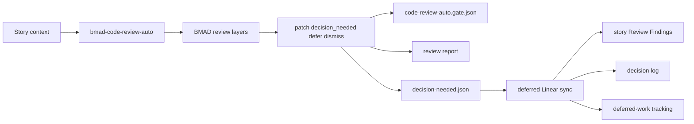

# BMAD-METHOD Architecture Handoff: BMAD Code Review Auto

## Document Purpose

This document is the local BMAD-METHOD architecture handoff for `bmad-code-review-auto`.
It contains only BMAD-METHOD-owned architecture constraints, contracts, artifacts, and validation rules.
It is intended to be read with `prd.md` and `epics.md` in this same folder.
Implementation agents must not traverse out of this repository to read parent workspace planning files.

## Architecture Paradigm

Add an automation-native sibling surface for BMAD code review.
The new surface should reuse or mirror existing BMAD review reasoning rather than creating an Archon-specific wrapper.
The route API is a versioned JSON contract.
The human review report remains a human evidence surface.

## Core Decisions

### M-AD-1: Automation Is A BMAD-METHOD Surface

`bmad-code-review-auto` lives in BMAD-METHOD.
Archon may invoke it but does not own its review semantics.
The interactive `bmad-code-review` remains available.

### M-AD-2: Existing Review Semantics Are Preserved

The implementation must preserve BMAD review layers where context allows.
The required layers are Blind Hunter, Edge Case Hunter, and Acceptance Auditor when story context exists.
The required categories are `patch`, `decision_needed`, `defer`, and `dismiss`.

### M-AD-3: Automation Does Not Patch

`bmad-code-review-auto` never applies code patches.
It writes findings, reports, and contracts.
Development fixes happen later through Archon's route back to `dev-story`.

### M-AD-4: The CR Contract Is The Route Port

`code-review-auto.gate.json` is the machine-readable route API.
Markdown review reports are human evidence and may evolve.
Archon routes on JSON only.

### M-AD-5: Decision Needed Is Durable Deferred Work

`decision_needed` findings are written to `decision-needed.json`.
They are not converted to patches in v2.
After Archon creates or reuses Linear issues, BMAD-METHOD artifacts must record the Linear references and deferred status.

## Contract Shape

`code-review-auto.gate.json` must include:

- `contract_version`
- `workflow`
- `story_ref`
- `node`
- `round`
- `gate`
- `patch_count`
- `decision_needed_count`
- `defer_count`
- `dismiss_count`
- `blocking_findings_count`
- `decision_needed_file`
- `report_file`
- `story_file`

Gate rules:

- `patch_count > 0` produces `FAIL`.
- `decision_needed_count > 0` with no patch findings produces `CONCERNS`.
- No patch findings and no decision-needed findings produces `PASS`.
- Reviewer execution failure, invalid evidence, or untrusted output produces `ERROR`.

## Decision Needed Artifact

`decision-needed.json` should be durable and stable enough for Archon `decision-needed-check`.
Each finding entry should include:

- Finding id
- Story reference
- Story file
- Source gate
- Finding title
- Finding detail
- Evidence pointers
- Human-judgment reason
- Status
- Linear issue id when synced
- Linear URL when synced
- Created and updated timestamps

Allowed v2 statuses should cover unresolved and deferred to Linear.
`converted_to_patch` is out of scope for v2.

## Sync Targets

When Archon supplies Linear references, BMAD-METHOD must update:

- Story Review Findings
- Decision log
- Deferred-work tracking
- `decision-needed.json`

The sync must preserve original finding detail and evidence pointers.
If any sync target fails in a way that leaves artifacts inconsistent, the sync output is `ERROR`.

## Validation Rules

Implementation is complete only when:

- BMAD skill or command validation passes.
- Interactive `bmad-code-review` remains available.
- Automated review does not apply patches.
- Automated review does not run interactive choices.
- Fixture coverage includes `patch`, `decision_needed`, `defer`, `dismiss`, and invalid or untrusted output.
- JSON contract validation proves `PASS`, `FAIL`, `CONCERNS`, and `ERROR`.
- Decision-needed persistence and Linear reference sync are deterministic and idempotent.

## Cross-Project Dependencies

BMAD-METHOD depends on Archon for:

- Invoking `bmad-code-review-auto` in the v2 workflow
- Passing or preserving `story_ref`
- Creating or reusing Linear issues
- Supplying Linear id and URL for sync

BMAD-METHOD depends on BMAD-TEA only through Archon's quality summary flow.
No BMAD-METHOD story should directly parse TEA markdown reports for route decisions.
