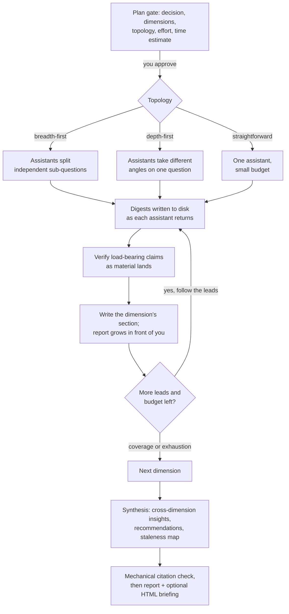

Deep Recon researches anything you need to decide on. This page explains its three modes, how to pick between them, and what actually happens inside a native research run.

## What is Deep Recon?

Run `bmad-deep-recon` and you get a research director, not a search engine. Every engagement starts from a decision: enter a market or skip it, pick a stack, choose a vendor, commit to a domain, ground a paper. The decision shapes which questions get asked, which sources count, and what the final report recommends.

It's a core skill, so it isn't tied to software projects. Product teams use it for market sizing, but it handles a literature review for a thesis, a teardown of three competitors, or "which health insurance plan should I pick" with the same machinery. If the answer should rest on evidence rather than the model's memory, it's in scope.

The output is always the same shape: a cited report (`research.md`) with metadata that downstream skills read directly. A PRD or product brief consumes the summary without reprocessing whatever the research originally looked like.

## Research types

A type selects a pack: a short card of prioritized dimensions, source craft, and freshness rules that makes the research sharper than an unaided prompt. Deep Recon infers the type from your ask, or you name it.

| Type | Reach for it when |
| --- | --- |
| `market` | Sizing an opportunity, segments, pricing, go-to-market |
| `domain` | Learning an industry or field: structure, players, rules, vocabulary |
| `technical` | Evaluating a technology area, integration approaches, implementation reality |
| `competitive` | Tearing down named competitors: offers, pricing, trajectory, sentiment |
| `user-voice` | What users actually experience and want: reviews, communities |
| `academic-lit` | Literature review, state of the art, grounding an approach in papers |

The decision shape is a second, independent choice. **Explore** (the default) builds understanding; **select** runs a structured choose-between when you're picking among candidates. Any type can end in a selection matrix. You can also add your own types through [bmad-customize](../how-to/customize-bmad.md).

## The three modes

| Mode | What happens | You provide |
| --- | --- | --- |
| **Draft** | Deep Recon composes a research prompt carrying the pack's craft; you run it in your own tool | One paste into ChatGPT, Gemini, Grok, or Perplexity |
| **Process** | A finished report gets filed, its claims extracted and checked against the pack, and distilled into the standard summary | The report, from any source |
| **Run** | Deep Recon does the research here: parallel web fan-out, verification, cited synthesis | Approval at one plan gate |

**Draft** exists because dedicated deep-research products are excellent gatherers and most people already pay for one. The drafted prompt packages the type's dimensions, recency requirements, and a strict citation demand, tuned to the tool you name. Your subscription does the expensive crawling.

**Process** closes the loop. Point it at any finished report (the one your tool just produced, an analyst PDF, a colleague's document) and it preserves the original untouched in the run folder, pulls out every claim that bears on your decision, flags the dimensions the material never covered, and writes the same summary a native run would. Draft and Process compose naturally: draft the prompt, run it in your app, bring the report back.

**Run** is fully capable on its own and stays entirely in your session. There's no round-trip, the framing is project-aware, and you control the effort through presets.

## Which mode should you use?

| Situation | Use |
| --- | --- |
| You subscribe to a deep-research tool and don't mind one manual round-trip | Draft, then Process |
| You already have a report, whatever produced it | Process |
| You want results now, in one sitting, no app switching | Run |
| The research needs internal sources or MCP tools only your session can reach | Run |
| Broad public sweep first, targeted follow-up after | Draft + Process, then a focused Run on the gaps |

The trade-off: Draft costs one manual round-trip but rides a subscription you've already paid for, and hosted deep-research products crawl wider than a session-bound run for the same money. Run costs tokens and minutes but stays in context and can use every tool your harness has. When you ask for research with no verb, Deep Recon states this trade once and remembers your preference for the session.

## How a native run thinks

A run works in phases. It plans, fans out, and verifies as it goes:

The plan gate is the single hard stop. It shows the decision, the dimensions pruned to it, the chosen topology, the knobs in force, and a realistic time estimate; approve it and the run proceeds with light checkpoints instead of interrogation.

Topology matters because fan-out is a deliberate choice. Independent sub-questions get parallel assistants; a single deep question gets several perspectives on the same material; a simple lookup gets one assistant with a handful of calls, because ten agents on an easy question just burns tokens.

Effort comes bundled in presets, and anything you say in the request overrides them:

| Preset | Assistants | Sources per round | Rounds |
| --- | --- | --- | --- |
| `quick` | 2 | 5 | 1 |
| `standard` (default) | 3 | 8 | 2 |
| `deep` | 6 | 12 | 3 |

Rounds follow leads: contradictions between sources and unexpected connections from round one become round two's assignments. Dimensions stop early when their questions are answered or a full round surfaces nothing new.

## Why the reports hold up

Two rules run through everything. First, no conclusions from training data: the model's memory proposes questions and search strategy, but every claim in the report traces to a source retrieved or imported during this engagement. Second, the research firewall: your project files and briefs shape what gets asked, never what gets found. Research assistants receive only their assignment, so a run can't come back quietly biased toward what your local context already believed.

Every claim carries a publisher, a publication date, and an access date, with inline `[n]` citations resolving to a source appendix. Verification runs as material lands, at a level you choose: `normal` spot-checks the claims the recommendation rests on, `high` cross-checks the pack's critical claim classes and red-teams major conclusions, and `max` checks everything. Freshness is part of truth here too; each pack sets windows per claim class, and a market size from three years ago gets reported as history, not fact.

:::note[Everything lands on disk]
Digests, extractions, and report sections are written to the run folder the moment they exist. A run that dies mid-flight resumes from disk with nothing lost, and the report builds in front of you instead of behind a spinner.
:::

## The run folder and refresh

Each engagement gets one folder under your planning artifacts: the original imports untouched, the extracted digests, the drafted brief when there is one, and `research.md`. The report ends with a staleness map naming which claims age fastest and when to re-check them.

That map powers the lifecycle. **Refresh** re-verifies only the stale claims and appends a delta report (confirmed, changed, overturned), warning you when an overturned claim feeds a downstream artifact. **Deepen** drills into one dimension without re-running the rest. Research stays a living asset instead of a snapshot.

## Starting it

| Goal | Type this |
| --- | --- |
| Research something | `/bmad-deep-recon` then describe the decision, or just "research the self-hosted analytics market" |
| Force a type | "competitive research on Linear and Height" |
| Draft a prompt for your tool | "draft a deep research prompt about X for Gemini" |
| Process a report | "there's a research report at ~/Downloads/report.pdf, process it" |
| Choose between options | "help me choose between Postgres and MySQL for this" |
| Refresh an existing report | "refresh the market research" |
| Customize defaults | `/bmad-customize bmad-deep-recon` |

## Where the old research skills went

The v6 `bmad-market-research`, `bmad-domain-research`, and `bmad-technical-research` skills merged into Deep Recon as the `market`, `domain`, and `technical` types. The old names still work and forward to the new skill, so existing habits and menu entries keep functioning.
