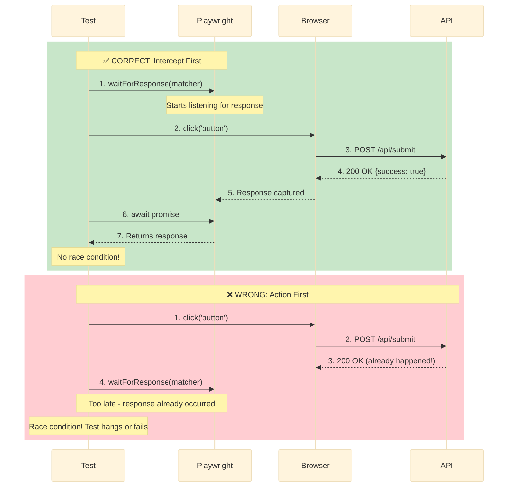

# Network-First Patterns Explained

Network-first patterns are TEA's solution to test flakiness. Instead of guessing how long to wait with fixed timeouts, wait for the actual network event that causes UI changes.

## Overview

**The Core Principle:**
UI changes because APIs respond. Wait for the API response, not an arbitrary timeout.

**Traditional approach:**
```typescript
await page.click('button');
await page.waitForTimeout(3000);  // Hope 3 seconds is enough
await expect(page.locator('.success')).toBeVisible();
```

**Network-first approach:**
```typescript
const responsePromise = page.waitForResponse(
  resp => resp.url().includes('/api/submit') && resp.ok()
);
await page.click('button');
await responsePromise;  // Wait for actual response
await expect(page.locator('.success')).toBeVisible();
```

**Result:** Deterministic tests that wait exactly as long as needed.

## The Problem

### Hard Waits Create Flakiness

```typescript
// ❌ The flaky test pattern
test('should submit form', async ({ page }) => {
  await page.fill('#name', 'Test User');
  await page.click('button[type="submit"]');

  await page.waitForTimeout(2000);  // Wait 2 seconds

  await expect(page.locator('.success')).toBeVisible();
});
```

**Why this fails:**
- **Fast network:** Wastes 1.5 seconds waiting
- **Slow network:** Not enough time, test fails
- **CI environment:** Slower than local, fails randomly
- **Under load:** API takes 3 seconds, test fails

**Result:** "Works on my machine" syndrome, flaky CI.

### The Timeout Escalation Trap

```typescript
// Developer sees flaky test
await page.waitForTimeout(2000);  // Failed in CI

// Increases timeout
await page.waitForTimeout(5000);  // Still fails sometimes

// Increases again
await page.waitForTimeout(10000);  // Now it passes... slowly

// Problem: Now EVERY test waits 10 seconds
// Suite that took 5 minutes now takes 30 minutes
```

**Result:** Slow, still-flaky tests.

### Race Conditions

```typescript
// ❌ Navigate-then-wait race condition
test('should load dashboard data', async ({ page }) => {
  await page.goto('/dashboard');  // Navigation starts

  // Race condition! API might not have responded yet
  await expect(page.locator('.data-table')).toBeVisible();
});
```

**What happens:**
1. `goto()` starts navigation
2. Page loads HTML
3. JavaScript requests `/api/dashboard`
4. Test checks for `.data-table` BEFORE API responds
5. Test fails intermittently

**Result:** "Sometimes it works, sometimes it doesn't."

## The Solution: Intercept-Before-Navigate

### Wait for Response Before Asserting

```typescript
// ✅ Good: Network-first pattern
test('should load dashboard data', async ({ page }) => {
  // Set up promise BEFORE navigation
  const dashboardPromise = page.waitForResponse(
    resp => resp.url().includes('/api/dashboard') && resp.ok()
  );

  // Navigate
  await page.goto('/dashboard');

  // Wait for API response
  const response = await dashboardPromise;
  const data = await response.json();

  // Now assert UI
  await expect(page.locator('.data-table')).toBeVisible();
  await expect(page.locator('.data-table tr')).toHaveCount(data.items.length);
});
```

**Why this works:**
- Wait set up BEFORE navigation (no race)
- Wait for actual API response (deterministic)
- No fixed timeout (fast when API is fast)
- Validates API response (catch backend errors)

### Intercept-Before-Navigate Pattern

**Key insight:** Set up wait BEFORE triggering the action.

```typescript
// ✅ Pattern: Intercept → Action → Await

// 1. Intercept (set up wait)
const promise = page.waitForResponse(matcher);

// 2. Action (trigger request)
await page.click('button');

// 3. Await (wait for actual response)
await promise;
```

**Why this order:**
- `waitForResponse()` starts listening immediately
- Then trigger the action that makes the request
- Then wait for the promise to resolve
- No race condition possible

#### Intercept-Before-Navigate Flow



**Correct Order (Green):**
1. Set up listener (`waitForResponse`)
2. Trigger action (`click`)
3. Wait for response (`await promise`)

**Wrong Order (Red):**
1. Trigger action first
2. Set up listener too late
3. Response already happened - missed!

## How It Works in TEA

### TEA Generates Network-First Tests

```typescript
// When you run *atdd or *automate, TEA generates:

test('should create user', async ({ page }) => {
  // TEA automatically includes network wait
  const createUserPromise = page.waitForResponse(
    resp => resp.url().includes('/api/users') &&
            resp.request().method() === 'POST' &&
            resp.ok()
  );

  await page.fill('#name', 'Test User');
  await page.click('button[type="submit"]');

  const response = await createUserPromise;
  const user = await response.json();

  // Validate both API and UI
  expect(user.id).toBeDefined();
  await expect(page.locator('.success')).toContainText(user.name);
});
```

### TEA Reviews for Hard Waits

When you run `*test-review`:

```markdown
## Critical Issue: Hard Wait Detected

**File:** tests/e2e/submit.spec.ts:45
**Issue:** Using `page.waitForTimeout(3000)`
**Severity:** Critical (causes flakiness)

**Current Code:**
```typescript
await page.click('button');
await page.waitForTimeout(3000);  // ❌
```

**Fix:**
```typescript
const responsePromise = page.waitForResponse(
  resp => resp.url().includes('/api/submit') && resp.ok()
);
await page.click('button');
await responsePromise;  // ✅
```

**Why:** Hard waits are non-deterministic. Use network-first patterns.
```

## Pattern Variations

### Basic Response Wait

```typescript
// Wait for any successful response
const promise = page.waitForResponse(resp => resp.ok());
await page.click('button');
await promise;
```

### Specific URL Match

```typescript
// Wait for specific endpoint
const promise = page.waitForResponse(
  resp => resp.url().includes('/api/users/123')
);
await page.goto('/user/123');
await promise;
```

### Method + Status Match

```typescript
// Wait for POST that returns 201
const promise = page.waitForResponse(
  resp =>
    resp.url().includes('/api/users') &&
    resp.request().method() === 'POST' &&
    resp.status() === 201
);
await page.click('button[type="submit"]');
await promise;
```

### Multiple Responses

```typescript
// Wait for multiple API calls
const [usersResp, postsResp] = await Promise.all([
  page.waitForResponse(resp => resp.url().includes('/api/users')),
  page.waitForResponse(resp => resp.url().includes('/api/posts')),
  page.goto('/dashboard')  // Triggers both requests
]);

const users = await usersResp.json();
const posts = await postsResp.json();
```

### Validate Response Data

```typescript
// Verify API response before asserting UI
const promise = page.waitForResponse(
  resp => resp.url().includes('/api/checkout') && resp.ok()
);

await page.click('button:has-text("Complete Order")');

const response = await promise;
const order = await response.json();

// Response validation
expect(order.status).toBe('confirmed');
expect(order.total).toBeGreaterThan(0);

// UI validation
await expect(page.locator('.order-confirmation')).toContainText(order.id);
```

## Advanced Patterns

### HAR Recording for Offline Testing

**Vanilla Playwright (Manual HAR Handling):**
```typescript
test('offline testing', async ({ page, context }) => {
  // Record mode: Save HAR manually
  await context.routeFromHAR('./hars/dashboard.har', {
    url: '**/api/**',
    update: true  // Update HAR file
  });

  await page.goto('/dashboard');

  // Playback: Load HAR manually
  await context.routeFromHAR('./hars/dashboard.har', {
    url: '**/api/**',
    update: false  // Use existing HAR
  });
});
```

**With Playwright Utils (Automatic HAR Management):**
```typescript
import { test } from '@seontechnologies/playwright-utils/network-recorder/fixtures';

// Record mode: Set environment variable
process.env.PW_NET_MODE = 'record';

test('should work offline', async ({ page, context, networkRecorder }) => {
  await networkRecorder.setup(context);  // Handles HAR automatically

  await page.goto('/dashboard');
  await page.click('#add-item');
  // All network traffic recorded, CRUD operations detected
});
```

**Switch to playback:**
```bash
# Playback mode (offline)
PW_NET_MODE=playback npx playwright test
# Uses HAR file, no backend needed!
```

**Playwright Utils Benefits:**
- Automatic HAR file management (naming, paths)
- CRUD operation detection (stateful mocking)
- Environment variable control (easy switching)
- Works for complex interactions (create, update, delete)
- No manual route configuration

### Network Request Interception

**Vanilla Playwright:**
```typescript
test('should handle API error', async ({ page }) => {
  // Manual route setup
  await page.route('**/api/users', (route) => {
    route.fulfill({
      status: 500,
      body: JSON.stringify({ error: 'Internal server error' })
    });
  });

  await page.goto('/users');

  const response = await page.waitForResponse('**/api/users');
  const error = await response.json();

  expect(error.error).toContain('Internal server');
  await expect(page.locator('.error-message')).toContainText('Server error');
});
```

**With Playwright Utils:**
```typescript
import { test } from '@seontechnologies/playwright-utils/fixtures';

test('should handle API error', async ({ page, interceptNetworkCall }) => {
  // Stub API to return error (set up BEFORE navigation)
  const usersCall = interceptNetworkCall({
    method: 'GET',
    url: '**/api/users',
    fulfillResponse: {
      status: 500,
      body: { error: 'Internal server error' }
    }
  });

  await page.goto('/users');

  // Wait for mocked response and access parsed data
  const { status, responseJson } = await usersCall;

  expect(status).toBe(500);
  expect(responseJson.error).toContain('Internal server');
  await expect(page.locator('.error-message')).toContainText('Server error');
});
```

**Playwright Utils Benefits:**
- Automatic JSON parsing (`responseJson` ready to use)
- Returns promise with `{ status, responseJson, requestJson }`
- No need to pass `page` (auto-injected by fixture)
- Glob pattern matching (simpler than regex)
- Single declarative call (setup + wait in one)

## Comparison: Traditional vs Network-First

### Loading Dashboard Data

**Traditional (Flaky):**
```typescript
test('dashboard loads data', async ({ page }) => {
  await page.goto('/dashboard');
  await page.waitForTimeout(2000);  // ❌ Magic number
  await expect(page.locator('table tr')).toHaveCount(5);
});
```

**Failure modes:**
- API takes 2.5s → test fails
- API returns 3 items not 5 → hard to debug (which issue?)
- CI slower than local → fails in CI only

**Network-First (Deterministic):**
```typescript
test('dashboard loads data', async ({ page }) => {
  const apiPromise = page.waitForResponse(
    resp => resp.url().includes('/api/dashboard') && resp.ok()
  );

  await page.goto('/dashboard');

  const response = await apiPromise;
  const { items } = await response.json();

  // Validate API response
  expect(items).toHaveLength(5);

  // Validate UI matches API
  await expect(page.locator('table tr')).toHaveCount(items.length);
});
```

**Benefits:**
- Waits exactly as long as needed (100ms or 5s, doesn't matter)
- Validates API response (catch backend errors)
- Validates UI matches API (catch frontend bugs)
- Works in any environment (local, CI, staging)

### Form Submission

**Traditional (Flaky):**
```typescript
test('form submission', async ({ page }) => {
  await page.fill('#email', 'test@example.com');
  await page.click('button[type="submit"]');
  await page.waitForTimeout(3000);  // ❌ Hope it's enough
  await expect(page.locator('.success')).toBeVisible();
});
```

**Network-First (Deterministic):**
```typescript
test('form submission', async ({ page }) => {
  const submitPromise = page.waitForResponse(
    resp => resp.url().includes('/api/submit') &&
            resp.request().method() === 'POST' &&
            resp.ok()
  );

  await page.fill('#email', 'test@example.com');
  await page.click('button[type="submit"]');

  const response = await submitPromise;
  const result = await response.json();

  expect(result.success).toBe(true);
  await expect(page.locator('.success')).toBeVisible();
});
```

## Common Misconceptions

### "I Already Use waitForSelector"

```typescript
// This is still a hard wait in disguise
await page.click('button');
await page.waitForSelector('.success', { timeout: 5000 });
```

**Problem:** Waiting for DOM, not for the API that caused DOM change.

**Better:**
```typescript
await page.waitForResponse(matcher);  // Wait for root cause
await page.waitForSelector('.success');  // Then validate UI
```

### "My Tests Are Fast, Why Add Complexity?"

**Short-term:** Tests are fast locally

**Long-term problems:**
- Different environments (CI slower)
- Under load (API slower)
- Network variability (random)
- Scaling test suite (100 → 1000 tests)

**Network-first prevents these issues before they appear.**

### "Too Much Boilerplate"

**Solution:** Extract to fixtures (see Fixture Architecture)

```typescript
// Create reusable fixture
export const test = base.extend({
  waitForApi: async ({ page }, use) => {
    await use((urlPattern: string) => {
      // Returns promise immediately (doesn't await)
      return page.waitForResponse(
        resp => resp.url().includes(urlPattern) && resp.ok()
      );
    });
  }
});

// Use in tests
test('test', async ({ page, waitForApi }) => {
  const promise = waitForApi('/api/submit');  // Get promise
  await page.click('button');  // Trigger action
  await promise;  // Wait for response
});
```

## Technical Implementation

For detailed network-first patterns, see the knowledge base:
- [Knowledge Base Index - Network & Reliability](/docs/reference/tea/knowledge-base.md)
- [Complete Knowledge Base Index](/docs/reference/tea/knowledge-base.md)

## Related Concepts

**Core TEA Concepts:**
- [Test Quality Standards](/docs/explanation/tea/test-quality-standards.md) - Determinism requires network-first
- [Risk-Based Testing](/docs/explanation/tea/risk-based-testing.md) - High-risk features need reliable tests

**Technical Patterns:**
- [Fixture Architecture](/docs/explanation/tea/fixture-architecture.md) - Network utilities as fixtures
- [Knowledge Base System](/docs/explanation/tea/knowledge-base-system.md) - Network patterns in knowledge base

**Overview:**
- [TEA Overview](/docs/explanation/features/tea-overview.md) - Network-first in workflows
- [Testing as Engineering](/docs/explanation/philosophy/testing-as-engineering.md) - Why flakiness matters

## Practical Guides

**Workflow Guides:**
- [How to Run Test Review](/docs/how-to/workflows/run-test-review.md) - Review for hard waits
- [How to Run ATDD](/docs/how-to/workflows/run-atdd.md) - Generate network-first tests
- [How to Run Automate](/docs/how-to/workflows/run-automate.md) - Expand with network patterns

**Use-Case Guides:**
- [Using TEA with Existing Tests](/docs/how-to/brownfield/use-tea-with-existing-tests.md) - Fix flaky legacy tests

**Customization:**
- [Integrate Playwright Utils](/docs/how-to/customization/integrate-playwright-utils.md) - Network utilities (recorder, interceptor, error monitor)

## Reference

- [TEA Command Reference](/docs/reference/tea/commands.md) - All workflows use network-first
- [Knowledge Base Index](/docs/reference/tea/knowledge-base.md) - Network-first fragment
- [Glossary](/docs/reference/glossary/index.md#test-architect-tea-concepts) - Network-first pattern term

---

Generated with [BMad Method](https://bmad-method.org) - TEA (Test Architect)
