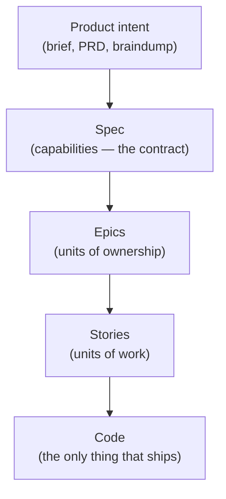
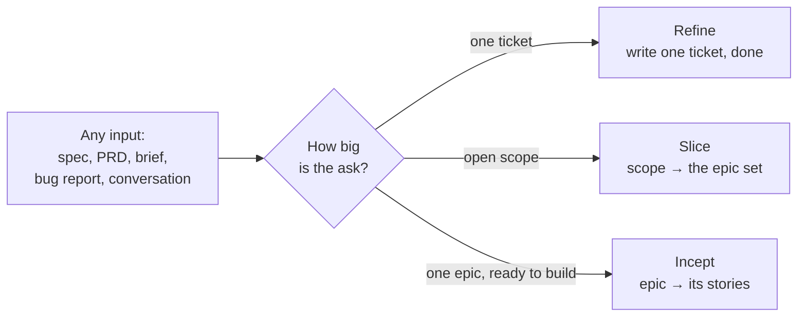
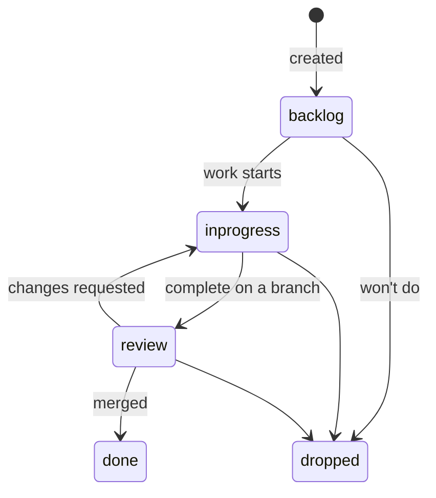
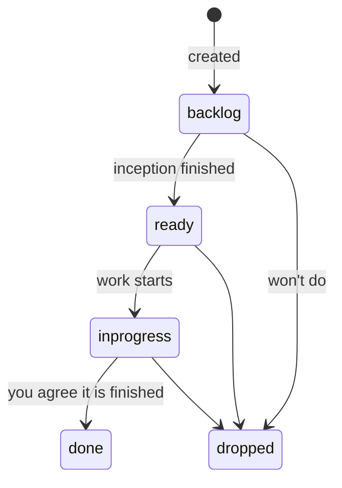
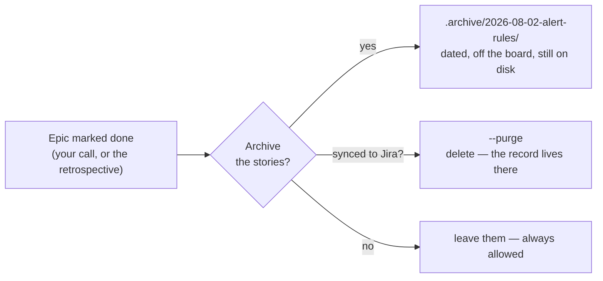

A ticket is a package of context: everything an AI agent needs to build one piece of work without guessing. This page explains how BMad thinks about tickets and specs, what the ticket tree is, and — most importantly — what *your* job is when you and the LLM write them together.

:::tip[Quick Path]
Say "turn this PRD into epics" or "make me a ticket" and `bmad-ticket` takes it from there. Everything below explains what happens and why.
:::

## The big idea: plans rot, records don't

There are two kinds of written plans:

- **Checked writing** stays true. A test suite, an API contract, a status field a script validates — when reality moves, something breaks loudly and gets fixed.
- **Unchecked writing** rots. A long prose document that "someone will keep updated" never gets updated. Nobody notices until an agent builds from stale instructions.

BMad's ticketing is built on that split. While work is open, the parts that matter are **checked by scripts**: status can only move along legal paths, dependencies can't form loops, and requirement coverage is computed, never guessed. Once work is merged, the story's prose is no longer checked by anything — so BMad stops pretending it's still true. A finished story becomes a **dated record of a moment**, not a document to maintain forever.

## Altitudes: the same question at different heights

Planning happens at altitudes. Each one answers "what are we building?" at a different zoom level.



- A **spec** (`bmad-spec`) locks the *what* into numbered capabilities (CAP-1, CAP-2...). It can sit at **feature level** (one spec for a whole feature area) or at **epic level** (a focused spec for one epic, written right before its stories).
- An **epic** is the single-person unit of work: one developer drives it to completion with AI as the workforce. Its envelope carries the goals, the reasoning, and which requirement ids it covers.
- A **story** is a vertical slice: a narrow but complete path through every layer, demoable on its own, with acceptance criteria a fresh agent can verify.

You don't need every altitude every time. A bug report can become one ticket in two minutes. A full PRD can become an epic set. The input decides the altitude — not a ritual.

## The ticket tree

All tickets live in one folder structure called the ticket tree. The shape *is* the data:

```text
.bmad-obeya/                         # the work store — the default home for tickets
├── ticket.md                        # the initiative node — carries the key (optional)
└── tickets/
    ├── alert-rules/                 # an epic is a folder
    │   ├── ticket.md                # the epic node
    │   └── tickets/                 # its children
    │       └── ALRT-12-rule-crud.md # a story (or bug, task, spike)
    ├── ALRT-31-snooze-button.md     # a one-off ticket — no epic needed
    └── .archive/                    # finished stories, filed by date
```

A node is a folder holding its own `ticket.md`, and its children live in `<node>/tickets/`. That shape repeats at every altitude, so depth is never a special case — and a tree of nothing but loose tickets is a legitimate shape, not a broken one.

The store sits at `.bmad-obeya/` in the project root out of the box, so your first ticket has somewhere to land with nothing configured. It is a config value (`project_root` in the skill's `customize.toml`): point it at a docs folder or a dedicated work-store repo and nothing about the shape changes.

Four rules keep it honest:

- **One stored fact.** A ticket stores exactly one piece of state: its `status`. Everything else — what's blocked, what's next, how far an epic has gotten — is computed by a script that scans the tree. There is no status spreadsheet to drift out of date.
- **The folder is the parent.** A story belongs to an epic because it sits in the epic's folder. No parent field, no list of children, so two agents never fight over a shared file.
- **The folder is also the listing.** There is no index file to keep current. Ask for one and a script renders it on demand; nothing depends on it.
- **Scripts guard the writes.** Status changes go through a gate script that only allows legal moves. You can override it deliberately — you can never corrupt it accidentally.

## Three ways in

`bmad-ticket` has three routes. The cheap exit always comes first.



- **Refine** — "make me a ticket for this fix." One file, minimal ceremony. Bugs, tasks, spikes, and one-off stories all land here.
- **Slice** — open scope in, a detailed epic set out. Each envelope gets a description, goals, and the requirement ids it covers. **Slice stops at epics.** No stories yet.
- **Incept** — one epic in, its stories out. Run it when that epic's work is about to begin.

**Why stop at epics?** Stories written months early get rewritten when reality moves. Writing them just-in-time folds in everything learned since slicing — including detail a product manager added to the envelope along the way. And if you need estimates before stories exist, the epic envelope already carries enough to T-shirt size the set. Ask for it.

Any artifact works as input at any route: a `bmad-spec` output (its CAP ids are carried into `covers:` unchanged), a PRD with FR ids, an imported doc with REQ ids, a pasted bug report, or just the conversation you're having.

## Your job as the human partner

The LLM holds the craft of shaping tickets. **You hold the product truth.** Quality comes from the partnership, and the skill is built around specific moments where your judgment is the whole point:

- **The open floor.** At the start, dump everything — docs, constraints, prior decisions, preferences. The more you bring, the better the set. This replaces twenty questions later.
- **The skeleton.** Before anything expensive is written, you see each planned item as a title, a one-line summary, and what it covers. Reshape the set *here* — changing a title costs nothing; changing five finished stories costs everything.
- **The gate.** Nothing is written to disk until you approve the set. Interrogate it: are the boundaries right? Is every dependency real? Should anything merge or split?
- **Push back — and expect push-back.** If your guidance contradicts the source document or itself, the skill is instructed to talk it through with you, not silently comply. Do the same in return. Reviews run before you ever see a draft (adversarial, edge-case, and verification-gap lenses), but automated review is a floor, not a ceiling. You are the last reviewer.

:::caution[The floors are not negotiable by the machine]
Work touching migrations, data deletion, auth, or payments always gets risk 4+ and `hitl: true` (human-in-the-loop) in anything the skill proposes on its own. You can override any score deliberately — the point is that an autonomous run can never quietly mark dangerous work as safe.
:::

## The life of a ticket



`done` means **merged** — not "looks finished." A ticket becomes workable only when everything it depends on is done. Illegal moves are refused by the gate script with the legal options named; if you really mean it, an explicit override (`--force`) applies your decision — but made-up statuses are refused always.

**Epics and projects run a different lifecycle.** They have no `review` — nothing is "complete on a branch" at that size. They have `ready` instead:



`ready` means the epic's stories exist and work can start. It is a record, not a gate — an epic nobody marked ready still blocks nothing, and if you want to start on it anyway, you start on it.

Every one of those moves is stored, and none of them is ever calculated from the children. That is the deliberate part. An epic is done because a person looked at the outcome and agreed, not because a counter hit zero — which also means `done` can never quietly flip back when someone adds a story next week, and archiving stays safe.

What *is* computed is progress: three of five children done, which stories are blocked, what is workable now. Ask `board` and it works that out fresh every time. Progress is information about an epic. It is not the epic's state.

## When an epic is done: archive the stories

The moment `done` lands on an epic, the skill offers to archive its stories:



Why archive? A merged story's prose is unchecked writing now — keeping it on the board invites someone to trust it later. Archived stories move to a dated dot-folder: off every board and query, out of an agent's way, but still on disk if you ever need the history. The **epic envelope stays** — it's small, durable, and carries the coverage trail. Their ids are never reused.

It's always an offer, never automatic. Keeping full history live is a legitimate choice, especially when the tree lives in its own repo.

## Everyday commands

You don't memorize scripts — you ask. These map to deterministic verbs under the hood:

| You say                              | What happens                                                          |
| ------------------------------------ | --------------------------------------------------------------------- |
| "Move ALRT-12 to review"             | The gate script applies the status change, or names the legal moves    |
| "What should I work on next?"        | `frontier` — tickets whose dependencies are all done                   |
| "Where are we overall?"              | `board` — epic states, counts, and what's blocked on what              |
| "Optimize the sequencing"            | `graph` — dependency diagram, parallel lanes, the critical path        |
| "Did we cover every requirement?"    | `coverage` — every id lands on a ticket, or is named as parked         |
| "Give me one file to share"          | `render` — a single generated epics-and-stories view (the tree stays the source of truth) |
| "The epic's done — clean up"         | `archive` — stories become the dated record                            |

Every answer comes from scanning the tree at that moment. Nothing is a cached report that could be stale.

## Coming from v6

`bmad-create-epics-and-stories` still works — it forwards here, recommends the just-in-time path, and honors the old all-stories-up-front shape if you still want it (built as a real tree, then rendered to the familiar single file). `sprint-status.yaml` keeps serving stories already in flight, but never tracks net-new work. Migrating mid-project is per-epic: finish in-flight epics where they are, and run each *new* epic through inception into the tree.
