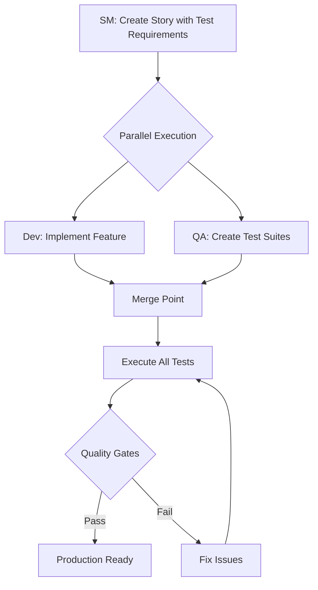
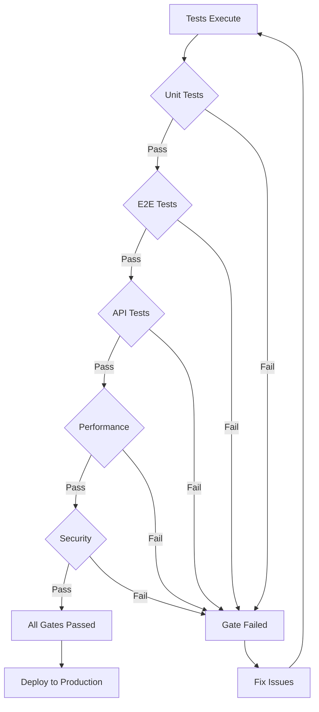

# Production QA Enhancement Guide

## Overview

The Production QA Enhancement transforms BMAD from a development framework into a complete enterprise software delivery platform with comprehensive testing automation. This guide explains everything you need to know about using Production QA alongside traditional BMAD.

## Table of Contents

1. [Quick Start](#quick-start)
2. [Architecture Overview](#architecture-overview)
3. [Production QA Agents](#production-qa-agents)
4. [Traditional vs Production QA](#traditional-vs-production-qa)
5. [Workflow Comparison](#workflow-comparison)
6. [Implementation Guide](#implementation-guide)
7. [Testing Framework Support](#testing-framework-support)
8. [Quality Gates](#quality-gates)
9. [CI/CD Integration](#cicd-integration)
10. [Best Practices](#best-practices)
11. [Troubleshooting](#troubleshooting)

## Quick Start

### Installation
Production QA is already integrated into this fork. No additional installation needed!

### Basic Usage

```bash
# 1. Initialize testing infrastructure (one-time setup)
@qa-test-engineer
*setup-testing-framework

# 2. Create stories with integrated QA
@sm *draft  # Stories now include test requirements automatically

# 3. Parallel development and testing
# Terminal 1:
@dev *implement docs/stories/1.1.story.md

# Terminal 2:
@qa-test-engineer *create-e2e-tests docs/stories/1.1.story.md
@qa-test-engineer *create-api-tests docs/stories/1.1.story.md

# 4. Execute tests and quality gates
@qa-test-engineer *execute-tests
@qa-test-lead *evaluate-quality-gates
```

## Architecture Overview

### How Production QA Integrates with BMAD

```
Traditional BMAD Core (Preserved)
    ├── Original Agents (SM, Dev, QA/Quinn, etc.)
    ├── Original Workflows
    └── Original Tasks

Production QA Expansion Pack (Added)
    ├── Specialized QA Agents (4 new agents)
    ├── Enhanced Tasks (create-next-story-with-qa)
    ├── Test Automation Workflows
    └── Quality Gate System
```

### Key Integration Points

1. **Story Creation Enhanced** - SM agent now uses `create-next-story-with-qa` task
2. **Parallel Workflows** - Dev and QA work simultaneously
3. **Quality Gates** - Automated pass/fail before production
4. **Tool Agnostic** - Works with any testing framework

## Production QA Agents

### 🧪 QA Test Engineer (Alex)
**Role**: Hands-on test automation specialist

**Capabilities**:
- Creates E2E test suites (Playwright, Cypress, Selenium)
- Develops API test collections (Bruno, Postman, REST Client)
- Implements integration tests
- Sets up testing frameworks
- Generates test data and fixtures

**Key Commands**:
```bash
*create-e2e-tests {story}        # Generate E2E test suite
*create-api-tests {story}        # Generate API test collection
*setup-testing-framework         # Initialize testing infrastructure
*analyze-test-coverage          # Review coverage metrics
```

### ⚡ Performance Engineer (Morgan)
**Role**: Performance and scalability testing expert

**Capabilities**:
- Creates load testing scenarios (k6, Artillery, JMeter)
- Implements stress and spike tests
- Establishes performance baselines
- Capacity planning and analysis

**Key Commands**:
```bash
*create-load-test {story}        # Generate load test scenarios
*create-stress-test {story}      # Create stress test scenarios
*analyze-performance-baseline    # Establish performance baseline
*create-capacity-plan           # Generate capacity analysis
```

### 🔒 Security Engineer (Riley)
**Role**: Security testing and vulnerability assessment specialist

**Capabilities**:
- Comprehensive security scanning (OWASP ZAP)
- Vulnerability assessments
- OWASP Top 10 compliance validation
- Dependency security scanning (Snyk)
- Penetration testing scenarios

**Key Commands**:
```bash
*security-scan {story}           # Perform security scan
*vulnerability-assessment        # Conduct vulnerability assessment
*owasp-compliance-check         # Validate OWASP compliance
*dependency-security-scan       # Scan dependencies
```

### 🎯 QA Test Lead (Jordan)
**Role**: Strategic QA coordination and oversight

**Capabilities**:
- Creates comprehensive test strategies
- Manages quality gates and criteria
- Coordinates all testing activities
- Generates quality reports and metrics

**Key Commands**:
```bash
*create-test-strategy           # Generate test strategy
*create-quality-gates           # Define quality gates
*coordinate-testing             # Manage testing activities
*create-test-reports           # Generate quality reports
```

## Traditional vs Production QA

### Comparison Table

| Aspect | Traditional BMAD (Quinn) | Production QA Enhancement |
|--------|-------------------------|--------------------------|
| **Purpose** | Advisory & Guidance | Implementation & Automation |
| **Test Creation** | Recommends what to test | Creates actual test code |
| **Quality Gates** | Advisory gates | Automated pass/fail gates |
| **Workflow** | Sequential (Dev → QA) | Parallel (Dev + QA) |
| **Tools** | Tool recommendations | Tool implementation |
| **Coverage** | Strategic coverage advice | Measurable coverage metrics |
| **Best For** | MVPs, Prototypes | Production, Enterprise |

### When to Use Each

**Use Traditional BMAD When**:
- Rapid prototyping
- MVP development
- Small teams
- Learning projects
- Advisory guidance sufficient

**Use Production QA When**:
- Enterprise applications
- Regulated industries
- High quality requirements
- Team has dedicated QA
- Automated testing needed

## Workflow Comparison

### Traditional BMAD Workflow


### Production QA Enhanced Workflow


## Implementation Guide

### Step 1: Project Setup

```bash
# 1. Install BMAD with Production QA (already done in this fork)
git clone https://github.com/papuman/BMAD-METHOD.git

# 2. Initialize your project
cd your-project
npx bmad-method install
```

### Step 2: Configure Testing Strategy

```bash
# Activate QA Test Lead
@qa-test-lead

# Create comprehensive test strategy
*create-test-strategy

# This generates:
# - docs/test-strategy.md
# - Quality gate definitions
# - Testing approach per epic
```

### Step 3: Setup Testing Infrastructure

```bash
# Activate QA Test Engineer
@qa-test-engineer

# Initialize testing framework
*setup-testing-framework

# You'll be asked to choose:
# - E2E Framework (Playwright, Cypress, etc.)
# - API Testing Tool (Bruno, Postman, etc.)
# - Performance Tool (k6, Artillery, etc.)
# - Security Scanner (OWASP ZAP, Snyk, etc.)
```

### Step 4: Enhanced Story Creation

```bash
# Stories now include test requirements automatically
@sm *draft

# Generated story includes:
# - Standard story elements
# - E2E test scenarios
# - API test requirements
# - Performance criteria
# - Security considerations
```

### Step 5: Parallel Development

```bash
# Development track
@dev *implement docs/stories/1.1.story.md

# Testing track (simultaneously)
@qa-test-engineer *create-e2e-tests docs/stories/1.1.story.md
@qa-performance-engineer *create-load-test docs/stories/1.1.story.md
@qa-security-engineer *security-scan docs/stories/1.1.story.md
```

## Testing Framework Support

### E2E Testing Frameworks

**Playwright** (Recommended)
```javascript
// Generated test example
test('User Login Flow', async ({ page }) => {
  await page.goto('/login');
  await page.fill('[data-testid="email"]', 'user@example.com');
  await page.fill('[data-testid="password"]', 'password');
  await page.click('[data-testid="submit"]');
  await expect(page).toHaveURL('/dashboard');
});
```

**Cypress**
```javascript
// Generated test example
describe('User Login Flow', () => {
  it('should login successfully', () => {
    cy.visit('/login');
    cy.get('[data-testid="email"]').type('user@example.com');
    cy.get('[data-testid="password"]').type('password');
    cy.get('[data-testid="submit"]').click();
    cy.url().should('include', '/dashboard');
  });
});
```

### API Testing Tools

**Bruno** (Git-friendly)
```yaml
# Generated collection
name: User API Tests
requests:
  - name: Login
    method: POST
    url: {{baseUrl}}/api/auth/login
    body:
      email: user@example.com
      password: password
    tests:
      - status: 200
      - body.token: exists
```

### Performance Testing

**k6** (JavaScript-based)
```javascript
// Generated load test
import http from 'k6/http';
import { check } from 'k6';

export const options = {
  stages: [
    { duration: '2m', target: 100 },
    { duration: '5m', target: 100 },
    { duration: '2m', target: 0 },
  ],
};

export default function() {
  const res = http.get('https://api.example.com/');
  check(res, { 'status is 200': (r) => r.status === 200 });
}
```

## Quality Gates

### Automated Quality Gate Criteria

```yaml
quality_gates:
  unit_tests:
    coverage: ">= 80%"
    passing: "100%"

  e2e_tests:
    passing: "100%"
    critical_paths: "100% coverage"

  api_tests:
    passing: "100%"
    response_time: "< 2s"

  performance:
    response_time_p95: "< 3s"
    error_rate: "< 1%"
    concurrent_users: ">= 100"

  security:
    critical_vulnerabilities: 0
    high_vulnerabilities: "< 3"
    owasp_compliance: "pass"

  accessibility:
    wcag_level: "AA"
    lighthouse_score: ">= 90"
```

### Quality Gate Workflow



## CI/CD Integration

### GitHub Actions Workflow

```yaml
# .github/workflows/production-qa.yml
name: Production QA Pipeline
on: [push, pull_request]

jobs:
  test:
    runs-on: ubuntu-latest
    steps:
      - uses: actions/checkout@v4

      - name: Setup Node.js
        uses: actions/setup-node@v4
        with:
          node-version: '20'

      - name: Install dependencies
        run: npm ci

      - name: Run unit tests
        run: npm run test:unit

      - name: Run E2E tests
        run: npm run test:e2e

      - name: Run API tests
        run: npm run test:api

      - name: Run security scan
        run: npm run test:security

      - name: Evaluate quality gates
        run: npm run quality-gates

      - name: Upload test reports
        uses: actions/upload-artifact@v4
        with:
          name: test-reports
          path: test-reports/
```

## Best Practices

### 1. Story Creation
- Always use `@sm *draft` for QA-integrated stories
- Review test requirements before development starts
- Ensure acceptance criteria are testable

### 2. Test Development
- Create tests in parallel with feature development
- Start with happy path scenarios
- Add edge cases and error handling
- Keep test data separate from test logic

### 3. Quality Management
- Run tests locally before committing
- Fix failing tests immediately
- Maintain coverage above thresholds
- Review performance impacts regularly

### 4. Tool Selection
- Choose tools your team knows
- Prioritize maintainability over features
- Use consistent patterns across test types
- Document tool decisions

## Troubleshooting

### Common Issues and Solutions

**Issue: Tests not generating**
```bash
# Solution 1: Ensure story file exists
ls docs/stories/

# Solution 2: Check expansion pack is loaded
ls expansion-packs/bmad-production-qa/

# Solution 3: Verify agent can access story
@qa-test-engineer
*create-e2e-tests docs/stories/1.1.story.md
```

**Issue: Quality gates failing**
```bash
# Check test results
cat test-reports/quality-gate-report.md

# Review specific failures
npm run test:e2e -- --verbose

# Check coverage
npm run test:coverage
```

**Issue: Framework not recognized**
```bash
# Reinitialize framework
@qa-test-engineer
*setup-testing-framework

# Manually install if needed
npm install --save-dev playwright
```

## Advanced Topics

### Custom Quality Gates

```javascript
// custom-gates.js
module.exports = {
  customGates: {
    performance: {
      ttfb: '<500ms',
      fcp: '<1s',
      lcp: '<2.5s'
    },
    bundle: {
      size: '<500kb',
      gzip: '<150kb'
    }
  }
};
```

### Test Data Management

```javascript
// test-data/users.js
export const testUsers = {
  admin: {
    email: 'admin@test.com',
    password: process.env.TEST_ADMIN_PASSWORD
  },
  user: {
    email: 'user@test.com',
    password: process.env.TEST_USER_PASSWORD
  }
};
```

### Parallel Test Execution

```bash
# Run tests in parallel
npm run test:e2e -- --workers=4

# Run specific test suites in parallel
npm run test:e2e:auth &
npm run test:e2e:dashboard &
npm run test:e2e:api &
wait
```

## Migration Guide

### From Traditional BMAD to Production QA

1. **Keep existing workflow** - Traditional BMAD still works
2. **Add testing gradually** - Start with one story
3. **Choose tools wisely** - Pick what team knows
4. **Train team** - Share this guide
5. **Monitor metrics** - Track quality improvements

## Support and Resources

- **Expansion Pack Documentation**: [README](../expansion-packs/bmad-production-qa/README.md)
- **BMAD Core Documentation**: [User Guide](user-guide.md)
- **GitHub Issues**: Report bugs or request features
- **Community Discord**: Get help from other users

---

*Production QA Enhancement - Enterprise-grade testing for BMAD Method*