# BMAD JavaScript Full-Stack Expansion Pack - Complete Technical Guide

## Table of Contents
1. [Overview](#overview)
2. [Expansion Pack Architecture](#expansion-pack-architecture)
3. [Config.yaml - The Brain](#configyaml---the-brain)
4. [Agents - The Workers](#agents---the-workers)
5. [Agent Teams - Orchestrated Collaboration](#agent-teams---orchestrated-collaboration)
6. [Workflows - Execution Blueprints](#workflows---execution-blueprints)
7. [Tasks - Repeatable Procedures](#tasks---repeatable-procedures)
8. [Checklists - Quality Gates](#checklists---quality-gates)
9. [Templates - Document Scaffolds](#templates---document-scaffolds)
10. [Data Folder - Knowledge Base](#data-folder---knowledge-base)
11. [Parallel Development](#parallel-development)
12. [Complete Execution Flow](#complete-execution-flow)
13. [Real-World Examples](#real-world-examples)

---

## Overview

The **bmad-javascript-fullstack** expansion pack extends BMAD-METHOD with specialized capabilities for modern JavaScript/TypeScript full-stack development. It provides a complete ecosystem of agents, workflows, checklists, and knowledge for building React/Node.js applications.

### What is BMAD-METHOD?

BMAD (Business Model-Agile Development) METHOD is an AI-powered software development framework that uses specialized AI agents to guide development workflows from requirements to deployment.

### What is an Expansion Pack?

An expansion pack extends BMAD core functionality with:
- **Specialized Agents** - Domain-specific AI assistants
- **Workflows** - Guided multi-step processes
- **Templates** - Document scaffolds
- **Checklists** - Quality validation
- **Knowledge Base** - Best practices and guidelines


---

## Expansion Pack Architecture

### Directory Structure

```
bmad-javascript-fullstack/
├── config.yaml                    # Expansion pack configuration
├── agents/                        # AI agent definitions (5)
│   ├── js-solution-architect.md
│   ├── react-developer.md
│   ├── node-backend-developer.md
│   ├── api-developer.md
│   └── typescript-expert.md
├── agent-teams/                   # Team bundles (3)
│   ├── fullstack-team.yaml
│   ├── frontend-team.yaml
│   └── backend-team.yaml
├── workflows/                     # Process workflows (6)
│   ├── fullstack-greenfield.yaml
│   ├── feature-development.yaml
│   ├── frontend-app-development.yaml
│   ├── backend-api-development.yaml
│   ├── mvp-rapid-prototype.yaml
│   └── migration-to-typescript.yaml
├── tasks/                         # Reusable tasks (6)
│   ├── create-development-story.md
│   ├── create-architecture-doc.md
│   ├── create-api-spec.md
│   ├── setup-project.md
│   ├── code-review.md
│   └── performance-optimization.md
├── checklists/                    # Quality checklists (8)
│   ├── architecture-review-checklist.md
│   ├── frontend-checklist.md
│   ├── backend-checklist.md
│   ├── api-design-checklist.md
│   ├── security-checklist.md
│   ├── performance-checklist.md
│   ├── deployment-readiness-checklist.md
│   └── story-dod-checklist.md
├── templates/                     # Document templates (2)
│   ├── prd/
│   │   └── fullstack-javascript-prd.md
│   └── stories/
│       └── javascript-development-story.md
├── data/                          # Knowledge base (6)
│   ├── development-guidelines.md
│   ├── architecture-patterns.md
│   ├── best-practices.md
│   ├── technology-stack-guide.md
│   ├── security-guidelines.md
│   └── deployment-strategies.md
└── DOCUMENTATION/                 # User documentation
```

### Component Relationships


---

## Config.yaml - The Brain

The `config.yaml` is the **entry point** for the expansion pack. It tells BMAD Core what this pack contains and how to integrate it.

### Structure

```yaml
# Expansion pack metadata
name: bmad-javascript-fullstack
version: 1.0.1
short-title: JavaScript Full-Stack Dev Pack
description: >-
  Comprehensive expansion pack for modern JavaScript/TypeScript full-stack
  development. Specialized agents for React, Node.js, API design, and
  TypeScript expertise. Complete workflows from architecture to deployment.
author: BMAD Community
slashPrefix: bmadJSFullStack
```

### Key Fields Explained

| Field | Purpose | Example |
|-------|---------|---------|
| `name` | Unique identifier for the pack | `bmad-javascript-fullstack` |
| `version` | Semantic version | `1.0.1` |
| `short-title` | Display name in UI | `JavaScript Full-Stack Dev Pack` |
| `description` | What this pack provides | Multi-line description |
| `author` | Creator/maintainer | `BMAD Community` |
| `slashPrefix` | Command prefix for agents | `bmadJSFullStack` |

### How BMAD Uses config.yaml


### What Gets Registered

When BMAD loads the expansion pack via `config.yaml`:

1. **Agents** - All `.md` files in `agents/` folder
2. **Agent Teams** - All `.yaml` files in `agent-teams/` folder
3. **Workflows** - All `.yaml` files in `workflows/` folder
4. **Templates** - All files in `templates/` folder
5. **Checklists** - All files in `checklists/` folder
6. **Tasks** - All files in `tasks/` folder
7. **Data** - All files in `data/` folder as reference material

---

## Agents - The Workers

Agents are **specialized AI assistants** that handle specific types of work. Each agent has expertise in a domain.

### Agent Definition Structure

Agents are defined in Markdown files with YAML frontmatter:

```markdown
---
name: react-developer
icon: ⚛️
expertise:
  - React 18+ development
  - Next.js 14+ App Router
  - State management
  - Performance optimization
technologies:
  - React
  - Next.js
  - TypeScript
  - Tailwind CSS
---

# React Developer Agent

## Role
Frontend development specialist...

## Expertise
- React hooks and patterns
- Component architecture
- ...

## When to Use
- Building UI components
- ...
```

### The 5 Agents in This Pack

```mermaid
graph TB
    subgraph "JavaScript Expansion Pack Agents"
        ARCH[js-solution-architect<br/>🏗️ Architecture & Design]
        REACT[react-developer<br/>⚛️ Frontend Development]
        NODE[node-backend-developer<br/>🟢 Backend Development]
        API[api-developer<br/>🌐 API Design]
        TS[typescript-expert<br/>📘 Type Safety]
    end

    ARCH -->|Designs for| REACT
    ARCH -->|Designs for| NODE
    ARCH -->|Defines| API

    TS -->|Helps| REACT
    TS -->|Helps| NODE
    TS -->|Helps| API

    REACT -->|Calls| API
    NODE -->|Implements| API

    style ARCH fill:#ff6b6b,color:#fff
    style REACT fill:#4ecdc4,color:#fff
    style NODE fill:#95e1d3,color:#000
    style API fill:#f38181,color:#fff
    style TS fill:#546de5,color:#fff
```



#### 1. JS Solution Architect

**Purpose:** High-level architecture and technology decisions

**Responsibilities:**
- System architecture design
- Technology stack selection
- Database schema design
- Scalability planning
- Performance architecture
- Cloud infrastructure decisions

**When to Use:**
- Starting a new project
- Major architectural changes
- Technology evaluation
- System design reviews

**Example Interaction:**
```
User: I need to build a real-time collaboration platform with 10k users.
      What architecture should I use?

Agent: I recommend a microservices architecture with:
       - Frontend: Next.js 14 with React Server Components
       - Backend: NestJS with TypeScript
       - Database: PostgreSQL for relational data, Redis for sessions
       - Real-time: WebSocket with Socket.io
       - Deployment: Docker containers on AWS ECS

       [Detailed architecture document follows...]
```

#### 2. React Developer

**Purpose:** Frontend development with React

**Responsibilities:**
- Component development
- State management
- UI/UX implementation
- Performance optimization
- Accessibility
- Testing

**When to Use:**
- Building UI components
- State management decisions
- Frontend architecture
- Performance issues

#### 3. Node Backend Developer

**Purpose:** Server-side development

**Responsibilities:**
- API implementation
- Database operations
- Authentication/authorization
- Background jobs
- WebSocket/real-time
- Error handling

**When to Use:**
- API implementation
- Database design
- Authentication systems
- Background processing

#### 4. API Developer

**Purpose:** API design and contracts

**Responsibilities:**
- API contract design
- RESTful/GraphQL/tRPC design
- OpenAPI documentation
- Versioning strategies
- Rate limiting
- API security

**When to Use:**
- Designing API contracts
- API documentation
- Versioning decisions
- API best practices

#### 5. TypeScript Expert

**Purpose:** Advanced TypeScript and type safety

**Responsibilities:**
- Complex type definitions
- Generics and utility types
- JavaScript to TypeScript migration
- Type system architecture
- Configuration optimization

**When to Use:**
- Complex type problems
- JS to TS migration
- Type system design
- Advanced TypeScript patterns

### How to Use Agents

#### In Web UI (Chat Interface)
```
*react-developer

I need to build a data table component with sorting, filtering, and pagination.
```

#### In IDE (VS Code Extension)
```
@react-developer Build a sortable data table with these features...
```

#### In API/CLI
```bash
bmad-method invoke --agent react-developer --input "Build data table..."
```

---

## Agent Teams - Orchestrated Collaboration

Agent teams are **pre-configured bundles** that include multiple agents and workflows for specific scenarios.

### Team Structure (YAML)

```yaml
# <!-- Powered by BMAD™ Core -->
bundle:
  name: JavaScript Full-Stack Team
  icon: 🚀
  description: Complete team for full-stack development
agents:
  - analyst                  # From BMAD Core
  - bmad-orchestrator        # From BMAD Core
  - js-solution-architect    # From this pack
  - react-developer          # From this pack
  - node-backend-developer   # From this pack
  - api-developer            # From this pack
  - typescript-expert        # From this pack
workflows:
  - fullstack-greenfield.yaml
  - feature-development.yaml
  - mvp-rapid-prototype.yaml
```

### The 3 Teams in This Pack

```mermaid
graph TB
    subgraph "Full-Stack Team 🚀"
        FS1[analyst]
        FS2[bmad-orchestrator]
        FS3[js-solution-architect]
        FS4[react-developer]
        FS5[node-backend-developer]
        FS6[api-developer]
        FS7[typescript-expert]
    end

    subgraph "Frontend Team ⚛️"
        FE1[analyst]
        FE2[bmad-orchestrator]
        FE3[js-solution-architect]
        FE4[react-developer]
        FE5[typescript-expert]
    end

    subgraph "Backend Team 🟢"
        BE1[analyst]
        BE2[bmad-orchestrator]
        BE3[js-solution-architect]
        BE4[node-backend-developer]
        BE5[api-developer]
        BE6[typescript-expert]
    end

    style FS1 fill:#dfe4ea
    style FE1 fill:#dfe4ea
    style BE1 fill:#dfe4ea
```



### What Agent Teams Do

1. **Bundle Related Agents** - Group agents that work together
2. **Include Relevant Workflows** - Attach workflows for the team
3. **Simplify Selection** - Load entire team instead of individual agents
4. **Define Collaboration Patterns** - Show how agents work together

### How Teams Enable Collaboration


### Using Teams

```
*fullstack-team

I need to build a task management app with real-time collaboration.
```

The team orchestrator will:
1. Route requirements to **analyst**
2. Send to **js-solution-architect** for architecture
3. Distribute work to **react-developer** and **node-backend-developer**
4. Use **api-developer** for API contracts
5. Leverage **typescript-expert** for type safety

---

## Workflows - Execution Blueprints

Workflows are **step-by-step guides** that orchestrate agents through complex processes.

### Workflow Structure (YAML)

```yaml
# <!-- Powered by BMAD™ Core -->
workflow:
  id: fullstack-greenfield
  name: Full-Stack JavaScript - Greenfield Project
  description: Complete workflow for building a new full-stack app
  type: greenfield
  project_types:
    - web-application
    - saas-platform

  full_sequence:
    - agent: analyst
      creates: requirements-analysis.md
      notes: "Gather requirements. SAVE to docs/requirements/"

    - agent: js-solution-architect
      creates: technology-stack-decision.md
      requires: requirements-analysis.md
      notes: "Select tech stack. SAVE to docs/architecture/"

    - agent: js-solution-architect
      creates: system-architecture.md
      requires:
        - requirements-analysis.md
        - technology-stack-decision.md
      notes: "Design system architecture"

    - agent: js-solution-architect
      validates: architecture_completeness
      uses: architecture-review-checklist
      notes: "Validate architecture"
```

### Workflow Components


### The 6 Workflows

#### 1. Fullstack Greenfield Workflow
**Purpose:** Build a new full-stack app from scratch
**Steps:**
1. Requirements analysis (analyst)
2. Tech stack selection (js-solution-architect)
3. System architecture design (js-solution-architect)
4. Architecture validation (js-solution-architect + checklist)
5. Project initialization
6. Story development begins

**Flow Diagram:**


#### 2. Feature Development Workflow
**Purpose:** Add features to existing apps
**Steps:**
1. Feature requirements (analyst)
2. Technical impact assessment (js-solution-architect)
3. Technical specification (relevant developer agent)
4. Story breakdown (scrum-master)
5. Implementation begins

#### 3. Frontend App Development
**Purpose:** Frontend-only projects
**Steps:**
1. Requirements (analyst)
2. UI/UX design review
3. Component architecture (react-developer)
4. Implementation stories

#### 4. Backend API Development
**Purpose:** Backend/API-only projects
**Steps:**
1. Requirements (analyst)
2. API contract design (api-developer)
3. Implementation specification (node-backend-developer)
4. Database design
5. Implementation stories

#### 5. MVP Rapid Prototype
**Purpose:** Quick MVP/proof-of-concept
**Steps:**
1. Core feature identification
2. Minimal architecture
3. Rapid implementation
4. Skip detailed documentation

#### 6. Migration to TypeScript
**Purpose:** Convert JavaScript projects to TypeScript
**Steps:**
1. Codebase analysis (typescript-expert)
2. Migration strategy
3. Incremental conversion plan
4. Type definition creation
5. Validation

### Workflow Execution Flow


### How Workflows Work

1. **User Invokes Workflow** - Via command or UI
2. **BMAD Loads Definition** - Reads YAML file
3. **Sequential Execution** - Each step runs in order
4. **Agent Handoffs** - Output of one step becomes input to next
5. **Validation Gates** - Checklists validate outputs
6. **Document Creation** - Agents create artifacts at each step
7. **Workflow Completion** - All steps done, user proceeds to implementation

### Workflow vs Manual Agent Use

| Aspect | Manual | Workflow |
|--------|--------|----------|
| **Process** | Ad-hoc | Structured |
| **Handoffs** | Manual | Automatic |
| **Validation** | Optional | Built-in |
| **Documentation** | User's responsibility | Guided |
| **Learning Curve** | Steeper | Easier |
| **Flexibility** | High | Medium |
| **Consistency** | Variable | High |

---

## Tasks - Repeatable Procedures

Tasks are **reusable procedures** that can be invoked by agents or workflows. They're like functions in code.

### Task Structure (Markdown)

```markdown
# <!-- Powered by BMAD™ Core -->

# Create Development Story Task

## Purpose
Create detailed, actionable development stories for JavaScript/TypeScript
full-stack features that enable developers to implement without additional
design decisions.

## When to Use
- Breaking down epics into implementable stories
- Converting architecture documents into development tasks
- Preparing work for sprint planning

## Prerequisites
- Completed architecture document
- PRD or feature requirements
- Epic definition this story belongs to

## Process

### 1. Story Identification
**Review Context:**
- Understand the epic's overall goal
- Review architecture document sections
- Identify specific feature to implement

### 2. Story Scoping
**Single Responsibility:**
- Focus on one specific feature or component
- Ensure story is completable in 1-3 days

### 3. Template Execution
Use `templates/stories/javascript-development-story.md` template

### 4. Story Validation
Execute `checklists/story-dod-checklist.md` against completed story

## Success Criteria
- [ ] Developer can start implementation immediately
- [ ] No additional design decisions required
- [ ] All technical questions answered
```

### The 6 Tasks


#### Task Details

| Task | Purpose | Used By | Output |
|------|---------|---------|--------|
| **create-development-story** | Generate implementation stories | Scrum Master, Agents | Story document |
| **create-architecture-doc** | Document system design | Solution Architect | Architecture doc |
| **create-api-spec** | Define API contracts | API Developer | OpenAPI spec |
| **setup-project** | Initialize project structure | Developer | Project skeleton |
| **code-review** | Review code quality | Developer, QA | Review report |
| **performance-optimization** | Analyze and improve performance | Developer | Optimization plan |

### How Tasks Are Used

#### In Workflows
```yaml
- agent: scrum-master
  creates: feature-stories.md
  uses: create-development-story task
  notes: Break feature into implementable stories
```

#### Directly by Agents
```
*scrum-master

Use the create-development-story task to break down the user authentication
feature into implementable stories.
```

#### Manual Invocation
```
Task: create-development-story
Input: User authentication feature from architecture doc
```

### Task Execution Flow


---

## Checklists - Quality Gates

Checklists are **quality validation tools** that ensure outputs meet standards.

### Checklist Structure (Markdown)

```markdown
# <!-- Powered by BMAD™ Core -->

# Frontend Quality Checklist

## React/Next.js Component Quality

### Component Structure
- [ ] Single Responsibility - Each component has one clear purpose
- [ ] Proper TypeScript Types - Props interface defined with no `any`
- [ ] Component Size - Under 300 lines
- [ ] Named Exports - Prefer named exports

### React Best Practices
- [ ] Hooks Usage - Hooks used correctly
- [ ] useEffect Dependencies - All dependencies included
- [ ] Memoization - useMemo/useCallback for expensive operations

## Performance
- [ ] Code Splitting - Large components lazy loaded
- [ ] Bundle Size - No unnecessary dependencies
- [ ] Lighthouse Score - >90 on all metrics

## Security
- [ ] XSS Prevention - User input sanitized
- [ ] No Secrets - No API keys in frontend code

**Quality Rating:** ⭐⭐⭐⭐⭐
**Ready for Production:** [ ] Yes [ ] No
```

### The 8 Checklists


#### Checklist Categories

| Checklist | Purpose | Used In | Validates |
|-----------|---------|---------|-----------|
| **architecture-review-checklist** | Validate architecture docs | Greenfield workflow | Completeness, feasibility, scalability |
| **frontend-checklist** | Validate React/UI code | Code review, deployment | Component quality, accessibility, performance |
| **backend-checklist** | Validate Node.js code | Code review, deployment | API quality, security, error handling |
| **api-design-checklist** | Validate API contracts | API design phase | RESTful principles, versioning, docs |
| **security-checklist** | Validate security measures | Pre-deployment | Authentication, encryption, input validation |
| **performance-checklist** | Validate performance targets | Pre-deployment | Load times, API speed, bundle size |
| **deployment-readiness-checklist** | Validate production readiness | Before deploy | Monitoring, backups, rollback plan |
| **story-dod-checklist** | Validate story quality | Story creation | Completeness, clarity, testability |

### How Checklists Work

#### In Workflows (Automatic)
```yaml
- agent: js-solution-architect
  validates: architecture_completeness
  uses: architecture-review-checklist
  notes: "Validate architecture document"
```

#### In Tasks (Manual)
```markdown
### 4. Story Validation
Execute `checklists/story-dod-checklist.md` against completed story
```

#### In Code Reviews
```
Reviewer: Running frontend-checklist against UserProfile component...

✅ Component Structure: PASS
✅ React Best Practices: PASS
❌ Performance: FAIL - Missing code splitting
✅ Accessibility: PASS
❌ Security: FAIL - XSS vulnerability in user input
```

### Checklist Execution Flow


---

## Templates - Document Scaffolds

Templates are **pre-structured documents** that agents fill out with project-specific information.

### Template Structure

Templates are Markdown files with placeholder sections:

```markdown
# [Project Name] - Product Requirements Document

## 1. Executive Summary
**Product Name:** [Name]
**Version:** [Version]
**Date:** [Date]
**Author:** [Author]

### Vision
[Describe the product vision in 2-3 sentences]

### Goals
1. [Primary goal]
2. [Secondary goal]

## 2. Technology Stack

### Frontend
- **Framework:** [React/Next.js/Vue]
- **State Management:** [Redux/Zustand/React Query]
- **Styling:** [Tailwind/CSS Modules/Styled Components]

### Backend
- **Framework:** [Express/Fastify/NestJS]
- **Database:** [PostgreSQL/MongoDB/MySQL]
- **ORM:** [Prisma/TypeORM/Mongoose]

## 3. Features

### Core Features
| Feature | Priority | Complexity | Status |
|---------|----------|------------|--------|
| [Feature 1] | High | Medium | Planned |

## 4. API Requirements

### Endpoints
| Endpoint | Method | Purpose | Authentication |
|----------|--------|---------|----------------|
| `/api/v1/users` | GET | List users | Required |
```

### The 2 Templates

#### 1. Full-Stack JavaScript PRD Template
**Purpose:** Document product requirements for JavaScript projects

**Sections:**
1. Executive Summary
2. Technology Stack Recommendations
3. Architecture Overview
4. Feature Requirements
5. User Stories
6. API Requirements
7. Database Design
8. UI/UX Requirements
9. Non-Functional Requirements
10. Security Requirements
11. Performance Requirements
12. Testing Requirements
13. Deployment Strategy
14. Timeline & Milestones
15. Appendices

**Used By:**
- Product Manager
- Solution Architect
- Analyst

**When:**
- Project kickoff
- Feature planning
- Architecture phase

#### 2. JavaScript Development Story Template
**Purpose:** Define implementation tasks for developers

**Sections:**
1. Story Header (ID, Epic, Sprint, Status, Priority, Effort)
2. User Story (As a / I want / So that)
3. Background & Context
4. Acceptance Criteria (Functional, Technical, Performance, Security)
5. Technical Specification
   - Frontend Implementation
   - Backend Implementation
   - API Contract
   - Database Changes
   - TypeScript Types
6. File Changes
7. Implementation Tasks (ordered)
8. Testing Requirements
9. Dependencies
10. Definition of Done
11. Notes & Considerations

**Used By:**
- Scrum Master
- Developers
- QA

**When:**
- Sprint planning
- Feature breakdown
- Task assignment

### How Templates Work


### Template Usage Example

**User Request:**
```
*pm
Create a PRD for a task management SaaS application using the
fullstack-javascript-prd template.
```

**Agent Process:**
1. Loads `templates/prd/fullstack-javascript-prd.md`
2. Reads project context from previous conversations
3. Fills in each section with relevant information
4. Applies best practices from `data/` folder
5. Validates completeness
6. Outputs filled PRD

**Result:**
```markdown
# TaskFlow - Product Requirements Document

## 1. Executive Summary
**Product Name:** TaskFlow
**Version:** 1.0.0
**Date:** 2024-10-01
**Author:** Product Team

### Vision
TaskFlow is a modern task management platform that enables teams to
collaborate effectively on projects with real-time updates and intuitive
workflows.

### Goals
1. Provide seamless real-time collaboration for distributed teams
2. Simplify project management with intuitive UI
3. Scale to 10,000+ users in first year

## 2. Technology Stack

### Frontend
- **Framework:** Next.js 14+ (App Router)
- **State Management:** Zustand + React Query
- **Styling:** Tailwind CSS
- **Real-time:** Socket.io Client

### Backend
- **Framework:** NestJS with TypeScript
- **Database:** PostgreSQL 14+
- **ORM:** Prisma
- **Real-time:** Socket.io Server
- **Caching:** Redis

[... continues with all sections filled ...]
```

---

## Data Folder - Knowledge Base

The `data/` folder contains **reference material** that agents use to provide informed recommendations.

### Purpose

The data folder is a **knowledge repository** containing:
- Best practices
- Architecture patterns
- Technology guides
- Security guidelines
- Deployment strategies
- Development standards

### The 6 Knowledge Documents


#### 1. development-guidelines.md
**Content:**
- Code organization standards
- Naming conventions
- File structure
- Git workflow
- Code review process
- Documentation standards

**Used By:** All developer agents
**Impact:** Ensures consistent code style and structure

#### 2. architecture-patterns.md
**Content:**
- Monolithic architecture
- Microservices patterns
- JAMstack architecture
- Serverless patterns
- Event-driven architecture
- CQRS and Event Sourcing

**Used By:** js-solution-architect
**Impact:** Informed architecture decisions

#### 3. best-practices.md
**Content:**
- Frontend best practices (React, state, performance, a11y)
- Backend best practices (API, security, database, errors)
- Testing strategies
- DevOps practices
- Code quality standards

**Used By:** All agents
**Impact:** High-quality, maintainable code

#### 4. technology-stack-guide.md
**Content:**
- React vs Vue vs Svelte comparison
- Express vs Fastify vs NestJS
- PostgreSQL vs MongoDB vs MySQL
- State management options
- Testing frameworks
- Deployment platforms

**Used By:** js-solution-architect, all developers
**Impact:** Informed technology choices

#### 5. security-guidelines.md
**Content:**
- OWASP Top 10 mitigations
- Authentication patterns (JWT, OAuth, Sessions)
- Authorization (RBAC, ABAC)
- Input validation
- SQL injection prevention
- XSS and CSRF protection
- Security headers
- Secrets management

**Used By:** All developer agents, api-developer
**Impact:** Secure applications

#### 6. deployment-strategies.md
**Content:**
- Blue-green deployment
- Canary releases
- Rolling updates
- Docker containerization
- Kubernetes orchestration
- CI/CD pipelines
- Monitoring and logging
- Backup strategies

**Used By:** All agents during deployment planning
**Impact:** Reliable deployments

### How Agents Use Data


### Data vs Agent Knowledge

| Source | Purpose | Content | Updates |
|--------|---------|---------|---------|
| **Agent Knowledge** | General AI knowledge | Broad programming concepts | Model training |
| **Data Folder** | Specialized context | Specific patterns for this stack | Expansion pack updates |
| **User Context** | Project-specific | Current project details | Per conversation |

**Combined Result:** Agent uses all three sources to provide relevant, accurate, contextual advice.

### Example: Agent Using Data

**User Question:**
```
*js-solution-architect

Should I use PostgreSQL or MongoDB for a social media application with
complex relationships and analytics?
```

**Agent Process:**
1. Reads `data/technology-stack-guide.md` - database comparison section
2. Reads `data/architecture-patterns.md` - social media architecture
3. Reads `data/best-practices.md` - database best practices
4. Analyzes user's requirements (complex relationships, analytics)
5. Formulates recommendation

**Agent Response:**
```
Based on your requirements and industry best practices:

**Recommendation: PostgreSQL**

**Reasoning:**
1. Complex Relationships: Social media has many-to-many relationships
   (users, friends, posts, comments, likes). PostgreSQL excels at
   relational data.

2. Analytics: PostgreSQL has powerful aggregation functions and window
   functions for analytics queries.

3. ACID Compliance: Social interactions require transactional integrity.

4. JSON Support: PostgreSQL can also store unstructured data via JSONB
   when needed.

[Source: technology-stack-guide.md, Section: Database Selection]

**Implementation:**
- Use Prisma ORM for type-safe database access
- Add indexes on foreign keys and frequently queried fields
- Use PostgreSQL full-text search for user/content search
- Consider read replicas for analytics queries

[Source: best-practices.md, Section: Database Best Practices]
```

---

## Parallel Development

Can BMAD and this expansion pack support parallel development? **Yes, absolutely!**

### Parallel Development Strategies

#### 1. Multi-Agent Parallel Work


**How It Works:**
- **Frontend Developer** works on UI stories using `react-developer` agent
- **Backend Developer** works on API stories using `node-backend-developer` agent
- Both work simultaneously on different stories
- API contracts defined upfront ensure compatibility

#### 2. Feature Team Parallelization


**How It Works:**
- Multiple feature teams work on independent features
- Each team uses the full-stack agent team
- Minimal dependencies between features
- Coordinated through architecture document and API contracts

#### 3. Workflow Parallel Execution


### Enabling Parallel Development

#### 1. Clear API Contracts (Critical!)

The **api-developer** agent creates contracts upfront:

```typescript
// API Contract: User Authentication
// Created by: api-developer agent
// Date: 2024-10-01

interface AuthAPI {
  // Login
  POST /api/v1/auth/login
  Request: { email: string; password: string }
  Response: { token: string; user: User }

  // Register
  POST /api/v1/auth/register
  Request: { email: string; password: string; name: string }
  Response: { token: string; user: User }
}
```

With this contract:
- **Frontend team** can implement UI immediately (mock API)
- **Backend team** can implement API independently
- Both teams work in parallel, guaranteed compatibility

#### 2. Independent Stories

Stories created with `create-development-story` task are designed for parallelization:

```
✅ Story JS-001: Login UI Component
   - Frontend only
   - No backend dependencies (uses mock API)
   - Can implement immediately
   - Assigned to: React Developer

✅ Story JS-002: Authentication API
   - Backend only
   - No frontend dependencies
   - Can implement immediately
   - Assigned to: Node Developer

✅ Story JS-003: Integrate Login UI with Auth API
   - Frontend + Backend
   - Depends on: JS-001, JS-002
   - Assigned to: Full-Stack Developer
```

Stories JS-001 and JS-002 can be done **in parallel**!

#### 3. Database Migrations

The **node-backend-developer** agent creates migration files that can be run independently:

```
migrations/
  001_create_users_table.sql
  002_create_posts_table.sql
  003_create_comments_table.sql
```

Different developers can work on different migrations in parallel.

#### 4. Component Isolation

The **react-developer** agent structures components for parallel development:

```
src/
  features/
    auth/
      components/     # Auth team works here
      hooks/
      services/

    dashboard/
      components/     # Dashboard team works here
      hooks/
      services/

    profile/
      components/     # Profile team works here
      hooks/
      services/
```

Each feature folder is independent, allowing parallel work.

### Parallel Development Workflow Example

**Scenario:** Building a task management app with 3 developers


**Day 1-2: Architecture**
- Solution Architect agent designs system
- API contracts defined
- Stories created

**Day 3-4: Parallel Implementation (3 developers)**
- Dev1 uses `react-developer` for Task List UI
- Dev2 uses `node-backend-developer` for Task API
- Dev3 uses `node-backend-developer` for WebSocket

**Day 5-6: Parallel Implementation (continued)**
- Dev1 uses `react-developer` for Task Form + Dashboard (parallel)
- Dev2 uses `node-backend-developer` for User API + Auth API (parallel)
- Dev3 uses `node-backend-developer` for Real-time Sync

**Day 7: Integration**
- All developers integrate and test together

**Result:** 7 days with parallel work vs 13 days sequential!

### Coordination Mechanisms

```mermaid
graph TB
    subgraph "Coordination Layer"
        ARCH[Architecture Document]
        API[API Contracts]
        TYPES[Shared TypeScript Types]
        STORIES[Story Dependencies]
    end

    subgraph "Dev Team"
        DEV1[Developer 1<br/>Frontend]
        DEV2[Developer 2<br/>Backend]
        DEV3[Developer 3<br/>Real-time]
    end

    ARCH -->|Guides| DEV1
    ARCH -->|Guides| DEV2
    ARCH -->|Guides| DEV3

    API -->|Defines interface| DEV1
    API -->|Defines interface| DEV2

    TYPES -->|Shared types| DEV1
    TYPES -->|Shared types| DEV2
    TYPES -->|Shared types| DEV3

    STORIES -->|Prevents conflicts| DEV1
    STORIES -->|Prevents conflicts| DEV2
    STORIES -->|Prevents conflicts| DEV3

    style ARCH fill:#ff6b6b,color:#fff
    style API fill:#4ecdc4,color:#fff
    style TYPES fill:#45b7d1,color:#fff
```

### Best Practices for Parallel Development

1. **Define API Contracts First** - Use `api-developer` before splitting work
2. **Use Shared TypeScript Types** - One source of truth for types
3. **Feature Flags** - Deploy incomplete features hidden behind flags
4. **Regular Integration** - Integrate at least daily to catch conflicts early
5. **Story Dependencies** - Clearly mark which stories block others
6. **Communication** - Daily standup to coordinate
7. **Mock APIs** - Frontend can use mock APIs while backend is in progress

---

## Complete Execution Flow

Let's walk through a **complete end-to-end example** of building a new application.

### Scenario: Building a Blog Platform

**Requirements:**
- User authentication
- Create/edit/delete blog posts
- Comment system
- User profiles
- SEO-friendly URLs

### Phase 1: Architecture (Days 1-3)

```mermaid
sequenceDiagram
    participant User
    participant Analyst
    participant Architect
    participant API Dev
    participant Docs

    User->>Analyst: I want to build a blog platform
    Analyst->>Analyst: Gather requirements
    Analyst->>Docs: Create requirements-analysis.md

    Analyst->>Architect: Requirements ready
    Architect->>Architect: Select tech stack
    Architect->>Docs: Create technology-stack-decision.md

    Architect->>Architect: Design system architecture
    Architect->>Docs: Create system-architecture.md

    Architect->>Architect: Validate with architecture-review-checklist
    Architect->>User: Architecture complete ✅

    Architect->>API Dev: Design API contracts
    API Dev->>Docs: Create api-specification.md
```

**Outputs:**
1. `requirements-analysis.md` - 1,200 lines detailing all requirements
2. `technology-stack-decision.md` - Selected Next.js, NestJS, PostgreSQL
3. `system-architecture.md` - Complete architecture with diagrams
4. `api-specification.md` - OpenAPI spec for all endpoints

**Time:** 3 days (mostly thinking and design)

### Phase 2: Story Creation (Day 4)

```mermaid
sequenceDiagram
    participant PM
    participant Scrum Master
    participant Task
    participant Template
    participant Stories

    PM->>Scrum Master: Break down architecture into stories
    Scrum Master->>Task: Use create-development-story task
    Task->>Template: Load javascript-development-story.md

    loop For each feature
        Scrum Master->>Template: Fill template for feature
        Template-->>Stories: Create story document
    end

    Scrum Master->>Stories: Validate with story-dod-checklist
    Scrum Master->>PM: 15 stories created ✅
```

**Outputs:**
15 implementation stories:
- `BLOG-001`: Project setup and configuration
- `BLOG-002`: Database schema and migrations
- `BLOG-003`: User authentication API
- `BLOG-004`: Login/Register UI
- `BLOG-005`: Post API (CRUD)
- `BLOG-006`: Post list UI
- `BLOG-007`: Post detail UI
- `BLOG-008`: Post editor UI
- `BLOG-009`: Comment API
- `BLOG-010`: Comment UI
- `BLOG-011`: User profile API
- `BLOG-012`: User profile UI
- `BLOG-013`: SEO optimization
- `BLOG-014`: Testing suite
- `BLOG-015`: Deployment pipeline

**Time:** 1 day

### Phase 3: Sprint 1 - Foundation (Days 5-10)

```mermaid
gantt
    title Sprint 1 - Foundation
    dateFormat  YYYY-MM-DD
    section Setup
    Project Setup              :s1, 2024-10-05, 1d
    section Backend
    Database Schema            :b1, after s1, 1d
    Auth API                   :b2, after b1, 2d
    section Frontend
    App Structure              :f1, after s1, 1d
    Login/Register UI          :f2, after f1, 2d
    section Testing
    Auth Tests                 :t1, after b2, 1d
```

**Developer 1 (Backend) - Uses `node-backend-developer` agent**

**Day 5: BLOG-001 - Project Setup**
```bash
# Developer interaction with agent
*node-backend-developer

Story: BLOG-001
Task: Set up NestJS project with TypeScript, Prisma, and PostgreSQL.

[Agent provides complete setup instructions]
```

Agent creates:
- NestJS project structure
- `prisma/schema.prisma`
- `.env.example`
- `docker-compose.yml` for PostgreSQL
- `README.md` with setup instructions

**Day 6: BLOG-002 - Database Schema**
```bash
*node-backend-developer

Story: BLOG-002
Task: Create Prisma schema for User, Post, Comment models.

[Agent creates schema]
```

Agent creates:
```prisma
model User {
  id        String   @id @default(cuid())
  email     String   @unique
  password  String
  name      String
  posts     Post[]
  comments  Comment[]
  createdAt DateTime @default(now())
}

model Post {
  id        String   @id @default(cuid())
  title     String
  slug      String   @unique
  content   String
  author    User     @relation(...)
  comments  Comment[]
  createdAt DateTime @default(now())
}

model Comment {
  id        String   @id @default(cuid())
  content   String
  post      Post     @relation(...)
  author    User     @relation(...)
  createdAt DateTime @default(now())
}
```

**Days 7-8: BLOG-003 - Auth API**
```bash
*node-backend-developer

Story: BLOG-003
Task: Implement authentication API with JWT.

[Agent implements auth module]
```

Agent creates:
- `src/auth/auth.controller.ts`
- `src/auth/auth.service.ts`
- `src/auth/jwt.strategy.ts`
- `src/auth/dto/login.dto.ts`
- `src/auth/dto/register.dto.ts`
- Tests

**Developer 2 (Frontend) - Uses `react-developer` agent**

**Day 5: BLOG-001 - App Structure**
```bash
*react-developer

Story: BLOG-001
Task: Set up Next.js 14 project with TypeScript and Tailwind.

[Agent provides setup]
```

Agent creates:
- Next.js project with App Router
- TypeScript configuration
- Tailwind CSS setup
- Folder structure (`components/`, `app/`, `lib/`)

**Days 6-7: BLOG-004 - Login/Register UI**
```bash
*react-developer

Story: BLOG-004
Task: Create login and register pages with forms.

[Agent implements auth UI]
```

Agent creates:
```typescript
// app/auth/login/page.tsx
export default function LoginPage() {
  const [email, setEmail] = useState('')
  const [password, setPassword] = useState('')

  const loginMutation = useMutation({
    mutationFn: (credentials) => authService.login(credentials),
    onSuccess: (data) => {
      // Handle successful login
    }
  })

  return (
    <form onSubmit={handleSubmit}>
      {/* Form fields */}
    </form>
  )
}
```

**End of Sprint 1:**
- ✅ Foundation complete
- ✅ Authentication working
- ✅ Both developers worked in parallel

### Phase 4: Sprint 2 - Core Features (Days 11-18)

**Parallel Development:**

**Backend (Developer 1):**
- Days 11-13: BLOG-005 - Post API (CRUD)
- Days 14-15: BLOG-009 - Comment API
- Days 16-17: BLOG-011 - User Profile API

**Frontend (Developer 2):**
- Days 11-12: BLOG-006 - Post List UI
- Days 13-14: BLOG-007 - Post Detail UI
- Days 15-16: BLOG-008 - Post Editor UI
- Day 17: BLOG-010 - Comment UI

**Integration (Both):**
- Day 18: Integration testing

### Phase 5: Polish & Deploy (Days 19-21)

**Developer 1:**
- Day 19: BLOG-013 - SEO optimization
- Day 20: BLOG-014 - Testing suite completion

**Developer 2:**
- Day 19: UI polish and accessibility
- Day 20: Performance optimization

**Both:**
- Day 21: BLOG-015 - Deployment pipeline setup

### Complete Flow Visualization

```mermaid
flowchart TB
    START([User: I want to build a blog platform])

    subgraph "Phase 1: Architecture (Days 1-3)"
        WF1[Invoke: fullstack-greenfield workflow]
        A1[analyst: requirements-analysis.md]
        A2[js-solution-architect: tech-stack-decision.md]
        A3[js-solution-architect: system-architecture.md]
        A4[api-developer: api-specification.md]
    end

    subgraph "Phase 2: Planning (Day 4)"
        SM[scrum-master: Create 15 stories]
        TASK[Use: create-development-story task]
        TPL[Use: javascript-development-story template]
        CHK[Validate: story-dod-checklist]
    end

    subgraph "Phase 3-4: Development (Days 5-18)"
        DEV1[node-backend-developer<br/>Backend stories]
        DEV2[react-developer<br/>Frontend stories]
        CHK1[Validate: backend-checklist]
        CHK2[Validate: frontend-checklist]
    end

    subgraph "Phase 5: Deploy (Days 19-21)"
        OPT[Performance optimization]
        TEST[Complete testing]
        DEPLOY[Deploy to production]
        CHK3[Validate: deployment-readiness-checklist]
    end

    END([Blog Platform Live! 🎉])

    START --> WF1
    WF1 --> A1 --> A2 --> A3 --> A4
    A4 --> SM
    SM --> TASK --> TPL --> CHK
    CHK --> DEV1
    CHK --> DEV2
    DEV1 --> CHK1 --> OPT
    DEV2 --> CHK2 --> OPT
    OPT --> TEST --> DEPLOY --> CHK3 --> END

    style START fill:#e8f5e9
    style END fill:#c8e6c9
    style WF1 fill:#5f27cd,color:#fff
    style DEV1 fill:#95e1d3
    style DEV2 fill:#4ecdc4,color:#fff
```

### Final Deliverables

**Documentation:**
- `requirements-analysis.md` (1,200 lines)
- `technology-stack-decision.md` (300 lines)
- `system-architecture.md` (2,500 lines)
- `api-specification.md` (OpenAPI, 800 lines)
- 15 implementation stories (avg 400 lines each = 6,000 lines)

**Code:**
- Backend: ~5,000 lines
- Frontend: ~4,000 lines
- Tests: ~3,000 lines
- **Total:** ~12,000 lines of production code

**Timeline:**
- **21 days** with 2 developers working in parallel
- Would be **35+ days** with sequential work
- **40% time savings** from parallel development!

---

## Real-World Examples

### Example 1: Adding a Feature to Existing App

**Scenario:** Add "dark mode" to existing blog platform

#### Step 1: Feature Requirements (1 hour)
```bash
*analyst

I want to add dark mode to our blog platform. Users should be able to toggle
between light and dark themes, and their preference should persist.
```

**Output:** `feature-requirements.md`

#### Step 2: Technical Impact (30 minutes)
```bash
*js-solution-architect

Review the feature requirements and assess technical impact on our existing
Next.js + Tailwind application.
```

**Output:** Impact assessment
- Frontend changes: Theme context, toggle component, CSS updates
- Backend changes: User preference storage (new column)
- No API breaking changes

#### Step 3: Create Story (1 hour)
```bash
*scrum-master

Use the create-development-story task to create an implementation story for
dark mode feature.
```

**Output:** `BLOG-DM-001` story with:
- Frontend: Theme provider, toggle component, CSS variables
- Backend: Add `theme` column to User model
- API: PATCH `/api/v1/users/me` to update theme preference
- Testing: Theme switching, persistence, SSR compatibility

#### Step 4: Implementation (1 day)
```bash
# Frontend developer
*react-developer
Story: BLOG-DM-001
Implement dark mode toggle and theme provider.

# Backend developer (parallel)
*node-backend-developer
Story: BLOG-DM-001
Add theme column to User model and update API.
```

**Result:** Dark mode complete in **1.5 days** (vs 3 days without BMAD)

### Example 2: TypeScript Migration

**Scenario:** Migrate existing JavaScript codebase to TypeScript

#### Step 1: Codebase Analysis
```bash
*typescript-expert

Analyze our JavaScript codebase and create a TypeScript migration strategy.

Codebase details:
- React frontend (CRA, 50 components)
- Express backend (20 routes, 15 services)
- No types currently
```

**Output:** Migration strategy document
- Phase 1: Infrastructure (tsconfig, tooling)
- Phase 2: Shared types and interfaces
- Phase 3: Incremental file conversion
- Phase 4: Strict mode enablement

#### Step 2: Create Migration Stories
```bash
*scrum-master

Use the create-development-story task to create migration stories following
the TypeScript expert's strategy.
```

**Output:** 12 migration stories
- `TS-001`: TypeScript setup
- `TS-002`: Shared type definitions
- `TS-003-010`: Convert files (8 stories, parallel)
- `TS-011`: Enable strict mode
- `TS-012`: Fix strict mode issues

#### Step 3: Parallel Migration (2 weeks)
```bash
# Developer 1
*typescript-expert
Stories: TS-003, TS-004, TS-005

# Developer 2
*typescript-expert
Stories: TS-006, TS-007, TS-008

# Developer 3
*typescript-expert
Stories: TS-009, TS-010
```

**Result:** Full TypeScript migration in **2 weeks** with 3 developers

### Example 3: Performance Optimization

**Scenario:** Blog platform is slow, needs optimization

#### Step 1: Performance Analysis
```bash
*js-solution-architect

Our blog platform has performance issues:
- Lighthouse score: 65
- LCP: 4.5s
- Large bundle size: 850KB

Analyze and create optimization plan.
```

**Output:** Optimization strategy
1. Frontend: Code splitting, image optimization, lazy loading
2. Backend: Database query optimization, caching, CDN
3. Metrics: Set up monitoring

#### Step 2: Execute Performance Task
```bash
*react-developer

Use the performance-optimization task to optimize the frontend.
Apply the performance-checklist.
```

**Agent actions:**
1. Analyzes bundle with webpack-bundle-analyzer
2. Implements code splitting for routes
3. Adds next/image for images
4. Lazy loads heavy components
5. Implements React.memo for expensive components
6. Validates with performance-checklist

**Result:**
- Lighthouse score: 65 → 94
- LCP: 4.5s → 2.1s
- Bundle size: 850KB → 320KB

---

## Summary: How It All Works Together

```mermaid
graph TB
    subgraph "User Interaction Layer"
        USER[Developer]
    end

    subgraph "BMAD Core"
        CORE[BMAD Engine]
        UI[Web UI / IDE Extension]
    end

    subgraph "Expansion Pack"
        CONFIG[config.yaml]

        subgraph "Execution"
            AGENTS[5 Specialized Agents]
            TEAMS[3 Agent Teams]
            WORKFLOWS[6 Workflows]
        end

        subgraph "Guidance"
            TASKS[6 Tasks]
            CHECKLISTS[8 Checklists]
            TEMPLATES[2 Templates]
        end

        subgraph "Knowledge"
            DATA[6 Reference Docs]
        end
    end

    subgraph "Outputs"
        DOCS[Documentation]
        CODE[Code]
        SPECS[Specifications]
    end

    USER -->|Requests| UI
    UI -->|Invokes| CORE
    CORE -->|Loads| CONFIG

    CONFIG -->|Registers| AGENTS
    CONFIG -->|Defines| TEAMS

    USER -->|Starts| WORKFLOWS
    WORKFLOWS -->|Execute via| AGENTS
    WORKFLOWS -->|Use| TASKS

    AGENTS -->|Follow| TASKS
    AGENTS -->|Fill| TEMPLATES
    AGENTS -->|Reference| DATA

    TASKS -->|Validate with| CHECKLISTS
    TEMPLATES -->|Validated by| CHECKLISTS

    AGENTS -->|Create| DOCS
    AGENTS -->|Generate| CODE
    AGENTS -->|Write| SPECS

    style USER fill:#e8f5e9
    style CONFIG fill:#ff6b6b,color:#fff
    style AGENTS fill:#4ecdc4,color:#fff
    style WORKFLOWS fill:#5f27cd,color:#fff
    style DATA fill:#96ceb4
    style DOCS fill:#fff9c4
    style CODE fill:#c8e6c9
```

### The Complete Picture

1. **config.yaml** tells BMAD what this pack contains
2. **Agents** are specialized workers with domain expertise
3. **Agent Teams** bundle agents that work well together
4. **Workflows** provide step-by-step processes for common scenarios
5. **Tasks** are reusable procedures agents follow
6. **Checklists** validate quality at each step
7. **Templates** provide document structure
8. **Data** folder provides knowledge and best practices

### Key Principles

✅ **Modular** - Each component has a single purpose
✅ **Composable** - Components work together seamlessly
✅ **Reusable** - Tasks, checklists, templates used across workflows
✅ **Validated** - Quality gates at every step
✅ **Parallel** - Designed for concurrent development
✅ **Documented** - Everything is self-documenting
✅ **Extensible** - Easy to add new agents, workflows, etc.

### Benefits

🚀 **Speed** - 40% faster development with parallel work
🎯 **Quality** - Built-in validation and best practices
📚 **Consistency** - Templates and standards ensure uniformity
🧠 **Knowledge** - Data folder provides expert guidance
🤝 **Collaboration** - Clear handoffs and communication
📈 **Scalability** - Works for solo devs or large teams

---

## Conclusion

The **bmad-javascript-fullstack** expansion pack is a **complete ecosystem** for modern JavaScript development. It combines:

- **Specialized AI agents** that understand React, Node.js, TypeScript, and APIs
- **Orchestrated workflows** that guide complex processes
- **Quality gates** that ensure production-ready output
- **Knowledge base** with industry best practices
- **Parallel development** support for team efficiency

Whether you're building a greenfield app, adding features, migrating to TypeScript, or optimizing performance, this expansion pack provides the structure, guidance, and automation to deliver high-quality software faster.

---

**Version:** 1.0.1
**Last Updated:** 2024-10-01
**Maintained By:** BMAD Community
