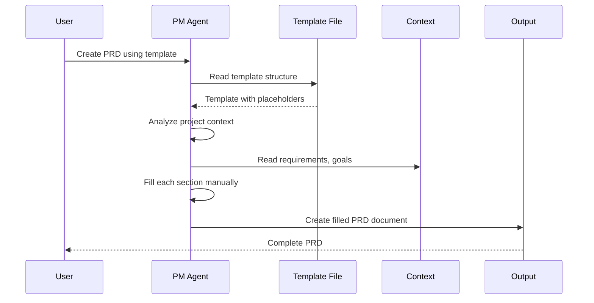
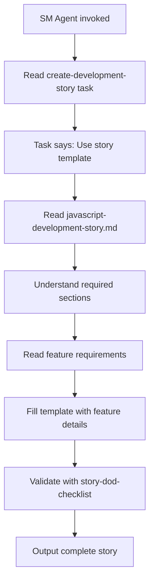
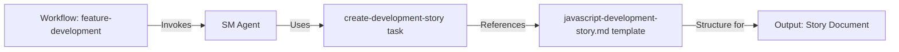
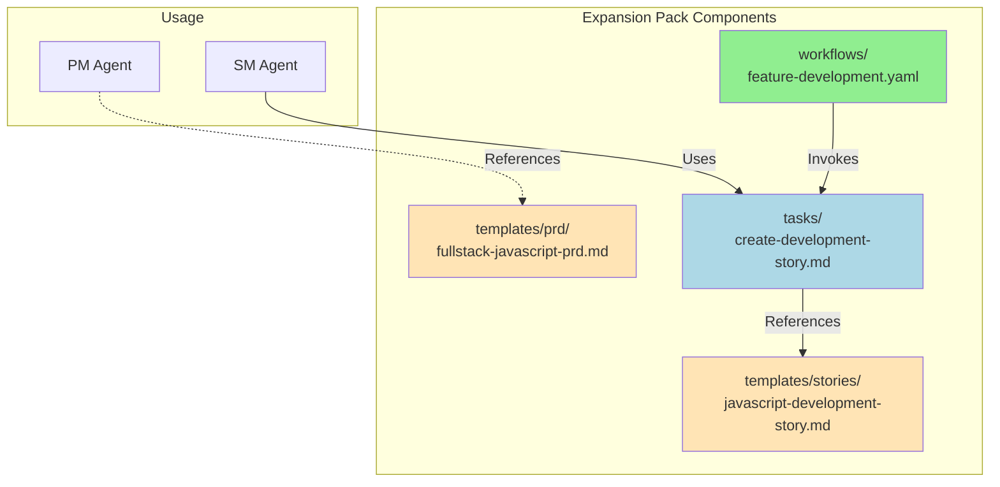

# How Templates Work in bmad-javascript-fullstack Expansion Pack

## Overview

The `bmad-javascript-fullstack` expansion pack includes **2 templates** that serve as **document scaffolds** for creating project documentation. However, **they work differently** than BMAD Core templates.

## Template Files

1. **`templates/prd/fullstack-javascript-prd.md`** (433 lines)
   - Product Requirements Document template
   - Plain Markdown file with placeholders

2. **`templates/stories/javascript-development-story.md`** (543 lines)
   - Development Story template
   - Plain Markdown file with placeholders

## Key Difference: BMAD Core vs Expansion Pack Templates

### BMAD Core Templates (YAML)

BMAD Core has **structured YAML templates** with AI-driven workflows:

```yaml
# bmad-core/templates/prd-tmpl.yaml
template:
  id: prd-template-v2
  name: Product Requirements Document
  version: 2.0
  output:
    format: markdown
    filename: docs/prd.md

workflow:
  mode: interactive
  elicitation: advanced-elicitation  # AI guides user through questions

sections:
  - id: goals-context
    title: Goals and Background Context
    instruction: |
      Ask if Project Brief document is available...
    elicit: true  # AI actively elicits information
```

**Features:**
- ✅ **Interactive workflows** - AI agent asks questions
- ✅ **Auto-population** - AI fills in sections
- ✅ **Validation** - Built-in validation logic
- ✅ **Dynamic** - Sections can be conditional
- ✅ **Guided creation** - User is walked through the process

### Expansion Pack Templates (Markdown)

The bmad-javascript-fullstack templates are **static Markdown files** with placeholders:

```markdown
# templates/prd/fullstack-javascript-prd.md
# Product Requirements Document: [Project Name]

**Version:** 1.0
**Date:** [Date]
**Author:** [Your Name]

## Executive Summary
[Brief 2-3 sentence description of the project]

## Technology Stack

### Frontend
- **Framework:** [e.g., React 18 with Next.js 14]
- **Language:** [e.g., TypeScript 5.x]
- **State Management:** [e.g., React Query + Zustand]
```

**Features:**
- 📋 **Static structure** - No AI workflow built-in
- 📋 **Manual fill-in** - Agent reads template and fills it manually
- 📋 **Reference guide** - Shows what sections to include
- 📋 **Best practices** - Demonstrates JavaScript-specific requirements

## How Expansion Pack Templates Are Actually Used

### Method 1: Agent Manual Reference

When you ask the **PM agent** to create a PRD for a JavaScript project:

```
*pm

Create a PRD for a task management SaaS application using the
fullstack-javascript-prd template.
```

**What happens:**



**The agent:**
1. Reads the template file to understand the structure
2. Uses it as a **reference guide** for what sections to include
3. Manually fills in each section based on:
   - User's requirements
   - Conversation context
   - Best practices from `data/` folder
4. Creates a new document with all placeholders replaced

### Method 2: Task-Driven Usage

The **create-development-story task** explicitly references the template:

```markdown
# tasks/create-development-story.md

### 3. Template Execution
**Use Template:**
Use `templates/stories/javascript-development-story.md` template

**Key Focus Areas:**
- Clear, actionable description with user story format
- Specific acceptance criteria
- Detailed technical specifications
```

**What happens when SM agent uses this task:**

```
*sm

Use the create-development-story task to break down the user authentication
feature into implementable stories.
```



**The agent:**
1. Reads the **task** instructions
2. Task tells it to use the **template**
3. Agent reads the template to see structure
4. Agent fills in all sections for the specific feature
5. Validates using checklist
6. Outputs complete story document

### Method 3: Workflow Reference

Workflows reference tasks, which reference templates:

```yaml
# workflows/feature-development.yaml
- agent: sm
  creates: feature-stories.md
  requires: technical-specification.md
  uses: create-development-story task
  notes: Break feature into implementable stories
```

**Flow:**



## Comparison: Core Template vs Expansion Template

| Aspect | BMAD Core Template | Expansion Pack Template |
|--------|-------------------|------------------------|
| **Format** | YAML | Markdown |
| **Workflow** | Interactive AI-driven | Manual agent reference |
| **Questions** | Auto-generated by template | Agent asks based on context |
| **Validation** | Built-in | External (via checklists) |
| **Flexibility** | Structured, guided | Freeform, reference guide |
| **Use Case** | General-purpose PRDs/docs | JavaScript-specific docs |
| **Population** | AI elicitation engine | Agent reads & fills manually |

## Why This Design?

### Expansion Pack Templates Are References, Not Workflows

The expansion pack templates serve a **different purpose** than core templates:

1. **Specialization** - Show JavaScript/TypeScript-specific sections
2. **Best Practices** - Demonstrate what a good JS PRD/Story contains
3. **Flexibility** - Agents can adapt structure as needed
4. **Simplicity** - No complex YAML, just Markdown reference

### Core Templates Handle the Workflow

When you want an **interactive workflow** with AI elicitation:
- Use **BMAD Core templates** (`prd-tmpl.yaml`, etc.)
- AI walks you through questions
- Auto-populates sections

When you want **JavaScript-specific structure**:
- Agents **reference** expansion pack templates
- They see what sections are important for JS projects
- They manually fill with appropriate JS/TS content

## Real-World Usage Examples

### Example 1: Creating a PRD

**Using Core Template (Interactive):**
```
*pm

Use the prd-template-v2 to create a PRD for my project.
```
→ AI asks questions, walks you through each section interactively

**Using Expansion Template (Reference):**
```
*pm

Create a PRD for a React/Node.js task management app.
Use the fullstack-javascript-prd template as a reference
to ensure we cover all JavaScript-specific requirements.
```
→ Agent reads template for structure, fills it based on your description

### Example 2: Creating Stories

**SM Agent with Task:**
```
*sm

We need to implement user authentication with JWT.
Use the create-development-story task to create the story.
```

**What SM agent does:**
1. Reads `tasks/create-development-story.md`
2. Task says: "Use `templates/stories/javascript-development-story.md` template"
3. Reads template to understand structure
4. Fills in all sections:
   - Story Description
   - Acceptance Criteria (functional, technical, performance, security)
   - Frontend Implementation (React components, hooks, state)
   - Backend Implementation (NestJS endpoints, Prisma models)
   - TypeScript interfaces
   - Testing requirements
   - Definition of Done
5. Validates with `checklists/story-dod-checklist.md`
6. Outputs complete story document

**Example Output:**
```markdown
# Story: User Authentication with JWT

**Story ID:** AUTH-001
**Epic:** User Management
**Sprint:** Sprint 1
**Priority:** P0
**Estimated Effort:** Large (3-5 days)

## Story Description

### User Story
**As a** user
**I want** to log in securely with my credentials
**So that** I can access my personalized dashboard

### Background
This is the foundation for all authenticated features...

## Acceptance Criteria

### Functional Requirements
- [ ] User can register with email/password
- [ ] User can log in with credentials
- [ ] User receives JWT token on successful login
- [ ] Token expires after 24 hours
...

### Technical Requirements
- [ ] TypeScript types defined with no `any` types
- [ ] Unit tests written with >80% coverage
- [ ] JWT stored in httpOnly cookie
...

## Technical Specification

### Frontend Implementation

#### Components to Create
1. **Component: `LoginForm`**
   - **Location:** `src/components/auth/LoginForm.tsx`
   - **Props Interface:**
     ```typescript
     interface LoginFormProps {
       onSuccess?: () => void;
       redirectTo?: string;
     }
     ```

#### Hooks to Create
1. **Hook: `useAuth`**
   - **Location:** `src/hooks/useAuth.ts`
   - **Interface:**
     ```typescript
     interface UseAuthReturn {
       user: User | null;
       login: (credentials: LoginDto) => Promise<void>;
       logout: () => void;
       isAuthenticated: boolean;
     }
     ```

### Backend Implementation

#### API Endpoints

##### Endpoint 1: `POST /api/v1/auth/login`
- **Authentication:** None
- **Request:**
  ```typescript
  interface LoginRequest {
    email: string;
    password: string;
  }
  ```
- **Response:**
  ```typescript
  interface LoginResponse {
    token: string;
    user: User;
  }
  ```

...

[Complete 500+ line story with all sections filled in]
```

## Template Integration Points

### Where Templates Are Referenced



1. **Direct Reference** - PM agent references PRD template directly
2. **Task Reference** - `create-development-story` task references story template
3. **Workflow → Task → Template** - Workflows invoke tasks that reference templates

## Benefits of This Approach

### ✅ Specialization
Templates show **JavaScript/TypeScript-specific** sections that wouldn't be in generic templates:
- Technology Stack (React, Node.js, TypeScript versions)
- Frontend Implementation (React components, hooks, state)
- Backend Implementation (NestJS, Prisma, API endpoints)
- TypeScript interfaces and types
- JavaScript-specific testing (Vitest, Jest, Playwright)

### ✅ Flexibility
Agents can **adapt** the template:
- Skip sections not relevant to the project
- Add sections for unique requirements
- Reorder sections as needed
- Combine or split sections

### ✅ Best Practices
Templates **demonstrate** what good JavaScript docs look like:
- Performance requirements (Lighthouse scores, Core Web Vitals)
- Security requirements (XSS prevention, CSRF protection)
- TypeScript strict mode compliance
- Accessibility (WCAG 2.1 AA)

### ✅ Simplicity
No need to learn **complex YAML syntax**:
- Plain Markdown files
- Easy to read and understand
- Easy to modify and customize
- No special tooling required

## How to Use Templates Effectively

### For PM Creating PRDs

```
*pm

I'm building a blog platform with React and Node.js.

Create a comprehensive PRD using the fullstack-javascript-prd template
as a reference. The app needs:
- User authentication
- Create/edit/delete blog posts
- Comment system
- SEO-friendly URLs

Target: 10,000 users in first 6 months
Timeline: 3 months to MVP
```

The PM agent will:
1. Read the template to understand structure
2. Fill in each section based on your requirements
3. Add JavaScript-specific technology recommendations
4. Include performance/security requirements for JS apps
5. Output a complete PRD

### For SM Creating Stories

```
*sm

Use the create-development-story task to create stories for
the blog post CRUD feature from the PRD.
```

The SM agent will:
1. Read the task instructions
2. Task tells it to use the story template
3. Read template to see all required sections
4. Create multiple stories, each following template structure
5. Fill in JavaScript-specific sections (React components, API endpoints, TypeScript types)
6. Validate with checklist
7. Output complete stories

## Template Customization

You can **customize templates** for your organization:

### Add Sections
```markdown
## Compliance Requirements
- [ ] GDPR compliance
- [ ] SOC 2 compliance
- [ ] HIPAA compliance (if applicable)
```

### Modify Technology Defaults
```markdown
### Frontend
- **Framework:** [e.g., Vue 3 with Nuxt 3]  # Changed from React/Next.js
- **State Management:** [e.g., Pinia]       # Changed from React Query/Zustand
```

### Add Your Patterns
```markdown
### Code Organization (Our Standard)
```
src/
  features/           # Feature-based organization
    auth/
      api/           # API integration
      components/    # UI components
      hooks/         # Custom hooks
      types/         # TypeScript types
```
```

## Summary

### Templates in bmad-javascript-fullstack Are:

✅ **Reference Guides** - Show structure and best practices
✅ **Static Markdown** - No built-in AI workflow
✅ **JavaScript-Specific** - Tailored for React/Node.js/TypeScript
✅ **Agent-Referenced** - Agents read and manually fill them
✅ **Task-Integrated** - Used via tasks like `create-development-story`
✅ **Workflow-Connected** - Workflows invoke tasks that use templates

### Templates Are NOT:

❌ **Interactive Workflows** - That's BMAD Core YAML templates
❌ **Auto-Populated** - Agents fill them manually
❌ **Validated Internally** - Use external checklists
❌ **Required** - Agents can adapt structure as needed

### When to Use Each Type

| Need | Use This |
|------|----------|
| Interactive PRD creation with Q&A | BMAD Core `prd-tmpl.yaml` |
| JavaScript-specific PRD structure | Expansion `fullstack-javascript-prd.md` |
| Generic story template | BMAD Core story template (if exists) |
| JavaScript story with React/Node sections | Expansion `javascript-development-story.md` |
| Walk me through questions | BMAD Core YAML templates |
| Show me what sections to include | Expansion Markdown templates |

---

**The expansion pack templates are like cookbooks** - they show you the recipe (structure) and ingredients (sections), but the chef (AI agent) decides how to combine them based on your specific dish (project requirements).
