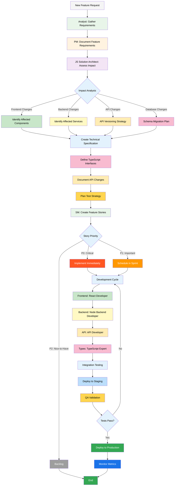
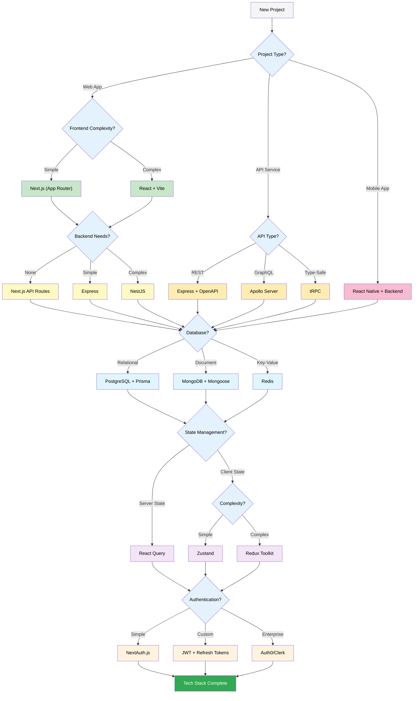

# JavaScript Full-Stack Expansion Pack — User Guide

This guide explains how to effectively use the JavaScript Full-Stack Expansion Pack with the BMad Method for building modern JavaScript/TypeScript applications.

## Overview

The JavaScript Full-Stack Expansion Pack provides specialized agents, workflows, and templates for:

- **Frontend Development**: React 18+, Next.js 14, modern state management
- **Backend Development**: Node.js, Express, Fastify, NestJS
- **API Design**: REST, GraphQL, tRPC with versioning and documentation
- **Type Safety**: TypeScript strict mode, advanced patterns, migration
- **Full-Stack Integration**: Coordinated frontend/backend development

## The JavaScript Full-Stack Workflow

### Planning Phase: Greenfield Projects

For new JavaScript/TypeScript projects, follow this specialized planning workflow:

```mermaid
graph TD
    A["Start: New JS Project"] --> B{Optional: Analyst Research}
    B -->|Yes| C["Analyst: Brainstorming & Research"]
    B -->|No| G{Project Brief Available?}
    C --> C2["Analyst: Competitor Analysis"]
    C2 --> D["Analyst: Create Project Brief"]
    D --> G
    G -->|Yes| E["PM: Create PRD (JS Template)"]
    G -->|No| E2["PM: Interactive PRD Creation"]
    E --> F["PRD with JS-Specific Requirements"]
    E2 --> F

    F --> F2{UX Required?}
    F2 -->|Yes| F3["UX Expert: Create Frontend Spec"]
    F2 -->|No| H["JS Solution Architect: Tech Stack Selection"]
    F3 --> H

    H --> H2["JS Solution Architect: Database Schema Design"]
    H2 --> H3["JS Solution Architect: API Contract Definition"]
    H3 --> H4["JS Solution Architect: System Architecture"]

    H4 --> TS{TypeScript Migration?}
    TS -->|Existing JS Codebase| TS2["TypeScript Expert: Migration Strategy"]
    TS -->|New Project| I
    TS2 --> I["Architect: Complete Architecture Document"]

    I --> Q{Early Test Strategy?}
    Q -->|Yes| R["QA: Risk Assessment + Test Strategy"]
    Q -->|No| V
    R --> V["PO: Master Checklist Validation"]

    V --> J{Documents Aligned?}
    J -->|Yes| K["Planning Complete"]
    J -->|No| L["PO: Update Epics & Stories"]
    L --> M["Update PRD/Architecture"]
    M --> V

    K --> N["📁 Switch to IDE"]
    N --> O["PO: Shard Documents"]
    O --> P["Ready for Development"]

    style A fill:#f5f5f5,color:#000
    style B fill:#e3f2fd,color:#000
    style C fill:#e8f5e9,color:#000
    style C2 fill:#e8f5e9,color:#000
    style D fill:#e8f5e9,color:#000
    style E fill:#fff3e0,color:#000
    style E2 fill:#fff3e0,color:#000
    style F fill:#fff3e0,color:#000
    style F2 fill:#e3f2fd,color:#000
    style F3 fill:#e1f5fe,color:#000
    style G fill:#e3f2fd,color:#000
    style H fill:#f3e5f5,color:#000
    style H2 fill:#f3e5f5,color:#000
    style H3 fill:#f3e5f5,color:#000
    style H4 fill:#f3e5f5,color:#000
    style TS fill:#e3f2fd,color:#000
    style TS2 fill:#f3e5f5,color:#000
    style I fill:#f3e5f5,color:#000
    style Q fill:#e3f2fd,color:#000
    style R fill:#ffd54f,color:#000
    style V fill:#f9ab00,color:#fff
    style J fill:#e3f2fd,color:#000
    style K fill:#34a853,color:#fff
    style L fill:#f9ab00,color:#fff
    style M fill:#fff3e0,color:#000
    style N fill:#1a73e8,color:#fff
    style O fill:#f9ab00,color:#fff
    style P fill:#34a853,color:#fff
```



#### Planning Artifacts (JavaScript Projects)

```text
PRD                    → docs/prd.md (uses fullstack-javascript-prd.md template)
Architecture           → docs/architecture.md
Tech Stack Decision    → docs/architecture/tech-stack-decision.md
Database Schema        → docs/architecture/database-schema.md
API Specification      → docs/architecture/api-specification.md
Frontend Architecture  → docs/architecture/frontend-architecture.md
Backend Architecture   → docs/architecture/backend-architecture.md
TypeScript Config      → docs/architecture/typescript-configuration.md
Sharded Epics          → docs/epics/
Sharded Stories        → docs/stories/
QA Assessments         → docs/qa/assessments/
QA Gates               → docs/qa/gates/
```

### Development Phase: Full-Stack Implementation

Once planning is complete, follow this development workflow with JavaScript-specific considerations:

```mermaid
graph TD
    A["Development Phase Start"] --> B["SM: Review Previous Story Notes"]
    B --> B2["SM: Draft Story from Epic + Architecture"]
    B2 --> ST{Story Type?}

    ST -->|Full-Stack Feature| ST1["Include Frontend + Backend + API Tasks"]
    ST -->|Frontend Only| ST2["Include React/Next.js Tasks"]
    ST -->|Backend Only| ST3["Include Node.js/API Tasks"]
    ST -->|TypeScript Migration| ST4["Include Migration Tasks"]

    ST1 --> S
    ST2 --> S
    ST3 --> S
    ST4 --> S

    S{High-Risk Story?}
    S -->|Yes| T["QA: *risk + *design"]
    S -->|No| B3
    T --> U["Test Strategy Created"]
    U --> B3{PO: Validate Story?}

    B3 -->|Yes| B4["PO: Validate Against Architecture"]
    B3 -->|Skip| C
    B4 --> C{User Approval}

    C -->|Approved| D["Dev: Select Appropriate Agent(s)"]
    C -->|Needs Changes| B2

    D --> D2{Implementation Type?}
    D2 -->|Frontend| D3["React Developer: Implement Components"]
    D2 -->|Backend| D4["Node Backend Developer: Implement Services"]
    D2 -->|API| D5["API Developer: Implement Endpoints"]
    D2 -->|Types| D6["TypeScript Expert: Define Types"]
    D2 -->|Full-Stack| D7["Coordinate Multiple Agents"]

    D3 --> E
    D4 --> E
    D5 --> E
    D6 --> E
    D7 --> E

    E["Dev: Implementation + Tests"]
    E --> E2["Frontend: Component Tests + E2E"]
    E2 --> E3["Backend: Unit Tests + Integration Tests"]
    E3 --> E4["API: Contract Tests + Documentation"]
    E4 --> E5["TypeScript: Type Checking"]

    E5 --> V{Mid-Dev QA Check?}
    V -->|Yes| W["QA: *trace or *nfr"]
    V -->|No| F
    W --> X["Dev: Address Gaps"]
    X --> F

    F["Dev: Run All Validations"]
    F --> F2["✓ TypeScript: tsc --noEmit"]
    F2 --> F3["✓ Linting: ESLint"]
    F3 --> F4["✓ Tests: Unit + Integration + E2E"]
    F4 --> F5["✓ Build: Frontend + Backend"]
    F5 --> F6["✓ Checklists: Frontend/Backend/API"]

    F6 --> G["Dev: Mark Ready for Review + Notes"]
    G --> H{User Verification}

    H -->|Request QA Review| I["QA: Full Test Architecture Review"]
    H -->|Approve Without QA| M
    I --> J["QA: Requirements Tracing + Refactoring"]
    J --> L{QA Decision}

    L -->|Needs Dev Work| D
    L -->|Approved| M
    H -->|Needs Fixes| D

    M["CRITICAL: Verify Tests + Linting Pass"]
    M --> M2["CRITICAL: Test on Dev Environment"]
    M2 --> N["CRITICAL: COMMIT CHANGES!"]

    N --> Y{Gate Update?}
    Y -->|Yes| Z["QA: *gate to Update Status"]
    Y -->|No| K
    Z --> K["Mark Story Complete"]
    K --> K2["Update Story Status in Epic"]
    K2 --> B

    style A fill:#f5f5f5,color:#000
    style B fill:#e8f5e9,color:#000
    style B2 fill:#e8f5e9,color:#000
    style ST fill:#e3f2fd,color:#000
    style ST1 fill:#bbdefb,color:#000
    style ST2 fill:#c8e6c9,color:#000
    style ST3 fill:#fff9c4,color:#000
    style ST4 fill:#f8bbd0,color:#000
    style S fill:#e3f2fd,color:#000
    style T fill:#ffd54f,color:#000
    style U fill:#ffd54f,color:#000
    style B3 fill:#e3f2fd,color:#000
    style B4 fill:#fce4ec,color:#000
    style C fill:#e3f2fd,color:#000
    style D fill:#e3f2fd,color:#000
    style D2 fill:#e3f2fd,color:#000
    style D3 fill:#c8e6c9,color:#000
    style D4 fill:#fff9c4,color:#000
    style D5 fill:#ffecb3,color:#000
    style D6 fill:#f8bbd0,color:#000
    style D7 fill:#bbdefb,color:#000
    style E fill:#e3f2fd,color:#000
    style E2 fill:#c8e6c9,color:#000
    style E3 fill:#fff9c4,color:#000
    style E4 fill:#ffecb3,color:#000
    style E5 fill:#f8bbd0,color:#000
    style V fill:#e3f2fd,color:#000
    style W fill:#ffd54f,color:#000
    style X fill:#e3f2fd,color:#000
    style F fill:#e3f2fd,color:#000
    style F2 fill:#e1f5fe,color:#000
    style F3 fill:#e1f5fe,color:#000
    style F4 fill:#e1f5fe,color:#000
    style F5 fill:#e1f5fe,color:#000
    style F6 fill:#e1f5fe,color:#000
    style G fill:#e3f2fd,color:#000
    style H fill:#e3f2fd,color:#000
    style I fill:#f9ab00,color:#fff
    style J fill:#ffd54f,color:#000
    style K fill:#34a853,color:#fff
    style K2 fill:#34a853,color:#fff
    style L fill:#e3f2fd,color:#000
    style M fill:#ff5722,color:#fff
    style M2 fill:#ff5722,color:#fff
    style N fill:#d32f2f,color:#fff
    style Y fill:#e3f2fd,color:#000
    style Z fill:#ffd54f,color:#000
```



### Feature Development Workflow

For adding features to existing JavaScript applications:



### TypeScript Migration Workflow

For migrating existing JavaScript codebases to TypeScript:

```mermaid
graph TD
    A["Start: JS Codebase"] --> B["TypeScript Expert: Assess Codebase"]
    B --> B2["Estimate Effort & Complexity"]
    B2 --> C["Create Migration Strategy"]

    C --> D["Phase 1: Setup TypeScript"]
    D --> D2["Configure tsconfig.json (allowJs: true)"]
    D2 --> D3["Install @types packages"]
    D3 --> D4["Add Type Definitions"]

    D4 --> E["Phase 2: Incremental Conversion"]
    E --> E2{File Selection Strategy}

    E2 -->|Bottom-Up| E3["Convert Utilities First"]
    E2 -->|Top-Down| E4["Convert Entry Points First"]
    E2 -->|Risk-Based| E5["Convert Critical Paths First"]

    E3 --> F
    E4 --> F
    E5 --> F

    F["Convert Files in Batches (5-10 files)"]
    F --> F2["Run Tests After Each Batch"]
    F2 --> F3{Tests Pass?}

    F3 -->|Yes| G["Commit Changes"]
    F3 -->|No| F4["Fix Issues"]
    F4 --> F2

    G --> H{More Files?}
    H -->|Yes| F
    H -->|No| I["Phase 3: Enable Strict Mode"]

    I --> I2["Enable noImplicitAny"]
    I2 --> I3["Fix Errors"]
    I3 --> I4["Enable strictNullChecks"]
    I4 --> I5["Fix Errors"]
    I5 --> I6["Enable All Strict Flags"]
    I6 --> I7["Fix Remaining Errors"]

    I7 --> J["Phase 4: Refinement"]
    J --> J2["Replace 'any' with Proper Types"]
    J2 --> J3["Add Generics Where Appropriate"]
    J3 --> J4["Document Complex Types"]

    J4 --> K["Migration Complete"]
    K --> L["Update Documentation"]
    L --> M["Train Team on TypeScript"]
    M --> N["Establish TypeScript Standards"]

    style A fill:#f5f5f5,color:#000
    style B fill:#f8bbd0,color:#000
    style B2 fill:#f8bbd0,color:#000
    style C fill:#f3e5f5,color:#000
    style D fill:#e1f5fe,color:#000
    style D2 fill:#e1f5fe,color:#000
    style D3 fill:#e1f5fe,color:#000
    style D4 fill:#e1f5fe,color:#000
    style E fill:#fff3e0,color:#000
    style E2 fill:#e3f2fd,color:#000
    style E3 fill:#c8e6c9,color:#000
    style E4 fill:#fff9c4,color:#000
    style E5 fill:#ffecb3,color:#000
    style F fill:#e3f2fd,color:#000
    style F2 fill:#ffd54f,color:#000
    style F3 fill:#e3f2fd,color:#000
    style F4 fill:#ff5722,color:#fff
    style G fill:#34a853,color:#fff
    style H fill:#e3f2fd,color:#000
    style I fill:#fff3e0,color:#000
    style I2 fill:#ffecb3,color:#000
    style I3 fill:#e3f2fd,color:#000
    style I4 fill:#ffecb3,color:#000
    style I5 fill:#e3f2fd,color:#000
    style I6 fill:#ffecb3,color:#000
    style I7 fill:#e3f2fd,color:#000
    style J fill:#c8e6c9,color:#000
    style J2 fill:#c8e6c9,color:#000
    style J3 fill:#c8e6c9,color:#000
    style J4 fill:#c8e6c9,color:#000
    style K fill:#34a853,color:#fff
    style L fill:#1a73e8,color:#fff
    style M fill:#1a73e8,color:#fff
    style N fill:#34a853,color:#fff
```



## Specialized Agents

### JS Solution Architect

**When to Use:** Architecture design, tech stack selection, system design

**Key Responsibilities:**
- Technology stack selection (Next.js vs Vite, Express vs NestJS, etc.)
- Architecture pattern selection (Monolith, Microservices, JAMstack, Serverless)
- Database design (SQL vs NoSQL, schema design)
- API contract definition (REST vs GraphQL vs tRPC)
- Performance and scalability planning
- Security architecture

**Example Usage:**
```
@js-solution-architect I need to build a SaaS application with:
- React frontend with real-time updates
- Node.js backend
- PostgreSQL database
- 10,000 expected users
- Multi-tenant architecture

Please recommend the tech stack and create the architecture.
```

**Key Outputs:**
- `docs/architecture/tech-stack-decision.md`
- `docs/architecture/system-architecture.md`
- `docs/architecture/database-schema.md`
- `docs/architecture/api-specification.md`

### React Developer

**When to Use:** Frontend implementation, React components, state management

**Key Responsibilities:**
- Component implementation (React 18+, Next.js 14)
- State management (React Query, Zustand, Redux)
- Routing (file-based or React Router)
- Styling (Tailwind CSS, CSS Modules)
- Performance optimization (code splitting, lazy loading)
- Accessibility (WCAG compliance)

**Example Usage:**
```
@react-developer Implement a user dashboard with:
- User profile card
- Activity feed with infinite scroll
- Real-time notifications
- Dark mode support
- Fully responsive
- Accessible (WCAG AA)

Use React Query for data fetching and Tailwind for styling.
```

**Validation Checklist:**
- Uses `checklists/frontend-checklist.md`
- TypeScript types for all props
- Component tests with React Testing Library
- Accessibility tests
- Performance checks (bundle size, re-renders)

### Node Backend Developer

**When to Use:** Backend services, business logic, database operations

**Key Responsibilities:**
- Express/Fastify/NestJS implementation
- Database integration (Prisma, TypeORM)
- Authentication & authorization (JWT, OAuth)
- Background jobs (Bull, BullMQ)
- Caching strategies (Redis)
- Error handling and logging

**Example Usage:**
```
@node-backend-developer Implement user authentication service:
- Email/password registration
- JWT access tokens (15 min expiry)
- Refresh token strategy
- Password reset flow
- Rate limiting (5 attempts per 15 min)
- Bcrypt password hashing

Use Express with Prisma and PostgreSQL.
```

**Validation Checklist:**
- Uses `checklists/backend-checklist.md`
- Input validation (Zod schemas)
- Unit tests for business logic
- Integration tests for API endpoints
- Security checks (SQL injection, XSS prevention)

### API Developer

**When to Use:** API design, endpoint implementation, documentation

**Key Responsibilities:**
- RESTful API design (resource-based URLs, proper HTTP methods)
- GraphQL schema and resolvers
- tRPC for type-safe APIs
- API versioning strategies
- Rate limiting and throttling
- OpenAPI/Swagger documentation

**Example Usage:**
```
@api-developer Design the REST API for a blog platform:
- User management (CRUD)
- Post management (with drafts, publishing)
- Comments (nested, moderation)
- Tags and categories
- Search functionality
- Pagination (cursor-based)

Include OpenAPI specification and example requests.
```

**Validation Checklist:**
- Uses `checklists/api-design-checklist.md`
- RESTful conventions followed
- Proper HTTP status codes
- Pagination implemented
- Rate limiting configured
- API documentation complete

### TypeScript Expert

**When to Use:** Type definitions, advanced patterns, migration

**Key Responsibilities:**
- TypeScript configuration (strict mode)
- Advanced type patterns (generics, mapped types, conditional types)
- Type inference and narrowing
- JavaScript to TypeScript migration
- Shared types between frontend/backend
- Type-safe API client design

**Example Usage:**
```
@typescript-expert Create type-safe API client:
- Define all request/response types
- Implement generic fetch wrapper
- Type-safe query parameters
- Discriminated unions for API responses
- Error types with proper narrowing

No 'any' types allowed, full type safety end-to-end.
```

**Validation:**
- `tsc --noEmit` passes with no errors
- No `any` types (use `unknown` if needed)
- Proper type guards for runtime checks
- Comprehensive interfaces for all DTOs

## Agent Teams

### Full-Stack Team

**Use When:** Building complete applications from scratch

**Team Composition:**
- Analyst (core BMAD)
- BMad-Orchestrator (core BMAD)
- JS Solution Architect
- React Developer
- Node Backend Developer
- API Developer
- TypeScript Expert

**Workflows:**
- `fullstack-greenfield.yaml`
- `feature-development.yaml`
- `mvp-rapid-prototype.yaml`

### Frontend Team

**Use When:** Frontend-only or frontend-heavy projects

**Team Composition:**
- Analyst (core BMAD)
- BMad-Orchestrator (core BMAD)
- JS Solution Architect
- React Developer
- TypeScript Expert

**Workflows:**
- `frontend-app-development.yaml`
- `feature-development.yaml`

### Backend Team

**Use When:** API services, backend systems, microservices

**Team Composition:**
- Analyst (core BMAD)
- BMad-Orchestrator (core BMAD)
- JS Solution Architect
- Node Backend Developer
- API Developer
- TypeScript Expert

**Workflows:**
- `backend-api-development.yaml`
- `feature-development.yaml`

## Quality Checklists

The expansion pack includes comprehensive quality checklists for each phase:

### Architecture Phase
- **`architecture-review-checklist.md`**: Validates architecture completeness
  - Frontend architecture (framework, state, routing, styling)
  - Backend architecture (framework, API, auth, middleware)
  - Database design (schema, indexes, migrations)
  - API design (versioning, pagination, rate limiting)
  - Non-functional requirements (performance, security, scalability)

### Development Phase
- **`frontend-checklist.md`**: React/Next.js code quality
  - Component structure and TypeScript types
  - React best practices (hooks, memoization, error boundaries)
  - State management
  - Performance (code splitting, bundle size, Core Web Vitals)
  - Accessibility (WCAG compliance)

- **`backend-checklist.md`**: Node.js backend quality
  - API endpoint quality (RESTful design, status codes)
  - Authentication & authorization
  - Database operations (ORM usage, transactions, indexes)
  - Error handling
  - Security (Helmet.js, input validation, rate limiting)

- **`api-design-checklist.md`**: API quality standards
  - REST API design (resource naming, HTTP methods)
  - Request/response format
  - Authentication strategy
  - Error handling
  - Documentation (OpenAPI/Swagger)

- **`security-checklist.md`**: Security validation
  - Authentication (password hashing, token management)
  - Authorization (RBAC, resource-level permissions)
  - Input validation (frontend and backend)
  - SQL injection prevention
  - XSS and CSRF protection
  - OWASP Top 10 coverage

- **`performance-checklist.md`**: Performance optimization
  - Frontend performance (Core Web Vitals, bundle size)
  - Backend performance (API response time, database queries)
  - Caching strategy
  - Network optimization (CDN, compression, HTTP/2)

### Deployment Phase
- **`deployment-readiness-checklist.md`**: Production readiness
  - Code quality (tests pass, no TypeScript errors)
  - Environment configuration
  - Database migrations tested
  - Security headers configured
  - Performance targets met
  - Monitoring and logging configured

- **`story-dod-checklist.md`**: Definition of Done
  - Requirements met
  - Code quality (TypeScript, linting)
  - Testing (unit, integration, E2E)
  - Frontend-specific (responsive, accessible)
  - Backend-specific (validation, error handling)
  - Security and documentation

## Task Guides

Detailed step-by-step guides for common tasks:

### `create-development-story.md`
- Story identification and scoping
- Using the JavaScript story template
- Full-stack coordination (frontend + backend + API)
- TypeScript interface definitions
- Testing requirements
- Validation process

### `create-architecture-doc.md`
- Architecture document structure
- Technology stack selection
- Database schema design
- API contract definition
- Non-functional requirements
- Development standards

### `create-api-spec.md`
- API specification structure
- Endpoint documentation template
- TypeScript DTO definitions
- OpenAPI/Swagger generation
- Best practices

### `setup-project.md`
- Monorepo setup (Turborepo)
- TypeScript configuration
- Linting and formatting (ESLint, Prettier)
- Database setup (Prisma)
- Testing frameworks (Vitest, Jest, Playwright)
- CI/CD pipeline

### `code-review.md`
- Code review checklist
- TypeScript quality checks
- React best practices
- Backend security checks
- Performance considerations
- Git hygiene

### `performance-optimization.md`
- Performance measurement
- Frontend optimization (bundle, images, caching)
- Backend optimization (database, Redis, background jobs)
- Network optimization
- Monitoring setup

## Reference Materials

### `development-guidelines.md`
- TypeScript standards (strict mode, naming conventions)
- React best practices (hooks, memoization)
- Backend patterns (error handling, validation)
- Code organization
- Testing standards

### `architecture-patterns.md`
- Monolithic Full-Stack
- JAMstack with Serverless
- Microservices
- Backend for Frontend (BFF)
- Event-Driven Architecture
- Decision matrix and migration paths

### `best-practices.md`
- General principles
- Frontend best practices
- Backend best practices
- Testing strategy
- DevOps and deployment
- Common anti-patterns to avoid

### `technology-stack-guide.md`
- Decision framework
- Recommended stacks by use case (MVP, SaaS, E-commerce, etc.)
- Technology comparison tables
- Decision trees for framework/database selection

### `security-guidelines.md`
- Authentication (password hashing, JWT)
- Input validation (Zod schemas)
- SQL injection prevention
- XSS and CSRF protection
- CORS configuration
- Rate limiting
- Secrets management
- OWASP Top 10 checklist

### `deployment-strategies.md`
- Deployment patterns (Rolling, Blue-Green, Canary)
- Platform-specific deployment (Vercel, Railway, AWS)
- CI/CD setup (GitHub Actions)
- Database migrations
- Environment management
- Rollback strategies
- Health checks and monitoring

## Best Practices

### Planning Phase
1. **Start with Tech Stack Selection**: Let JS Solution Architect evaluate options
2. **Define API Contracts Early**: Enables parallel frontend/backend development
3. **Consider TypeScript from Day One**: Easier than migration later
4. **Plan for Testing**: Include test strategy in architecture
5. **Document NFRs**: Performance, security, scalability requirements

### Development Phase
1. **Use Appropriate Agent**: Match agent to task (React Dev for components, API Dev for endpoints)
2. **Coordinate Full-Stack Features**: Define TypeScript interfaces shared between frontend/backend
3. **Test at Multiple Levels**: Unit tests (logic), integration tests (APIs), E2E tests (user flows)
4. **Run Checklists**: Use quality checklists before marking stories complete
5. **Commit Often**: Save work after each story completion

### Code Quality
1. **TypeScript Strict Mode**: Enable all strict flags
2. **No `any` Types**: Use proper types or `unknown`
3. **Lint and Format**: ESLint + Prettier configured
4. **Test Coverage**: >80% for frontend, >85% for backend
5. **Security First**: Validate all inputs, sanitize outputs

### Performance
1. **Monitor Metrics**: Track Core Web Vitals, API response times
2. **Optimize Bundle Size**: Code splitting, lazy loading
3. **Database Indexes**: Add indexes on frequently queried fields
4. **Caching Strategy**: Use Redis for frequently accessed data
5. **CDN for Static Assets**: Serve assets from edge locations

### Deployment
1. **CI/CD Pipeline**: Automate tests and deployment
2. **Environment Variables**: Never commit secrets
3. **Database Migrations**: Test on staging first
4. **Health Checks**: Implement `/health` endpoint
5. **Monitor Post-Deployment**: Watch for 24 hours after launch

## Common Workflows

### MVP Rapid Prototype Workflow

For time-constrained projects (1-2 weeks), use the streamlined MVP workflow:

```mermaid
graph TD
    A["Start: MVP Concept"] --> B["Day 1: Planning (4 hours)"]
    B --> B2["Analyst: Quick Requirements (1 hour)"]
    B2 --> B3["PM: Lean PRD (1 hour)"]
    B3 --> B4["JS Architect: Minimal Architecture (2 hours)"]

    B4 --> C["Day 2-3: Setup + Core Features"]
    C --> C2["Dev: Project Setup (2 hours)"]
    C2 --> C3["Node Dev: Auth + DB (4 hours)"]
    C3 --> C4["React Dev: Core UI (6 hours)"]
    C4 --> C5["API Dev: Basic Endpoints (4 hours)"]

    C5 --> D["Day 4-5: Features + Integration"]
    D --> D2["React Dev: Feature Components (8 hours)"]
    D2 --> D3["Node Dev: Business Logic (6 hours)"]
    D3 --> D4["Integration + Basic Tests (2 hours)"]

    D4 --> E["Day 6-7: Polish + Deploy"]
    E --> E2["Dev: Bug Fixes (4 hours)"]
    E2 --> E3["Dev: Essential Tests (2 hours)"]
    E3 --> E4["Dev: Deploy to Staging (1 hour)"]
    E4 --> E5["QA: Quick Validation (2 hours)"]
    E5 --> E6["Dev: Deploy to Production (1 hour)"]

    E6 --> F["MVP Complete"]

    style A fill:#f5f5f5,color:#000
    style B fill:#fff3e0,color:#000
    style B2 fill:#e8f5e9,color:#000
    style B3 fill:#fff3e0,color:#000
    style B4 fill:#f3e5f5,color:#000
    style C fill:#e3f2fd,color:#000
    style C2 fill:#e1f5fe,color:#000
    style C3 fill:#fff9c4,color:#000
    style C4 fill:#c8e6c9,color:#000
    style C5 fill:#ffecb3,color:#000
    style D fill:#e3f2fd,color:#000
    style D2 fill:#c8e6c9,color:#000
    style D3 fill:#fff9c4,color:#000
    style D4 fill:#ffd54f,color:#000
    style E fill:#e3f2fd,color:#000
    style E2 fill:#e3f2fd,color:#000
    style E3 fill:#ffd54f,color:#000
    style E4 fill:#bbdefb,color:#000
    style E5 fill:#ffd54f,color:#000
    style E6 fill:#34a853,color:#fff
    style F fill:#34a853,color:#fff
```



**Key MVP Principles:**
- **Time-boxing**: Strict 2-hour max per planning phase
- **Minimal Documentation**: PRD + lean architecture only
- **Essential Features Only**: Core user flow, no nice-to-haves
- **Basic Testing**: Critical paths only
- **Fast Deployment**: Vercel/Railway for instant deploy

---

### Step-by-Step MVP Commands (For Beginners)

Here's exactly what to type and run for a simple MVP project. **Example: Building a basic Todo App MVP**

#### **Day 1: Planning (Morning - 4 hours)**

**Step 1: Define Your Idea (1 hour)**
```bash
# In Web UI, prompt the Analyst:
@analyst I want to build a simple Todo app MVP with:
- User can add, edit, delete todos
- Mark todos as complete
- Simple login (email/password)
- Mobile responsive
- Deploy in 1 week

Please create a brief project outline.
```

**Step 2: Create PRD (1 hour)**
```bash
# After analyst completes, prompt PM:
@pm Create a minimal PRD for this Todo app MVP focusing on:
- Core features only (add, edit, delete, complete todos)
- User authentication
- Simple UI
- 1-week timeline
```

**Step 3: Architecture Design (2 hours)**
```bash
# Switch to IDE, prompt JS Solution Architect:
@js-solution-architect Design minimal architecture for Todo MVP:
- Frontend: Next.js with App Router
- Backend: Next.js API routes
- Database: PostgreSQL with Prisma
- Auth: NextAuth.js
- Deployment: Vercel

Create tech stack document and simple database schema.
```

---

#### **Day 2: Project Setup (Morning - 2 hours)**

**Step 1: Initialize Project**
```bash
# In your terminal, create the project:
npx create-next-app@latest todo-mvp --typescript --tailwind --app

# Navigate into project:
cd todo-mvp

# Install dependencies:
npm install prisma @prisma/client next-auth bcryptjs
npm install -D @types/bcryptjs
```

**Step 2: Setup Database**
```bash
# Initialize Prisma:
npx prisma init

# In IDE, prompt:
@typescript-expert Create Prisma schema for Todo app with:
- User model (id, email, password, name)
- Todo model (id, title, completed, userId, createdAt)

Update prisma/schema.prisma file.
```

```bash
# After schema is created, run migration:
npx prisma migrate dev --name init
npx prisma generate
```

**Step 3: Configure Environment**
```bash
# Create .env.local file:
@dev Create .env.local with:
- DATABASE_URL
- NEXTAUTH_SECRET
- NEXTAUTH_URL

Generate secure secret with: openssl rand -base64 32
```

---

#### **Day 2-3: Authentication (Afternoon - 4 hours)**

**Step 1: Setup NextAuth**
```bash
# In IDE, prompt:
@node-backend-developer Setup NextAuth.js with:
- Credentials provider (email/password)
- JWT strategy
- Bcrypt password hashing
- Session handling

Create app/api/auth/[...nextauth]/route.ts
```

**Step 2: Create Auth API**
```bash
# Prompt API Developer:
@api-developer Create registration endpoint at /api/auth/register:
- Validate email and password
- Hash password with bcrypt
- Create user in database
- Return success/error
```

**Step 3: Create Login UI**
```bash
# Prompt React Developer:
@react-developer Create authentication pages:
- app/login/page.tsx (email/password form)
- app/register/page.tsx (registration form)
- Use Tailwind CSS
- Form validation
- Loading states
```

---

#### **Day 3: Todo Backend (Afternoon - 4 hours)**

**Step 1: Create Todo API Endpoints**
```bash
# Prompt API Developer:
@api-developer Create Todo CRUD API endpoints:
- GET /api/todos (list all user todos)
- POST /api/todos (create todo)
- PATCH /api/todos/[id] (update todo)
- DELETE /api/todos/[id] (delete todo)

All endpoints require authentication.
```

**Step 2: Test API Endpoints**
```bash
# In terminal, test with curl or use Postman:
# (After implementing endpoints)

# Login to get session
curl -X POST http://localhost:3000/api/auth/callback/credentials \
  -H "Content-Type: application/json" \
  -d '{"email":"test@example.com","password":"password123"}'

# Test creating a todo
curl -X POST http://localhost:3000/api/todos \
  -H "Content-Type: application/json" \
  -d '{"title":"Test Todo"}'
```

---

#### **Day 3-4: Todo Frontend (Evening/Morning - 6 hours)**

**Step 1: Create Todo Components**
```bash
# Prompt React Developer:
@react-developer Create Todo UI components:
- TodoList component (displays all todos)
- TodoItem component (single todo with edit/delete)
- AddTodoForm component (input + add button)
- Use Tailwind CSS for styling
- Mobile responsive
```

**Step 2: Add State Management**
```bash
# Prompt React Developer:
@react-developer Add state management:
- Use React hooks (useState, useEffect)
- Fetch todos on page load
- Optimistic UI updates
- Error handling
```

**Step 3: Create Main Todo Page**
```bash
# Prompt React Developer:
@react-developer Create main todo page at app/dashboard/page.tsx:
- Protected route (requires login)
- Display TodoList component
- Add AddTodoForm at top
- Logout button
```

---

#### **Day 4-5: Polish & Features (8 hours)**

**Step 1: Add Todo Completion**
```bash
# Prompt:
@react-developer Add toggle completion feature:
- Click checkbox to mark todo complete
- Strikethrough completed todos
- Update database via PATCH /api/todos/[id]
```

**Step 2: Add Edit Functionality**
```bash
# Prompt:
@react-developer Add inline edit for todos:
- Double-click to edit
- Save on Enter or blur
- Cancel on Escape
```

**Step 3: Improve UI/UX**
```bash
# Prompt:
@react-developer Polish the UI:
- Add loading spinners
- Empty state (no todos message)
- Success/error toasts
- Smooth animations
- Better mobile layout
```

---

#### **Day 5: Testing (Afternoon - 2 hours)**

**Step 1: Manual Testing Checklist**
```bash
# Test in browser:
□ Register new user
□ Login with credentials
□ Add 5 different todos
□ Mark 2 todos as complete
□ Edit a todo title
□ Delete a todo
□ Logout and login again
□ Verify todos persist
□ Test on mobile screen size
```

**Step 2: Fix Critical Bugs**
```bash
# If you find bugs, prompt:
@dev Fix bug: [describe the issue]

# Example:
@dev Fix bug: Todos not persisting after refresh.
Check if API is returning correct user todos.
```

---

#### **Day 6: Deployment (Morning - 1 hour)**

**Step 1: Prepare for Deployment**
```bash
# In terminal, verify build works:
npm run build

# Check for TypeScript errors:
npx tsc --noEmit

# Run Prisma generate:
npx prisma generate
```

**Step 2: Setup Database (Production)**
```bash
# Option A: Vercel Postgres
# - Go to vercel.com
# - Create new Postgres database
# - Copy DATABASE_URL

# Option B: Supabase
# - Go to supabase.com
# - Create project
# - Copy connection string
```

**Step 3: Deploy to Vercel**
```bash
# Install Vercel CLI:
npm i -g vercel

# Login to Vercel:
vercel login

# Deploy:
vercel

# Follow prompts:
# - Link to project: Yes
# - Project name: todo-mvp
# - Framework: Next.js

# Set environment variables in Vercel dashboard:
# - DATABASE_URL
# - NEXTAUTH_SECRET
# - NEXTAUTH_URL (https://your-app.vercel.app)

# Run migration on production database:
npx prisma migrate deploy
```

---

#### **Day 6: Staging Validation (Afternoon - 2 hours)**

**Step 1: Test Production App**
```bash
# Open your deployed URL: https://todo-mvp.vercel.app

# Test complete flow:
□ Register new user
□ Login
□ Add todos
□ Edit todos
□ Complete todos
□ Delete todos
□ Logout/Login
□ Test on mobile device
```

**Step 2: Monitor for Issues**
```bash
# Check Vercel logs:
# - Go to Vercel dashboard
# - Click on your project
# - Go to "Logs" tab
# - Watch for errors

# Check database connections:
# - Verify todos are saving to production DB
```

---

#### **Day 7: Final Polish & Launch (2 hours)**

**Step 1: Add Final Touches**
```bash
# Prompt:
@react-developer Add finishing touches:
- Update page title and meta tags
- Add favicon
- Improve loading states
- Add basic error boundaries
```

**Step 2: Production Deploy**
```bash
# In terminal, commit all changes:
git add .
git commit -m "feat: MVP complete - todo app with auth"
git push origin main

# Vercel auto-deploys from main branch
# Wait for deployment to complete

# Visit production URL and verify everything works
```

**Step 3: Share Your MVP!**
```bash
# Your MVP is live! 🎉
# Share the URL: https://todo-mvp.vercel.app

# Next steps (post-MVP):
# - Gather user feedback
# - Monitor usage
# - Plan v2 features
```

---

### Complete Command Reference (Copy-Paste Ready)

Here's a complete script you can follow:

```bash
# === DAY 1: SETUP ===
npx create-next-app@latest todo-mvp --typescript --tailwind --app
cd todo-mvp
npm install prisma @prisma/client next-auth bcryptjs zod
npm install -D @types/bcryptjs
npx prisma init

# === DAY 2: DATABASE ===
# (After updating schema.prisma)
npx prisma migrate dev --name init
npx prisma generate

# === DAY 3-5: DEVELOPMENT ===
# Use IDE agents to build features
# Test locally:
npm run dev
# Open: http://localhost:3000

# === DAY 6: TESTING ===
npm run build
npx tsc --noEmit
npm test # if you added tests

# === DAY 7: DEPLOY ===
vercel login
vercel --prod
npx prisma migrate deploy

# === DONE! ===
```

### What You'll Have After 7 Days

✅ **Working Todo App** with authentication
✅ **Live URL** (e.g., todo-mvp.vercel.app)
✅ **User registration & login**
✅ **Full CRUD** for todos
✅ **Mobile responsive** design
✅ **Production database**
✅ **Deployed & running**

**Total Lines of Code:** ~800-1000 lines
**Total Time:** 35-40 hours (1 week)
**Cost:** $0 (free tier Vercel + Supabase)

### Complete Full-Stack Feature Workflow

Detailed step-by-step workflow for implementing a full-stack feature:

```mermaid
graph TD
    A["Feature Request"] --> B["Step 1: Requirements"]
    B --> B2["Analyst: Interview Stakeholders"]
    B2 --> B3["Analyst: Document User Stories"]
    B3 --> B4["PM: Add to PRD"]

    B4 --> C["Step 2: Technical Planning"]
    C --> C2["JS Architect: Impact Analysis"]
    C2 --> C3{Requires New Architecture?}
    C3 -->|Yes| C4["JS Architect: Design New Components"]
    C3 -->|No| D
    C4 --> D

    D["Step 3: Type Definitions"]
    D --> D2["TypeScript Expert: Define DTOs"]
    D2 --> D3["TypeScript Expert: Frontend Types"]
    D3 --> D4["TypeScript Expert: Backend Types"]
    D4 --> D5["TypeScript Expert: API Types"]

    D5 --> E["Step 4: API Contract"]
    E --> E2["API Dev: Define Endpoints"]
    E2 --> E3["API Dev: Document Request/Response"]
    E3 --> E4["API Dev: Create OpenAPI Spec"]

    E4 --> F["Step 5: Database Changes"]
    F --> F2{Schema Changes?}
    F2 -->|Yes| F3["Node Dev: Create Migration"]
    F2 -->|No| G
    F3 --> F4["Node Dev: Test Migration"]
    F4 --> G

    G["Step 6: Backend Implementation"]
    G --> G2["Node Dev: Service Layer"]
    G2 --> G3["Node Dev: Unit Tests"]
    G3 --> G4["API Dev: Endpoint Implementation"]
    G4 --> G5["API Dev: Integration Tests"]

    G5 --> H["Step 7: Frontend Implementation"]
    H --> H2["React Dev: Component Structure"]
    H2 --> H3["React Dev: State Management"]
    H3 --> H4["React Dev: API Integration"]
    H4 --> H5["React Dev: Component Tests"]

    H5 --> I["Step 8: Integration"]
    I --> I2["Dev: E2E Tests"]
    I2 --> I3["Dev: Manual Testing"]
    I3 --> I4{Issues Found?}
    I4 -->|Yes| I5["Dev: Fix Issues"]
    I4 -->|No| J
    I5 --> I2

    J["Step 9: Quality Validation"]
    J --> J2["Dev: Frontend Checklist"]
    J2 --> J3["Dev: Backend Checklist"]
    J3 --> J4["Dev: API Checklist"]
    J4 --> J5["Dev: Security Checklist"]

    J5 --> K["Step 10: Review"]
    K --> K2["QA: Test Architecture Review"]
    K2 --> K3{QA Approval?}
    K3 -->|Yes| L
    K3 -->|No| M["Dev: Address Feedback"]
    M --> I2

    L["Step 11: Deployment"]
    L --> L2["Dev: Deploy to Staging"]
    L2 --> L3["QA: Staging Validation"]
    L3 --> L4{Ready for Prod?}
    L4 -->|Yes| L5["Dev: Production Deploy"]
    L4 -->|No| M

    L5 --> N["Step 12: Monitoring"]
    N --> N2["Dev: Watch Error Logs"]
    N2 --> N3["Dev: Monitor Performance"]
    N3 --> N4["Dev: Track User Metrics"]

    N4 --> O["Feature Complete"]

    style A fill:#f5f5f5,color:#000
    style B fill:#e8f5e9,color:#000
    style C fill:#f3e5f5,color:#000
    style D fill:#f8bbd0,color:#000
    style E fill:#ffecb3,color:#000
    style F fill:#fff9c4,color:#000
    style G fill:#fff9c4,color:#000
    style H fill:#c8e6c9,color:#000
    style I fill:#e3f2fd,color:#000
    style J fill:#ffd54f,color:#000
    style K fill:#f9ab00,color:#fff
    style L fill:#bbdefb,color:#000
    style M fill:#ff5722,color:#fff
    style N fill:#1a73e8,color:#fff
    style O fill:#34a853,color:#fff
```



### Technology Stack Selection Workflow

Decision tree for choosing the right technology stack:



## Detailed Example Workflows

### Example 1: Building a SaaS Application (12-Week Timeline)

**Project:** Task management SaaS with teams, projects, and real-time collaboration

#### Week 1-2: Planning & Architecture

**Day 1-2: Requirements Gathering**
```bash
# Web UI
@analyst Create project brief for team task management SaaS
# Output: docs/project-brief.md

@analyst Research competitors (Asana, Linear, Monday.com)
# Output: docs/research/competitor-analysis.md

@pm Create comprehensive PRD from project brief
# Output: docs/prd.md
```

**Day 3-5: Technical Architecture**
```bash
# Web UI
@js-solution-architect Design architecture for:
- 5,000 teams (50,000 users)
- Real-time collaboration
- Multi-tenant database
- PostgreSQL + Redis
- Next.js 14 + NestJS backend

# Outputs:
# - docs/architecture/tech-stack-decision.md
# - docs/architecture/system-architecture.md
# - docs/architecture/database-schema.md
# - docs/architecture/api-specification.md

@typescript-expert Define core TypeScript types
# Output: docs/architecture/typescript-types.md
```

**Day 6-7: Validation & Planning**
```bash
@po Run master checklist validation
@po Shard documents into epics and stories
# Output: docs/epics/ and docs/stories/
```

#### Week 3-4: Project Setup & Authentication

**Day 8: Project Initialization**
```bash
# IDE
@dev Initialize monorepo with Turborepo
# Creates: apps/web, apps/api, packages/shared-types

@typescript-expert Configure strict TypeScript
# Creates: tsconfig.json, tsconfig.base.json

@dev Setup Prisma with PostgreSQL
# Creates: packages/database/
```

**Day 9-11: Authentication System**
```bash
# IDE
@sm Draft authentication story
# Output: docs/stories/auth-001-user-authentication.md

@typescript-expert Define auth types
# Creates: packages/shared-types/src/auth.ts

@node-backend-developer Implement JWT authentication
# Creates:
# - apps/api/src/auth/auth.service.ts
# - apps/api/src/auth/auth.controller.ts
# - apps/api/src/auth/strategies/jwt.strategy.ts

@api-developer Document auth endpoints
# Updates: docs/architecture/api-specification.md

@react-developer Create login/register components
# Creates:
# - apps/web/src/components/auth/LoginForm.tsx
# - apps/web/src/components/auth/RegisterForm.tsx

@dev Run frontend and backend checklists
@dev Commit: "feat: implement user authentication system"
```

**Day 12-14: Team Management**
```bash
@sm Draft team management story
@node-backend-developer Implement team CRUD
@react-developer Create team UI
@dev Run integration tests
@dev Commit: "feat: add team management"
```

#### Week 5-6: Core Task Management

**Day 15-18: Task CRUD**
```bash
@sm Draft task management story

@node-backend-developer Implement task service:
- Create, read, update, delete tasks
- Task assignments
- Due dates and priorities
- Task comments

@api-developer Create REST endpoints:
- POST /api/tasks
- GET /api/tasks/:id
- PATCH /api/tasks/:id
- DELETE /api/tasks/:id
- POST /api/tasks/:id/comments

@react-developer Implement task components:
- TaskList component
- TaskCard component
- TaskForm component
- TaskDetail component

@dev Run all tests
@dev Commit: "feat: implement core task management"
```

**Day 19-21: Project Organization**
```bash
@sm Draft project organization story
@node-backend-developer Implement projects and boards
@react-developer Create project views
@dev Integration tests
@dev Commit: "feat: add project organization"
```

#### Week 7-8: Real-Time Features

**Day 22-25: WebSocket Integration**
```bash
@js-solution-architect Design real-time architecture
# Updates: docs/architecture/realtime-architecture.md

@node-backend-developer Implement Socket.io server:
- WebSocket connection handling
- Room management (team/project rooms)
- Event broadcasting

@react-developer Implement WebSocket client:
- Connection management
- Event listeners
- Real-time UI updates

@dev Test real-time collaboration
@dev Commit: "feat: add real-time collaboration"
```

**Day 26-28: Live Updates**
```bash
@react-developer Implement real-time features:
- Live task updates
- Online user presence
- Typing indicators
- Instant notifications

@dev Performance testing
@dev Commit: "feat: implement live updates"
```

#### Week 9-10: Advanced Features

**Day 29-32: File Uploads**
```bash
@js-solution-architect Design file storage strategy (S3)
@node-backend-developer Implement file upload service
@react-developer Create file upload UI
@dev Test file uploads
@dev Commit: "feat: add file attachments"
```

**Day 33-35: Search & Filters**
```bash
@node-backend-developer Implement full-text search
@react-developer Create advanced filters UI
@dev Test search performance
@dev Commit: "feat: implement search and filters"
```

#### Week 11: Testing & Optimization

**Day 36-38: Comprehensive Testing**
```bash
@qa Create comprehensive test plan
@dev Write E2E tests with Playwright
@dev Performance testing
@dev Fix identified issues
```

**Day 39-42: Performance Optimization**
```bash
@react-developer Optimize bundle size:
- Code splitting
- Lazy loading
- Tree shaking

@node-backend-developer Optimize database:
- Add indexes
- Query optimization
- Redis caching

@dev Monitor Core Web Vitals
@dev Commit: "perf: optimize application performance"
```

#### Week 12: Deployment & Launch

**Day 43-45: Deployment Setup**
```bash
@dev Setup CI/CD with GitHub Actions
@dev Configure Vercel for frontend
@dev Configure Railway for backend
@dev Setup monitoring (Sentry, LogRocket)
```

**Day 46-47: Staging Testing**
```bash
@qa Full staging validation
@dev Fix staging issues
@dev Run deployment readiness checklist
```

**Day 48: Production Launch**
```bash
@dev Deploy to production
@dev Monitor for 24 hours
@dev Track error rates and performance
```

### Example 2: Adding Real-Time Notifications Feature (4-Day Implementation)

**Context:** Existing SaaS application needs real-time notification system

#### Day 1: Planning & Architecture

**Morning: Requirements**
```bash
# Web UI
@analyst Document notification requirements:
- Task assignments
- Comments and mentions
- Project updates
- Team invitations

# Output: docs/features/notifications-requirements.md

@js-solution-architect Assess technical impact:
- WebSocket vs Server-Sent Events
- Database schema changes
- Caching strategy
- Performance impact

# Output: docs/features/notifications-architecture.md
```

**Afternoon: Type Definitions & API Design**
```bash
# IDE
@typescript-expert Define notification types
# Creates: packages/shared-types/src/notifications.ts
```

```typescript
// packages/shared-types/src/notifications.ts
export enum NotificationType {
  TASK_ASSIGNED = 'TASK_ASSIGNED',
  TASK_COMMENT = 'TASK_COMMENT',
  MENTION = 'MENTION',
  PROJECT_UPDATE = 'PROJECT_UPDATE',
  TEAM_INVITATION = 'TEAM_INVITATION',
}

export interface Notification {
  id: string;
  userId: string;
  type: NotificationType;
  title: string;
  message: string;
  data: Record<string, any>;
  read: boolean;
  createdAt: Date;
}

export interface NotificationPreferences {
  emailNotifications: boolean;
  pushNotifications: boolean;
  notificationTypes: NotificationType[];
}
```

```bash
@api-developer Define notification endpoints
# Updates: docs/architecture/api-specification.md
```

#### Day 2: Backend Implementation

**Morning: Database & Service Layer**
```bash
# IDE
@node-backend-developer Create Prisma migration
```

```bash
# packages/database/prisma/migrations/
npx prisma migrate dev --name add_notifications
```

```bash
@node-backend-developer Implement notification service
# Creates:
# - apps/api/src/notifications/notification.service.ts
# - apps/api/src/notifications/notification.controller.ts
# - apps/api/src/notifications/notification.gateway.ts
```

**Afternoon: WebSocket Integration**
```bash
@node-backend-developer Implement WebSocket gateway:
- Connect/disconnect handlers
- Room management
- Event broadcasting
- Authentication

# Updates: apps/api/src/notifications/notification.gateway.ts

@node-backend-developer Write unit tests
# Creates: apps/api/src/notifications/__tests__/

@dev Run backend checklist
@dev Commit: "feat(api): implement notification backend"
```

#### Day 3: Frontend Implementation

**Morning: Notification Components**
```bash
# IDE
@react-developer Create notification components
# Creates:
# - apps/web/src/components/notifications/NotificationBell.tsx
# - apps/web/src/components/notifications/NotificationList.tsx
# - apps/web/src/components/notifications/NotificationItem.tsx
# - apps/web/src/components/notifications/NotificationPreferences.tsx
```

```tsx
// Example component structure
export function NotificationBell() {
  const { notifications, unreadCount } = useNotifications();

  return (
    <Popover>
      <PopoverTrigger>
        <Button variant="ghost" size="icon">
          <Bell className="h-5 w-5" />
          {unreadCount > 0 && (
            <Badge className="absolute -top-1 -right-1">
              {unreadCount}
            </Badge>
          )}
        </Button>
      </PopoverTrigger>
      <PopoverContent>
        <NotificationList notifications={notifications} />
      </PopoverContent>
    </Popover>
  );
}
```

**Afternoon: WebSocket Client & State Management**
```bash
@react-developer Implement WebSocket client hook
# Creates: apps/web/src/hooks/useNotifications.ts

@react-developer Integrate React Query for state
# Updates: apps/web/src/lib/api/notifications.ts

@dev Write component tests
# Creates: apps/web/src/components/notifications/__tests__/

@dev Run frontend checklist
@dev Commit: "feat(web): implement notification UI"
```

#### Day 4: Integration, Testing & Deployment

**Morning: Integration Testing**
```bash
@dev Write E2E tests
# Creates: apps/web/e2e/notifications.spec.ts

@dev Manual testing:
- Create task → verify assignment notification
- Add comment → verify comment notification
- Mention user → verify mention notification
- Test real-time delivery
- Test notification preferences

@dev Fix any issues found
```

**Afternoon: Quality & Deployment**
```bash
@qa *review notification feature

@dev Run all checklists:
- Frontend checklist
- Backend checklist
- Security checklist
- Performance checklist

@dev Deploy to staging
@qa Staging validation
@dev Deploy to production
@dev Monitor for issues

@dev Commit: "feat: complete real-time notifications feature"
```

### Example 3: Migrating JavaScript to TypeScript (12-Week Migration)

**Context:** Large JavaScript codebase (500+ files) migrating to TypeScript

#### Week 1-2: Assessment & Planning

**Week 1: Codebase Analysis**
```bash
# Web UI
@typescript-expert Assess codebase:
- Count files (JavaScript vs TypeScript)
- Identify complex areas
- List external dependencies
- Estimate effort

# Output: docs/migration/assessment.md

@typescript-expert Create migration strategy:
- Phase breakdown
- File prioritization (bottom-up approach)
- Risk mitigation
- Timeline

# Output: docs/migration/strategy.md
```

**Week 2: Environment Setup**
```bash
# IDE
@typescript-expert Configure TypeScript
# Creates: tsconfig.json
```

```json
{
  "compilerOptions": {
    "target": "ES2020",
    "module": "ESNext",
    "lib": ["ES2020", "DOM"],
    "allowJs": true,
    "checkJs": false,
    "noEmit": true,
    "strict": false,
    "esModuleInterop": true,
    "skipLibCheck": true
  },
  "include": ["src/**/*"],
  "exclude": ["node_modules"]
}
```

```bash
@typescript-expert Install @types packages
npm install -D @types/react @types/node @types/express

@dev Setup ESLint for TypeScript
# Updates: .eslintrc.js

@dev Commit: "chore: setup TypeScript environment"
```

#### Week 3-5: Phase 1 - Utilities & Helpers (Bottom-Up)

**Week 3: Core Utilities**
```bash
@typescript-expert Convert utility files (Batch 1: 20 files)
# Converts:
# - src/utils/date.js → src/utils/date.ts
# - src/utils/string.js → src/utils/string.ts
# - src/utils/validation.js → src/utils/validation.ts
# - src/utils/format.js → src/utils/format.ts

@dev Run tests after each file
npm test

@dev Commit: "refactor: convert core utilities to TypeScript"
```

**Week 4: Data Models & Types**
```bash
@typescript-expert Define shared types
# Creates: src/types/

@typescript-expert Convert model files (Batch 2: 25 files)
# Converts:
# - src/models/*.js → src/models/*.ts

@dev Run tests
@dev Commit: "refactor: convert data models to TypeScript"
```

**Week 5: Service Layer**
```bash
@typescript-expert Convert service files (Batch 3: 30 files)
# Converts:
# - src/services/auth.js → src/services/auth.ts
# - src/services/user.js → src/services/user.ts
# - src/services/task.js → src/services/task.ts

@dev Integration tests
@dev Commit: "refactor: convert service layer to TypeScript"
```

#### Week 6-8: Phase 2 - Components & API

**Week 6: React Components (Batch 4: 50 files)**
```bash
@typescript-expert Convert utility components first
@react-developer Update component props to TypeScript
```

```typescript
// Before (JavaScript)
export function Button({ children, onClick, variant }) {
  return (
    <button className={`btn btn-${variant}`} onClick={onClick}>
      {children}
    </button>
  );
}

// After (TypeScript)
interface ButtonProps {
  children: React.ReactNode;
  onClick?: () => void;
  variant?: 'primary' | 'secondary' | 'danger';
}

export function Button({
  children,
  onClick,
  variant = 'primary'
}: ButtonProps) {
  return (
    <button className={`btn btn-${variant}`} onClick={onClick}>
      {children}
    </button>
  );
}
```

```bash
@dev Test each component
@dev Commit: "refactor: convert utility components to TypeScript"
```

**Week 7: Complex Components (Batch 5: 40 files)**
```bash
@typescript-expert Convert feature components
@react-developer Add proper type inference for hooks
@dev Component tests
@dev Commit: "refactor: convert feature components to TypeScript"
```

**Week 8: API Layer (Batch 6: 35 files)**
```bash
@api-developer Convert API routes and controllers
@typescript-expert Define request/response types
@dev API tests
@dev Commit: "refactor: convert API layer to TypeScript"
```

#### Week 9-10: Phase 3 - Enable Strict Mode

**Week 9: Enable noImplicitAny**
```bash
# IDE
@typescript-expert Update tsconfig.json
```

```json
{
  "compilerOptions": {
    "noImplicitAny": true
  }
}
```

```bash
@typescript-expert Fix implicit any errors (100+ errors)
# Systematically add types to all parameters and variables

@dev Run tests continuously
@dev Commit: "refactor: enable noImplicitAny and fix errors"
```

**Week 10: Enable strictNullChecks**
```bash
@typescript-expert Update tsconfig.json
```

```json
{
  "compilerOptions": {
    "strictNullChecks": true
  }
}
```

```bash
@typescript-expert Fix null/undefined errors (200+ errors)
# Add proper null checks and optional chaining

@dev Run tests
@dev Commit: "refactor: enable strictNullChecks and fix errors"
```

#### Week 11: Phase 4 - Full Strict Mode

**Enable All Strict Flags**
```bash
@typescript-expert Update tsconfig.json to full strict mode
```

```json
{
  "compilerOptions": {
    "strict": true,
    "noImplicitAny": true,
    "strictNullChecks": true,
    "strictFunctionTypes": true,
    "strictBindCallApply": true,
    "strictPropertyInitialization": true,
    "noImplicitThis": true,
    "alwaysStrict": true
  }
}
```

```bash
@typescript-expert Fix remaining strict errors (150+ errors)
@dev Run full test suite
@dev Commit: "refactor: enable full strict mode"
```

#### Week 12: Refinement & Documentation

**Replace 'any' Types**
```bash
@typescript-expert Find all 'any' types:
npm run find-any-types  # Custom script

@typescript-expert Replace with proper types:
- Use generics where appropriate
- Create specific interfaces
- Use 'unknown' for truly unknown types
- Add type guards for runtime checks

@dev Commit: "refactor: eliminate 'any' types"
```

**Add Generics & Advanced Types**
```bash
@typescript-expert Improve type safety:
- Add generics to reusable functions
- Use conditional types where appropriate
- Implement type guards
- Add discriminated unions

@dev Commit: "refactor: add advanced TypeScript patterns"
```

**Documentation & Training**
```bash
@typescript-expert Document TypeScript standards
# Creates: docs/typescript-standards.md

@typescript-expert Create migration retrospective
# Creates: docs/migration/retrospective.md

@dev Update team documentation
@dev Commit: "docs: complete TypeScript migration documentation"
```

**Final Validation**
```bash
# Verify TypeScript compilation
tsc --noEmit

# Run all tests
npm test

# Check bundle size impact
npm run build && npm run analyze

# Performance testing
npm run test:perf

# Deploy to staging for final validation
@dev Deploy to staging
@qa Full regression testing
@dev Deploy to production

@dev Commit: "chore: complete TypeScript migration 🎉"
```

## Integration with Core BMAD

This expansion pack integrates seamlessly with core BMAD agents:

- **Analyst**: Gathers requirements for JavaScript projects
- **PM**: Uses JavaScript-specific PRD template
- **Architect**: Collaborates with JS Solution Architect
- **Scrum Master**: Creates stories using JavaScript story template
- **Dev**: Executes using specialized JavaScript agents
- **QA**: Tests with JavaScript testing frameworks
- **PO**: Validates using JavaScript-specific checklists

## Getting Help

- **Expansion Pack Issues**: Check `DOCUMENTATION/` folder
- **Core BMAD Help**: Reference main user guide
- **Community**: Join BMAD Discord
- **Examples**: See `data/` folder for reference implementations

## Quick Reference

### Agent Selection
- Architecture/Tech Stack → `@js-solution-architect`
- React Components → `@react-developer`
- Backend Services → `@node-backend-developer`
- API Endpoints → `@api-developer`
- TypeScript Types → `@typescript-expert`

### Quality Gates
- Architecture → `architecture-review-checklist.md`
- Frontend Code → `frontend-checklist.md`
- Backend Code → `backend-checklist.md`
- API Design → `api-design-checklist.md`
- Security → `security-checklist.md`
- Performance → `performance-checklist.md`
- Deployment → `deployment-readiness-checklist.md`

### Common Commands
```bash
# Planning
@js-solution-architect Design architecture for {project}
@typescript-expert Create type definitions for {feature}

# Development
@react-developer Implement {component}
@node-backend-developer Implement {service}
@api-developer Create {endpoint}

# Quality
@dev Run all validations
@qa *review {story}

# Deployment
@dev Deploy to staging
@dev Monitor production metrics
```

## Conclusion

The JavaScript Full-Stack Expansion Pack enhances BMAD Method with specialized expertise for modern JavaScript/TypeScript development. Use the appropriate agents for each task, follow the quality checklists, and leverage the comprehensive reference materials to build high-quality full-stack applications efficiently.

Remember: This expansion pack works best when integrated with core BMAD workflows. Use it as a specialized toolkit while following the overall BMAD methodology for planning, development, and quality assurance.