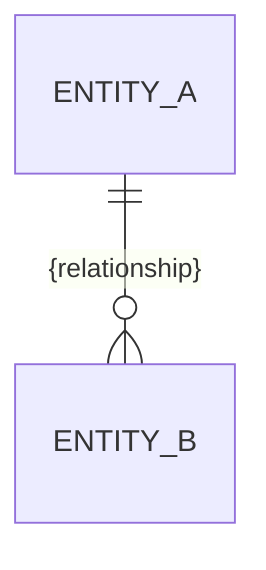

# Architecture Spine — {name}

> A consistency contract, not a design document. It fixes the **invariants** that keep the
> independently-built level below ({features | epics | stories}) coherent — the durable rules a
> clean codebase can't reveal. Structure is **seed**: true at cold-start, owned by the code after.
> Decisions, not rationale (that lives in the memlog). Diagrams over prose.

## Design Paradigm

Name the pattern — a known one loads a whole model for free — and map its layers to namespaces /
directories. The smallest, most durable thing in the file.

## Invariants & Rules

The durable heart: the calls a future builder can't read from compliant code. Each `AD-n` has a
stable ID (never reused), a binding scope, the divergence it prevents, and an enforceable rule.
Cover the boundary/dependency rules (who may depend on whom) and how state is mutated — a
dependency-direction diagram says these better than prose. An `AD-n` the user asserted as
already-settled (or one verified from existing reality) carries an `[ADOPTED]` tag after its
title, so its provenance is legible versus decisions made here.

```mermaid
flowchart LR
  %% arrows = allowed dependency direction (a rule, not just structure)
```

### AD-1 — {decision}

- **Binds:** {capability / unit IDs, areas, or `all`}
- **Prevents:** {the divergence this stops}
- **Rule:** {the constraint downstream must follow}

## Consistency Conventions

The defaults that bind everything where independent builders would otherwise drift. Cut rows that
don't apply.

| Concern | Convention |
| --- | --- |
| Naming (entities, files, interfaces, events) | |
| Data & formats (IDs, dates, error shapes, envelopes) | |
| State & cross-cutting (mutation, errors, logging, config, auth) | |

## Structural Seed

Cold-start scaffolding only — once the code exists it is the source of truth; regenerate or trim
these, don't maintain them. Keep minimal.

- **Stack & Versions** — the substrate (mirrors frontmatter `stack`).
- **System Shape** — C4 context / container.
- **Data Model** — an ERD of entities and relationships (ownership/mutation rules live above).
- **Project Structure** — a minimal source tree, only as deep as consistency needs.

```mermaid
C4Container
  title Containers — {name}
```



```text
{root}/
  {dir}/   # {what lives here}
```

## Capability → Architecture Map

Bridges the spec's capabilities to the architecture (and is the consistency auditor's checklist).
Present when a spec drove this run.

| Capability / Area | Lives in | Governed by |
| --- | --- | --- |
| {CAP-n / area} | {component / module} | {AD-n, convention, paradigm} |

## Deferred

Decisions intentionally pushed down, each with the reason it can wait. The half of the contract
that keeps the spine lean.
