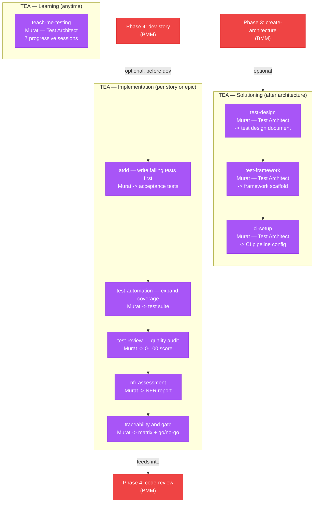
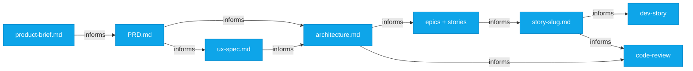

The BMad Method (BMM) is a module in the BMad Ecosystem, targeted at following the best practices of context engineering and planning. AI agents work best with clear, structured context. The BMM system builds that context progressively across 4 distinct phases - each phase, and multiple workflows optionally within each phase, produce documents that inform the next, so agents always know what to build and why.

The rationale and concepts come from agile methodologies that have been used across the industry with great success as a mental framework.

If at any time you are unsure what to do, the `/bmad-help` command will help you stay on track or know what to do next. You can always refer to this for reference also - but /bmad-help is fully interactive and much quicker if you have already installed the BMad Method. Additionally, if you are using different modules that have extended the BMad Method or added other complementary non-extension modules - the /bmad-help evolves to know all that is available to give you the best in-the-moment advice.

Final important note: Every workflow below can be run directly with your tool of choice via slash command or by loading an agent first and using the entry from the agents menu.

## Full Workflow Diagram

```mermaid
flowchart TD
    classDef analysis fill:#0ea5e9,stroke:#0284c7,color:#fff,font-weight:bold
    classDef planning fill:#22c55e,stroke:#16a34a,color:#fff,font-weight:bold
    classDef solutioning fill:#eab308,stroke:#ca8a04,color:#000,font-weight:bold
    classDef implementation fill:#ef4444,stroke:#dc2626,color:#fff,font-weight:bold
    classDef quickflow fill:#64748b,stroke:#475569,color:#fff
    classDef decision fill:#a855f7,stroke:#7c3aed,color:#fff
    classDef done fill:#10b981,stroke:#059669,color:#fff,font-weight:bold

    %% PHASE 1: ANALYSIS
    P1["PHASE 1 — ANALYSIS (Optional)\nExplore the problem space"]:::analysis
    BS["brainstorm\nMary — Analyst\n-> brainstorming-report.md"]:::analysis
    RES["research (market / domain / technical)\nMary — Analyst\n-> research findings"]:::analysis
    BRIEF["create-product-brief\nMary — Analyst\n-> product-brief.md"]:::analysis

    P1 --> BS
    P1 --> RES
    BS -.-> BRIEF
    RES -.-> BRIEF

    %% PHASE 2: PLANNING
    P2["PHASE 2 — PLANNING\nDefine what to build and for whom"]:::planning
    BRIEF --> P2
    PRD["create-prd\nJohn — PM\n-> PRD.md"]:::planning
    HASUI{"Has UI?"}:::decision
    UX["create-ux-design\nSally — UX Designer\n-> ux-spec.md"]:::planning

    P2 --> PRD
    PRD --> HASUI
    HASUI -- "Yes" --> UX
    HASUI -- "No" --> P3

    %% PHASE 3: SOLUTIONING
    P3["PHASE 3 — SOLUTIONING\nDecide how to build it"]:::solutioning
    UX --> P3
    ARCH["create-architecture\nWinston — Architect\n-> architecture.md + ADRs"]:::solutioning
    EPICS["create-epics-and-stories\nJohn — PM\n-> epic files with stories"]:::solutioning
    GATE["check-implementation-readiness\nWinston — Architect\n-> PASS / CONCERNS / FAIL"]:::solutioning

    P3 --> ARCH
    ARCH --> EPICS
    EPICS --> GATE

    %% PHASE 4: IMPLEMENTATION
    P4["PHASE 4 — IMPLEMENTATION\nBuild it, one story at a time"]:::implementation
    GATE -->|"PASS"| P4
    SPRINT["sprint-planning (once)\nBob — Scrum Master\n-> sprint-status.yaml"]:::implementation
    P4 --> SPRINT

    %% STORY CYCLE
    subgraph CYCLE["Story Cycle — repeat per story"]
        direction TB
        CSTORY["create-story\nBob — Scrum Master\n-> story-slug.md"]:::implementation
        DEV["dev-story\nAmelia — Developer\n-> working code + tests"]:::implementation
        CR["code-review\nAmelia — Developer\n-> approved or changes"]:::implementation
        CRPASS{"Review\nResult?"}:::decision
        CSTORY --> DEV
        DEV --> CR
        CR --> CRPASS
        CRPASS -->|"Changes needed"| DEV
    end

    SPRINT --> CYCLE
    CRPASS -->|"Approved, next story"| CSTORY
    CRPASS -->|"Epic complete"| RETRO

    RETRO["retrospective\nBob — Scrum Master\n-> lessons learned"]:::implementation
    MOREEPICS{"More\nepics?"}:::decision
    RETRO --> MOREEPICS
    MOREEPICS -->|"Yes"| CSTORY
    MOREEPICS -->|"No"| DONE
    DONE(["Project Complete"]):::done

    %% QUICK FLOW
    subgraph QUICK["Quick Flow — Parallel Track\nSkip phases 1-3 for small work"]
        direction LR
        QS["quick-spec\nBarry — Solo Dev\n-> tech-spec.md"]:::quickflow
        QD["quick-dev\nBarry — Solo Dev\n-> working code + tests"]:::quickflow
        QS --> QD
    end
```

## Phase 1: Analysis (Optional)

Explore the problem space and validate ideas before committing to planning.

| Workflow                        | Purpose                                                                    | Produces                  |
| ------------------------------- | -------------------------------------------------------------------------- | ------------------------- |
| `bmad-brainstorming`            | Brainstorm Project Ideas with guided facilitation of a brainstorming coach | `brainstorming-report.md` |
| `bmad-bmm-research`             | Validate market, technical, or domain assumptions                          | Research findings         |
| `bmad-bmm-create-product-brief` | Capture strategic vision                                                   | `product-brief.md`        |

## Phase 2: Planning

Define what to build and for whom.

| Workflow                    | Purpose                                  | Produces     |
| --------------------------- | ---------------------------------------- | ------------ |
| `bmad-bmm-create-prd`       | Define requirements (FRs/NFRs)           | `PRD.md`     |
| `bmad-bmm-create-ux-design` | Design user experience (when UX matters) | `ux-spec.md` |

## Phase 3: Solutioning

Decide how to build it and break work into stories.

| Workflow                                  | Purpose                                    | Produces                    |
| ----------------------------------------- | ------------------------------------------ | --------------------------- |
| `bmad-bmm-create-architecture`            | Make technical decisions explicit          | `architecture.md` with ADRs |
| `bmad-bmm-create-epics-and-stories`       | Break requirements into implementable work | Epic files with stories     |
| `bmad-bmm-check-implementation-readiness` | Gate check before implementation           | PASS/CONCERNS/FAIL decision |

## Phase 4: Implementation

Build it, one story at a time.

| Workflow                   | Purpose                                                                  | Produces                         |
| -------------------------- | ------------------------------------------------------------------------ | -------------------------------- |
| `bmad-bmm-sprint-planning` | Initialize tracking (once per project to sequence the dev cycle)         | `sprint-status.yaml`             |
| `bmad-bmm-create-story`    | Prepare next story for implementation                                    | `story-[slug].md`                |
| `bmad-bmm-dev-story`       | Implement the story                                                      | Working code + tests             |
| `bmad-bmm-code-review`     | Validate implementation quality                                          | Approved or changes requested    |
| `bmad-bmm-correct-course`  | Handle significant mid-sprint changes                                    | Updated plan or re-routing       |
| `bmad-bmm-automate`        | Generate tests for existing features - Use after a full epic is complete | End to End UI Focused Test suite |
| `bmad-bmm-retrospective`   | Review after epic completion                                             | Lessons learned                  |

## Quick Flow (Parallel Track)

Skip phases 1-3 for small, well-understood work.

| Workflow              | Purpose                                    | Produces                                      |
| --------------------- | ------------------------------------------ | --------------------------------------------- |
| `bmad-bmm-quick-spec` | Define an ad-hoc change                    | `tech-spec.md` (story file for small changes) |
| `bmad-bmm-quick-dev`  | Implement from spec or direct instructions | Working code + tests                          |

## TEA Module Integration

The TEA module is an optional installable module that adds test architecture workflows run by a dedicated Test Architect agent (Murat). It integrates with the BMM workflow at two points:

| TEA Phase | When | Workflows | Purpose |
|-----------|------|-----------|---------|
| Solutioning | After architecture is created | test-design, test-framework, ci-setup | Plan test strategy, scaffold framework, configure CI pipeline |
| Implementation | Per story or epic | atdd, test-automation, test-review, nfr-assessment, traceability | Write failing tests first (TDD), expand coverage, audit quality, check NFRs, traceability gate |
| Learning | Anytime | teach-me-testing | 7 progressive sessions to learn testing fundamentals |

## Context Flow

Each document becomes context for the next phase. The PRD tells the architect what constraints matter. The architecture tells the dev agent which patterns to follow. Story files give focused, complete context for implementation. Without this structure, agents make inconsistent decisions.

### Project Context

Create `project-context.md` to ensure AI agents follow your project's rules and preferences. This file works like a constitution for your project — it guides implementation decisions across all workflows. This optional file can be generated at the end of Architecture Creation, or in an existing project it can be generated also to capture whats important to keep aligned with current conventions.

**How to create it:**

- **Manually** — Create `_bmad-output/project-context.md` with your technology stack and implementation rules
- **Generate it** — Run `/bmad-bmm-generate-project-context` to auto-generate from your architecture or codebase
