```mermaid
%%{init: {'theme':'base', 'themeVariables': { 'fontFamily':'Inter, system-ui, sans-serif', 'fontSize':'14px'}}}%%
flowchart LR
    %% Business Goals (Left)
    BG0["<br/>⭐ PRIMARY GOAL: 50 EVANGELISTS<br/><br/>THE ENGINE<br/>50 hardcore believers and advocates<br/>Completed course + built real project<br/>Actively sharing and teaching others<br/>Timeline: 12 months<br/><br/>"]
    BG1["<br/>🚀 WDS ADOPTION GOALS<br/><br/>1,000 designers using WDS<br/>100 entrepreneurs embracing<br/>100 developers benefiting<br/>250 active community members<br/>Timeline: 24 months<br/><br/>"]
    BG2["<br/>💼 WHITEPORT BUSINESS GOALS<br/><br/>10 speaking engagements<br/>20 case studies published<br/>50 testimonials<br/>Client project opportunities<br/>Timeline: 24 months<br/><br/>"]
    
    %% Central Platform
    PLATFORM["<br/>🎨 WHITEPORT DESIGN STUDIO<br/><br/>End-to-End Design Methodology<br/><br/>Transform designers from overwhelmed<br/>task-doers into empowered strategic<br/>leaders who shoulder complexity<br/>as a calling, not a burden<br/><br/>"]
    
    %% Target Groups (Right)
    TG0["<br/>🎯 STINA THE STRATEGIST<br/>PRIMARY TARGET<br/><br/>Designer - Psychology background<br/>Job hunting - Overwhelmed<br/>AI curious but lacks confidence<br/><br/>"]
    TG1["<br/>💼 LARS THE LEADER<br/>SECONDARY TARGET<br/><br/>Entrepreneur - Employee #3<br/>Non-tech founder role<br/>Designer on maternity leave<br/><br/>"]
    TG2["<br/>💻 FELIX THE FULL-STACK<br/>TERTIARY TARGET<br/><br/>Developer - Software engineer<br/>Loves structure - Hates UI<br/>Respects design craft<br/><br/>"]
    
    %% Driving Forces (Far Right)
    DF0["<br/>🎯 STINA'S DRIVERS<br/><br/>WANTS<br/>✅ Be strategic expert<br/>✅ Make real impact<br/>✅ Use AI confidently<br/><br/>FEARS<br/>❌ Being replaced by AI<br/>❌ Wasting time/energy<br/>❌ Being sidelined<br/><br/>"]
    
    DF1["<br/>💼 LARS'S DRIVERS<br/><br/>WANTS<br/>✅ Happy & productive team<br/>✅ Smooth transition<br/>✅ Quality work<br/><br/>FEARS<br/>❌ Quality dropping<br/>❌ Being taken advantage<br/>❌ Team embarrassment<br/><br/>"]
    
    DF2["<br/>💻 FELIX'S DRIVERS<br/><br/>WANTS<br/>✅ Clear specifications<br/>✅ Logical thinking<br/>✅ Enlightened day<br/><br/>FEARS<br/>❌ Illogical designs<br/>❌ Vague specs<br/>❌ Forced UI work<br/><br/>"]
    
    %% Connections
    BG0 --> PLATFORM
    BG1 --> PLATFORM
    BG2 --> PLATFORM
    PLATFORM --> TG0
    PLATFORM --> TG1
    PLATFORM --> TG2
    TG0 --> DF0
    TG1 --> DF1
    TG2 --> DF2

    %% Light Gray Styling with Dark Text + Gold Primary Goal
    classDef primaryGoal fill:#fef3c7,color:#78350f,stroke:#fbbf24,stroke-width:3px
    classDef businessGoal fill:#f3f4f6,color:#1f2937,stroke:#d1d5db,stroke-width:2px
    classDef platform fill:#e5e7eb,color:#111827,stroke:#9ca3af,stroke-width:3px
    classDef targetGroup fill:#f9fafb,color:#1f2937,stroke:#d1d5db,stroke-width:2px
    classDef drivingForces fill:#f3f4f6,color:#1f2937,stroke:#d1d5db,stroke-width:2px
    
    class BG0 primaryGoal
    class BG1,BG2 businessGoal
    class PLATFORM platform
    class TG0,TG1,TG2 targetGroup
    class DF0,DF1,DF2 drivingForces
```

# Trigger Map Poster: WDS Presentation Page

> Visual overview connecting business goals to user psychology

**Created:** December 27, 2025  
**Author:** Mårten Angner with Saga the Analyst  
**Methodology:** Based on Effect Mapping (Balic & Domingues), adapted by WDS

---

## Strategic Visualization



## How to Read This Diagram

### **System Overview (Center)**
The central node represents **Whiteport Design Studio** - an end-to-end design methodology that transforms designers from overwhelmed task-doers into empowered strategic leaders.

### **Business Goals (Left Branch) - Properly Prioritized**

**⭐ PRIMARY GOAL: 50 Evangelists (THE ENGINE)**
- The absolute top priority in yellow/gold highlighting
- These 50 hardcore believers drive everything else
- Timeline: 12 months
- **This is the key to expansion**

**🚀 WDS Adoption Goals**
- Driven by the 50 evangelists
- 1,000 designers, 100 entrepreneurs, 100 developers, 250 community
- Timeline: 24 months
- Focused on methodology spread

**💼 Whiteport Business Goals**
- Company-level objectives (speaking, case studies, client projects)
- Timeline: 24 months
- **Important distinction:** WDS success drives these opportunities, not vice versa

### **Target User Groups (Right Branch)**
Three prioritized personas with distinct needs:
- **🎯 Stina the Strategist**: Primary target, becomes evangelist
- **💼 Lars the Leader**: Secondary target, validates business value
- **💻 Felix the Full-Stack**: Tertiary target, benefits from better specs

### **Usage Goals Legend**
- **✅ Green Checkmarks**: Positive goals - what users want to achieve
- **❌ Red X Marks**: Negative goals - what users want to avoid
- **⭐ Yellow/Gold Box**: PRIMARY GOAL - the engine that drives everything

---

## Strategic Documents

This is the visual overview. For detailed documentation, see:

- **01-Business-Goals.md** - Full vision statements and SMART objectives
- **02-Target-Groups.md** - All personas with complete driving forces
- **03-Stina-the-Strategist.md** - Designer persona detail
- **04-Lars-the-Leader.md** - Entrepreneur persona detail
- **05-Felix-the-Full-Stack.md** - Developer persona detail

---

## Vision

**WDS becomes the guiding light for designers and clients worldwide - empowering designers to thrive in the AI era while delivering exceptional value that drives real product success.**

---

## Business Objectives

### ⭐ PRIMARY GOAL: Build Core Evangelist Community (THE ENGINE)
- **Statement:** Build passionate core of WDS believers who advocate and spread the methodology
- **Metric:** Active evangelists (completed course, built real project with WDS, actively sharing/teaching others, contributing feedback)
- **Target:** 50 hardcore believers and evangelists
- **Timeline:** 12 months
- **Impact:** These 50 drive ALL other objectives - this is the key to expansion

---

### 🚀 WDS ADOPTION GOALS (Driven by Evangelists)

**Objective 1: Designer Adoption**
- **Statement:** Onboard 1,000 designers actively using WDS methodology
- **Metric:** Completed Module 01 + cloned repository + started at least one project using WDS
- **Target:** 1,000 designers
- **Timeline:** 24 months from page launch

**Objective 2: Entrepreneur Engagement**
- **Statement:** 100 entrepreneurs embrace WDS for their product development
- **Metric:** Entrepreneurs who hired designer using WDS OR completed WDS trigger mapping for their project
- **Target:** 100 entrepreneurs
- **Timeline:** 24 months from page launch

**Objective 3: Developer Integration**
- **Statement:** 100 developers benefit from BMad Method integration
- **Metric:** Developers who used BMM agents OR received WDS specifications for implementation
- **Target:** 100 developers
- **Timeline:** 24 months from page launch

**Objective 4: Community Growth**
- **Statement:** Build active WDS community
- **Metric:** Discord members actively participating (asking questions, sharing work, giving feedback)
- **Target:** 250 active community members
- **Timeline:** 24 months

---

### 💼 WHITEPORT BUSINESS GOALS (Company Revenue & Growth)

**Note:** These are Whiteport company goals, NOT WDS methodology goals. WDS success creates these opportunities, not vice versa.

**Objective 5: Thought Leadership & Validation**
- **Statement:** Establish WDS/Whiteport as recognized leaders through speaking and case studies
- **Metric:** Speaking engagements + published case studies from real projects + testimonials
- **Target:** 10 speaking engagements, 20 case studies, 50 testimonials
- **Timeline:** 24 months
- **Business Impact:** Creates consulting opportunities and client leads

**Objective 6: Client Project Opportunities**
- **Statement:** Generate paid client projects through WDS visibility and credibility
- **Metric:** Qualified leads + signed client projects using WDS methodology
- **Target:** TBD based on Whiteport capacity
- **Timeline:** 24 months
- **Business Impact:** Direct revenue for Whiteport agency

---

## Target Groups (Prioritized)

### 1. Stina the Strategist (Designer) - PRIMARY 🎯

**Priority Reasoning:** Designers shoulder the leadership role. They're the linchpin between business goals and technical implementation. WDS makes them indispensable by giving them the methodology to carry this burden well. These become the 50 hardcore evangelists.

> Multi-dimensional thinker who loves systems thinking, aesthetics, functionality, and human psychology. Studied psychology and cognition at university. No straight career path - arrived through passion for the meeting between business and user needs. Currently at end of 1-year contract as lone designer in dev team, actively job hunting. Overwhelmed, secretly works overtime. Uses AI in hobbies but lacks confidence to use professionally. Needs hand-holding and structured path.

**✅ Top 3 Positive Drivers:**
- To be the go-to strategic expert - valued and asked for advice
- To make real impact on the world through grand adventures
- To confidently use AI professionally and scale her impact

**⚠️ Top 3 Negative Drivers:**
- Being replaced by AI or becoming irrelevant
- Wasting time/energy on tools that don't work (banging head against wall)
- Being sidelined or not valued when she could save the world

---

### 2. Lars the Leader (Entrepreneur) - SECONDARY 💼

**Priority Reasoning:** Entrepreneurs validate that WDS delivers business value and create demand for WDS-trained designers. They need to trust designers and say "We need this, make it happen."

> Seasoned entrepreneur (employee #3, practically founder) who's burned through projects and learned there are no shortcuts. Not a tech person but plays hybrid PM/CTO role. Leans on consultants. Paid off technical debt, now optimizing UX. Designer going on maternity leave - needs stand-in with AI knowledge and drive. Values team happiness and "spark in eyes" when learning. Takes downtime and bugs very personally.

**✅ Top 3 Positive Drivers:**
- Team that's happy AND productive (optimized machinery)
- Smooth designer transition with AI-savvy replacement
- Quality work that fulfills the vision (willing to pay)

**⚠️ Top 3 Negative Drivers:**
- Quality dropping or bottlenecks (takes very personally)
- Being taken advantage of by consultants
- Being embarrassed in front of his team

---

### 3. Felix the Full-Stack (Developer) - TERTIARY 💻

**Priority Reasoning:** Developers benefit from designer's leadership through better specifications. They aren't the primary WDS audience but need to know it makes their life easier.

> Full-stack developer with straight career path. Studied software engineering, employed his whole life. Loves BMad Method structure and documentation (but hates writing it). Respects designers because he's terrible at "GUIs - who even calls it that anymore?" Loves AI technology but has love-hate relationship with AI code quality. Perfect situation: Designer does "the poetry," gives him good specs, he does his "magic" on dev side.

**✅ Top 3 Positive Drivers:**
- Clear, logical specifications that make his life easier
- Designers who think things through before handing off
- Work that enlightens his day (not creates problems)

**⚠️ Top 3 Negative Drivers:**
- Illogical designs creating cascading headaches
- Vague specs forcing him to guess designer's intent
- Being forced to do UI work he's terrible at

---

## The Battle Cry 🔥

**"Shoulder the complexity, break it down using AI as your co-pilot. Not as a burden, but with excitement. Not as a task, but as a calling!"**

---

## Strategic Visualization


## How to Read This Diagram

### **System Overview (Center)**
The central node represents **Whiteport Design Studio** - an end-to-end design methodology that transforms designers from overwhelmed task-doers into empowered strategic leaders.

### **Business Goals (Left Branch) - Properly Prioritized**

**⭐ PRIMARY GOAL: 50 Evangelists (THE ENGINE)**
- The absolute top priority in yellow/gold highlighting
- These 50 hardcore believers drive everything else
- Timeline: 12 months
- **This is the key to expansion**

**🚀 WDS Adoption Goals**
- Driven by the 50 evangelists
- 1,000 designers, 100 entrepreneurs, 100 developers, 250 community
- Timeline: 24 months
- Focused on methodology spread

**💼 Whiteport Business Goals**
- Company-level objectives (speaking, case studies, client projects)
- Timeline: 24 months
- **Important distinction:** WDS success drives these opportunities, not vice versa

### **Target User Groups (Right Branch)**
Three prioritized personas with distinct needs:
- **🎯 Stina the Strategist**: Primary target, becomes evangelist
- **💼 Lars the Leader**: Secondary target, validates business value
- **💻 Felix the Full-Stack**: Tertiary target, benefits from better specs

### **Usage Goals Legend**
- **✅ Green Checkmarks**: Positive goals - what users want to achieve
- **❌ Red X Marks**: Negative goals - what users want to avoid
- **⭐ Yellow/Gold Box**: PRIMARY GOAL - the engine that drives everything

---

## Key Insights

### **The Flywheel: 50 Evangelists Drive Everything**

**THE ENGINE (Priority #1):**
- 50 hardcore evangelists are THE PRIMARY GOAL
- Timeline: 12 months
- These believers complete the course, build real projects, actively share and teach
- They create the flywheel that drives ALL other objectives

**WDS Adoption (Priority #2):**
- Driven BY the 50 evangelists spreading the word
- 1,000 designers, 100 entrepreneurs, 100 developers, 250 community
- Timeline: 24 months
- Focus: Methodology spread and adoption

**Whiteport Business (Priority #3):**
- Company revenue goals (NOT WDS methodology goals)
- Speaking, case studies, client projects
- Timeline: 24 months
- **Key distinction**: WDS success creates these opportunities, not vice versa

### **Primary Development Focus**
1. **Convert Stina into Evangelist** - She's the profile who becomes one of the 50
2. **Strategic Leadership Transformation** - Address Stina's core need to move from overwhelmed to empowered
3. **AI Confidence Building** - Structured, hand-holding path to professional AI use
4. **Business Value Validation** - Show Lars how WDS designers deliver measurable results
5. **Better Specifications** - Prove to Felix that logical, complete specs reduce headaches

### **Critical Success Factors**
- **Emotional Transformation**: Burden → Calling (the battle cry in action)
- **Hand-Holding Approach**: Clear steps, course modules, installation guidance
- **Proof of Results**: Dog Week case study (5x faster, better quality)
- **Free Access**: No cost barriers or subscriptions
- **Complete Journey**: Idea → maintenance (not just fragments)

### **Design Implications**
- **Hero Section**: Address AI replacement fear immediately, position as leadership opportunity
- **Course Structure**: Show clear path with module-by-module progression
- **Social Proof**: Feature early evangelists, testimonials, case studies
- **Multi-Audience**: Primarily Stina, but validate for Lars and acknowledge Felix
- **BMad Foundation**: Explain proven 25-year methodology integration

### **Emotional Transformation Goals**
- **Designer Empowerment**: "I can be the strategic leader my team needs"
- **AI as Co-Pilot**: "AI amplifies my expertise, doesn't replace it"
- **Confidence Building**: "I have a structured path that works"
- **Impact Making**: "I'm making real difference through grand adventures"
- **Professional Pride**: "Design is my calling, not just a task"

---

## Design Focus Statement

**The WDS Presentation Page transforms designers from overwhelmed task-doers into empowered strategic leaders who shoulder complexity as a calling, not a burden.**

**Primary Design Target:** Stina the Strategist (Designer)

**Must Address (Critical for Conversion):**
1. Fear of AI replacing designers → Show how WDS makes designers indispensable
2. Lack of confidence with AI tools → Provide structured, hand-holding path
3. Feeling overwhelmed and sidelined → Position as strategic leader who shoulders complexity
4. Wasting time on tools that don't work → Prove methodology with real results (Dog Week case study)
5. Not being valued → Show path to becoming "go-to expert" asked for advice

**Should Address (Supporting Conversion):**
1. Lars needs trust signals → Show entrepreneurs how WDS designers deliver business value
2. Felix needs to see benefits → Quick mention that specs will be better
3. Community proof → Show the 50 evangelists emerging (testimonials, case studies)
4. Learning curve concerns → Module structure with hand-holding clear
5. Integration with dev workflow → BMad Method foundation explained

---

## Cross-Group Patterns

### Shared Drivers Across All Three

**Common Ground:**
- All three want **quality work** and **clear communication**
- All three fear **wasted effort** and **things breaking down**
- All three value **structure** and **thinking things through**
- All three are interested in **AI** but have reservations

**Design Implication:** WDS speaks to a shared desire for structure, quality, and thoughtful AI integration. The page should emphasize these universal values while primarily addressing Stina.

---

### Unique Drivers Per Group

**Stina's Unique Needs:**
- Emotional transformation: burden → calling
- Identity shift: task-doer → strategic leader
- AI confidence building with hand-holding

**Lars's Unique Needs:**
- Business validation and ROI proof
- Trust in designer-led process
- Team optimization and smooth transitions

**Felix's Unique Needs:**
- Better handoffs and fewer headaches
- UI help without learning design
- Respect for logical consistency

---

### Strategic Relationships

**The Triangle:**
```
        STINA (Designer)
        Strategic Leader
       Shoulders complexity
              │
              │ Creates specs for
              ▼
        FELIX (Developer)
        Gets logical specs
        Life gets easier
              │
              │ Delivers quality for
              ▼
         LARS (Entrepreneur)
         Gets business value
         Trusts the process
              │
              │ Hires/values
              └──────────────► STINA
                              (Loop closes)
```

**The Flywheel (Prioritized):**
1. **STINA BECOMES EVANGELIST** ⭐ (THE PRIMARY GOAL)
2. Stina learns WDS → becomes strategic leader
3. Stina delivers better specs → Felix's life improves
4. Felix delivers quality → Lars's business succeeds
5. Lars hires more WDS designers → creates demand
6. Success stories inspire more Stinas → 50 evangelists emerge (12 months)
7. **Evangelists spread WDS** → 1,000 designers adopt (24 months)
8. **WDS success** → Whiteport opportunities emerge (speaking, clients, etc.)

**Design Implication:** The page must start the flywheel by converting Stina into one of the 50 evangelists. Everything flows from this. Lars and Felix are supporting actors in Stina's hero journey.

---

## The Transformation Journey

### Stina's Emotional Arc (What the Page Must Deliver):

**BEFORE WDS:**
- 😰 Overwhelmed, working secret overtime
- 😔 Feels threatened by AI
- 🤷‍♀️ Lacks confidence, fears wasting time
- 😤 Sidelined, not valued as strategic partner
- 📦 Just a "pixel pusher" executing others' vision

**AFTER WDS:**
- 🎯 Strategic leader who shoulders complexity
- 🚀 AI as co-pilot amplifying expertise
- 💪 Confident with structured path and hand-holding
- ⭐ Go-to expert asked for advice
- 🌍 Making real impact through grand adventures
- 🔥 Treating design as a CALLING, not a burden

**The Battle Cry Delivers This Transformation**

---

## Key Insights for Design Phase

### Content Priorities Based on Triggers:

**Hero Section Must:**
- Hook Stina with "guiding light for designers in AI era"
- Address replacement fear immediately
- Position as leadership opportunity, not threat

**Methodology Section Must:**
- Show structure (addresses confidence + wasting time fears)
- Prove with results (Dog Week case study)
- Explain hand-holding approach (course modules)

**Benefits Section Must:**
- Make designer indispensable (replacement fear)
- Show AI as co-pilot (not replacement)
- Position as strategic leader (not task-doer)

**Course/Installation Must:**
- Show clear path with hand-holding
- Low barrier to entry (free, open-source)
- Prove it's worth time investment

**Social Proof Must:**
- Show early evangelists emerging
- Real project case studies
- Testimonials from designers like Stina

---

## Success Metrics Alignment

### How Trigger Map Connects to Objectives (Properly Prioritized):

**⭐ PRIMARY: Converting Stina into Evangelist → Achieves:**
- ✅ **50 evangelists** (THE ENGINE - she becomes one of them)
- ✅ Completes course + builds real project
- ✅ Actively shares and teaches others
- ✅ Creates testimonials and case studies from her success
- **Timeline: 12 months**
- **This drives ALL other objectives**

**🚀 SECONDARY: Evangelists Drive WDS Adoption → Achieves:**
- ✅ 1,000 designers (evangelists spread the word)
- ✅ 100 entrepreneurs (evangelists demonstrate business value)
- ✅ 100 developers (evangelists deliver better specs)
- ✅ 250 community (evangelists create engagement)
- **Timeline: 24 months**

**💼 TERTIARY: WDS Success Drives Whiteport Business → Achieves:**
- ✅ 10 speaking engagements (credibility from WDS success)
- ✅ 20 case studies (real projects from evangelist community)
- ✅ 50 testimonials (happy evangelists and users)
- ✅ Client opportunities (visibility and demand from WDS adoption)
- **Timeline: 24 months**

**The Trigger Map IS the Strategic Foundation - And Prioritization Matters**

The page must convert Stina → make her an evangelist → evangelists drive everything else.

---

## Development Phases

### **First Deliverable: WDS Presentation Page**
Focus on converting Stina from overwhelmed designer to empowered evangelist:
- **Hero Section** - Hook with "guiding light," address AI fear
- **Methodology Explanation** - Show structure, prove with Dog Week
- **Benefits Section** - Make designer indispensable message
- **Course Modules** - Present Modules 01-02 complete, more coming
- **Installation Guide** - Clear 5-step process with hand-holding
- **Social Proof** - Early testimonials and case study
- **Call to Action** - Multiple paths (GitHub, course, community)

### **Future Phases: Additional Content**
- **Phase 2**: Complete course modules 03-17
- **Phase 3**: Build evangelist case studies library
- **Phase 4**: Create interactive demos and examples
- **Phase 5**: Expand BMad Method integration documentation

---

## Related Documents

- **[Product Brief](../1-project-brief/01-product-brief.md)** - Complete strategic foundation
- **[Stina the Strategist](03-Stina-the-Strategist.md)** - Primary persona details (to be created)
- **[Lars the Leader](04-Lars-the-Leader.md)** - Secondary persona details (to be created)
- **[Felix the Full-Stack](05-Felix-the-Full-Stack.md)** - Tertiary persona details (to be created)

---

## Next Steps

This Trigger Map provides strategic foundation for all design work:

- ✅ **Phase 1: Product Brief** - Complete
- ✅ **Phase 2: Trigger Mapping** - Complete (this document)
- [ ] **Phase 3: Platform Requirements** - Technical foundation (if needed)
- [ ] **Phase 4: UX Design** - Begin sketching and specifications
- [ ] **Phase 5: Design System** - Extract components (if needed)
- [ ] **Phase 6: Development Handoff** - PRD finalization

**Primary Design Target:** Stina the Strategist  
**Battle Cry:** Shoulder the complexity as a calling, not a burden  
**Transformation:** Overwhelmed → Empowered Strategic Leader

---

_Generated by Whiteport Design Studio_  
_Trigger Mapping methodology credits: Effect Mapping by Mijo Balic & Ingrid Domingues (inUse), adapted with negative driving forces by WDS_

