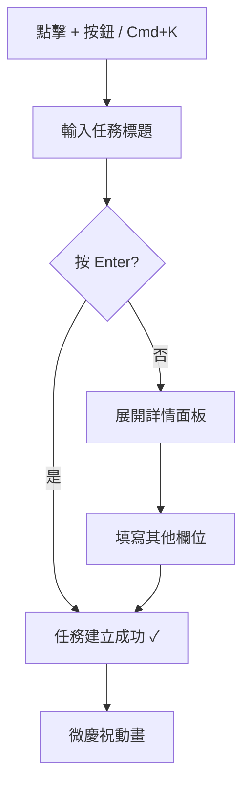
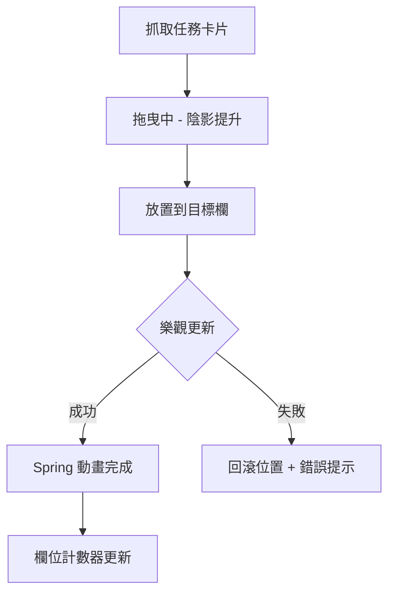
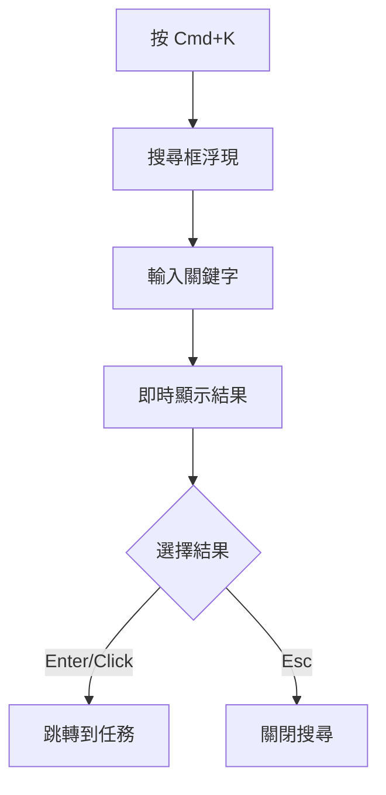

# UX Design Specification: AquaFlow SaaS 專案管理協作平台

**Author:** 東杰
**Date:** 2025年12月25日
**Version:** 1.0

---

## 產品背景摘要

**產品名稱:** AquaFlow
**產品類型:** 雲端 SaaS 專案管理協作平台
**目標受眾:** 中小型企業團隊領導者、專案經理、跨職能團隊成員

### 解決的核心問題
1. 現有工具太複雜或太輕量，團隊需要平衡清晰度、速度和適當結構的產品
2. 任務狀態追蹤困難
3. 新手上手時間過長

### 核心功能模組
- 專案管理（建立和管理多個專案）
- 任務看板（看板拖曳、快速新增）
- 任務詳情（指派、截止日期、優先級、評論）
- 搜尋與篩選
- 通知系統（應用內 + Email）

### 設計風格方向
- 關鍵字：trust、efficiency、clarity、professional
- 風格：Modern Professional SaaS

---

## Executive Summary

### Project Vision

AquaFlow 是專為中小型企業團隊打造的雲端專案管理協作平台。我們的目標是提供比 Jira 更輕量、更直覺的體驗，同時保持專業團隊所需的核心功能。

**核心價值主張：**
- 直覺的拖曳看板，讓任務管理變得簡單
- 清晰的團隊進度可見度，一眼掌握全局
- 快速上手，5分鐘即可開始使用
- 合理的價格，不需要企業級預算

### Target Users

**主要使用者：**
- 團隊領導者與專案經理（有 Jira 經驗）
- 跨職能團隊成員
- 營運與行銷團隊

**使用者特徵：**
- 技術熟練度：中高（有專案管理與 Jira 經驗）
- 主要設備：桌面電腦
- 使用情境：辦公室環境，團隊協作型任務

**核心痛點：**
- Jira 成本過高
- 現有工具過於複雜或功能不足

### Key Design Challenges

1. **避免「另一個 Jira」的印象** — 需要更簡潔但不失專業
2. **傳達價值感** — UI 需要讓用戶感受到「更划算且更好用」
3. **團隊協作可見度** — 清晰呈現「誰在做什麼、進度如何」

### Design Opportunities

1. **快速上手體驗** — 比 Jira 更低的學習門檻
2. **視覺化進度** — 一眼看清團隊全局
3. **極致拖曳體驗** — 讓核心互動成為產品亮點
4. **輕量專業** — 保持專業外觀，去除不必要複雜度

---

## Core User Experience

### Defining Experience

**核心互動：** 新增任務 + 拖曳任務狀態

這兩個動作是 AquaFlow 的靈魂。用戶每天會執行這些操作數十次，必須做到：
- **新增任務**：10 秒內完成，只需輸入標題
- **拖曳任務**：絲滑流暢，即時視覺回饋

**差異化策略（vs Jira）：**

| 面向 | Jira 痛點 | AquaFlow 解法 |
|------|-----------|---------------|
| 新增任務 | 要填很多欄位 | 「標題即任務」— 只需標題，其他選填 |
| 拖曳體驗 | 有時卡頓 | Spring 動畫 + 樂觀更新 |
| 進度可見度 | 要看報表 | 欄位計數器 + 進度環 |
| 設定複雜度 | 設定太多 | 智慧默認，開箱即用 |

### Platform Strategy

| 面向 | 決策 |
|------|------|
| **主要平台** | 響應式 Web App |
| **互動方式** | 滑鼠/鍵盤為主 |
| **離線功能** | V1 暫不支援（辦公室使用為主） |
| **瀏覽器支援** | Chrome, Firefox, Safari, Edge（最新兩版） |

### Effortless Interactions

1. **極速新增** — 浮動按鈕 + `Cmd+K` 快捷鍵
2. **絲滑拖曳** — Spring 動畫 + 樂觀更新
3. **一眼進度** — 欄位計數器 + 進度環
4. **快速搜尋** — `Cmd+K` 全域搜尋

### Critical Success Moments

| 時刻 | 用戶情感 | 設計策略 |
|------|----------|----------|
| **第一次拖曳到「完成」** | 「哇，好順！」 | 微慶祝動畫 |
| **看到團隊進度** | 「終於不用問了」 | 進度環 + 計數器 |
| **10秒內新增任務** | 「比 Jira 簡單」 | 快速新增流程 |
| **找到上週任務** | 「搜尋好用！」 | `Cmd+K` 全域搜尋 |

### Experience Principles

1. **🚀 速度優先** — 任何操作 200ms 內有視覺回應
2. **👁️ 資訊清晰** — 一眼看到：誰負責、何時截止、什麼狀態
3. **🎯 專注當下** — 減少干擾，專注於當前任務
4. **🔄 流暢過渡** — 所有狀態變化都有自然動畫
5. **⌨️ 效率捷徑** — 為專業用戶提供鍵盤快捷鍵

---

## Desired Emotional Response

### Primary Emotional Goals

| 情感 | 觸發時機 | 設計策略 |
|------|----------|----------|
| **掌控感** | 看到團隊進度 | 進度環 + 清晰的狀態欄 |
| **效率感** | 快速完成操作 | 200ms 內有回應 |
| **輕鬆感** | 首次使用 | 智慧默認，不需要設定 |
| **成就感** | 完成任務 | 微慶祝動畫 |

### Emotional Journey Mapping

| 階段 | 情感 | 設計策略 |
|------|------|----------|
| **發現** | 好奇 + 期待 | 清晰的價值主張，5秒內吸引注意 |
| **註冊** | 信任 + 輕鬆 | 最少步驟，支援社群登入 |
| **首次使用** | 自信 + 引導 | 引導式 onboarding，不壓迫 |
| **日常使用** | 高效 + 滿足 | 流暢操作，即時回饋 |
| **完成任務** | 成就感 | 微慶祝動畫，進度視覺化 |
| **出錯時** | 被理解 + 有方向 | 友善錯誤訊息，明確解決方案 |

### Micro-Emotions

**強化的正面情感：**
- ✅ **自信** vs ❌ 困惑 → 清晰的視覺層級
- ✅ **信任** vs ❌ 懷疑 → 一致的互動模式
- ✅ **成就感** vs ❌ 挫折 → 漸進式任務分解
- ✅ **歸屬感** vs ❌ 孤立 → 團隊活動可見性

**避免的負面情感：**
- 😰 焦慮 — 避免資訊過載（vs Jira 太多欄位）
- 😤 挫折 — 避免複雜操作流程
- 😵 困惑 — 避免不一致的 UI 元素
- 😒 厭煩 — 避免過多確認對話框

### Emotional Design Principles

1. **🏆 慶祝進步** — 每個完成的任務都值得微小的慶祝動畫
2. **🤝 溫暖的錯誤處理** — 錯誤訊息像朋友在幫忙，不像機器在責備
3. **✨ 驚喜時刻** — 隱藏的彩蛋讓日常使用不無聊
4. **🧘 減少認知負擔** — 默認值聰明，讓用戶少做決定
5. **👋 個人化觸點** — 使用者名字、偏好設定優先

---

## UX Pattern Analysis & Inspiration

### Inspiring Products Analysis

| 產品 | 優點 | 可借鑒的 UX 模式 |
|------|------|-----------------|
| **Trello** | 極致直覺的拖曳體驗 | 看板 + 卡片設計、封面圖片、標籤系統 |
| **Asana** | 多視圖無縫切換 | 列表/看板/時間軸視圖、右側滑出面板 |
| **Notion** | 鍵盤導向操作 | `Cmd+K` 萬能搜尋、斜線指令 |
| **Linear** | 極簡專業風格 | 清晰資訊層級、快捷鍵系統 |

### Transferable UX Patterns

**導航模式：**
- 側邊欄工作區切換（像 Slack 一樣快速切換）
- 麵包屑導航（工作區 > 專案 > 任務的清晰路徑）
- 全域搜尋 `Cmd+K`（快速找到任何東西）

**互動模式：**
- Trello 風格的流暢拖曳
- 右側滑出詳情面板（不離開上下文）
- @提及自動完成（自然的協作語法）

### Anti-Patterns to Avoid

| 反模式 | 來源 | 為什麼避免 |
|--------|------|-----------|
| 過度功能 | Jira | 中小企業不需要複雜設定 |
| 資訊過載 | Monday.com | 太多欄位造成認知負擔 |
| 強制教學 | 某些企業軟體 | 阻斷新手的探索慾望 |
| 深層導航 | 舊版 Basecamp | 超過 3 層深度造成迷失 |

### Design Inspiration Strategy

**採用 (Adopt)：**
- ✅ Trello 的拖曳體驗 → 核心看板互動
- ✅ Asana 的視圖切換 → 列表/看板無縫切換
- ✅ Notion 的 Cmd+K → 全域快捷搜尋

**改編 (Adapt)：**
- 🔄 Asana 的慶祝動畫 → 更輕量的完成微動畫
- 🔄 Linear 的鍵盤導向 → 簡化為常用快捷鍵

**避免 (Avoid)：**
- ❌ 任何需要培訓的功能 → 自助可發現
- ❌ 深層選單 → 最多 3 層

---

## Design System Foundation

### Design System Choice

**選定方案：** Chakra UI v2 + React

**技術組合：**
- UI 框架：Chakra UI v2
- 圖標庫：Lucide Icons
- 拖曳：@dnd-kit/core
- 動畫：Framer Motion（內建）
- 表單：React Hook Form + Chakra

### Rationale for Selection

| 考量因素 | Chakra UI 優勢 |
|----------|----------------|
| **React 整合** | 原生支援，符合 PRD 技術栈 |
| **可主題化** | 輕鬆建立 AquaFlow 品牌識別 |
| **無障礙** | 內建 WCAG 標準支援 |
| **開發體驗** | 清晰文件、TypeScript 支援 |
| **拖曳支援** | 易於整合 @dnd-kit |

### Implementation Approach

1. **Phase 1: 基礎設定**
   - 安裝 Chakra UI 和依賴套件
   - 配置主題 (theme.ts)
   - 建立設計令牌 (Design Tokens)

2. **Phase 2: 基礎組件**
   - Button, Input, Card 等基礎組件
   - 導航組件 (Sidebar, Navbar)
   - 版面配置組件

3. **Phase 3: 業務組件**
   - TaskCard (任務卡片)
   - KanbanColumn (看板欄)
   - ProjectList (專案列表)

### Customization Strategy

**設計令牌 (Design Tokens)：**
- 品牌色：待 Step 8 定義
- 字型：Inter (Google Fonts)
- 間距：4px 基礎單位
- 圓角：sm=4px, md=8px, lg=16px
- 陰影：使用 Chakra 默認 shadow tokens

---

## Visual Design Foundation

### Color System

**色彩來源：** UI/UX Pro Max 知識庫 (SaaS Modern Professional)

| 角色 | Hex 色碼 | 用途 |
|------|----------|------|
| **Primary** | `#2563EB` | 主按鈕、連結、品牌識別 |
| **Secondary** | `#3B82F6` | hover 狀態、次要強調 |
| **CTA** | `#F97316` | 行動呼籲按鈕 |
| **Background** | `#F8FAFC` | 頁面背景 |
| **Text** | `#1E293B` | 主要文字 |
| **Border** | `#E2E8F0` | 邊框、分隔線 |

**語意色彩：**
- Success: `#22C55E`
- Warning: `#EAB308`
- Error: `#EF4444`
- Info: `#3B82F6`

**設計理念：** Trust blue + accent contrast（信任藍 + 對比強調色）

### Typography System

**字型來源：** UI/UX Pro Max 知識庫 (Minimal Swiss)

**主要字型：** Inter (Google Fonts)
```css
@import url('https://fonts.googleapis.com/css2?family=Inter:wght@300;400;500;600;700&display=swap');
```

**字級階層：**

| 元素 | 大小 | 粗細 | 行高 |
|------|------|------|------|
| H1 | 32px | 700 | 1.2 |
| H2 | 24px | 600 | 1.3 |
| H3 | 20px | 600 | 1.4 |
| Body | 16px | 400 | 1.5 |
| Small | 14px | 400 | 1.5 |
| Caption | 12px | 400 | 1.4 |

### Spacing & Layout Foundation

**基礎單位：** 4px

**間距系統 (Chakra UI)：**
```
space.1 = 4px
space.2 = 8px    ← 最小按鈕間距
space.3 = 12px
space.4 = 16px   ← 常用內邊距
space.6 = 24px   ← 區塊間距
space.8 = 32px
space.10 = 40px
space.12 = 48px
```

**版面配置：**
- 最大寬度：1280px
- 側邊欄寬度：240px
- 卡片內邊距：16px
- 欄位間距：16px

### Accessibility Considerations

- ✅ 色彩對比度符合 WCAG AA 標準（4.5:1）
- ✅ 主要按鈕使用至少 44x44px 觸控區域
- ✅ 相鄰按鈕間距至少 8px
- ✅ Inter 字型具備優秀的可讀性
- ✅ 支援鍵盤導航（Tab/Shift+Tab）

---

## Design Direction Decision

### Design Directions Explored

由於設計決策已在前面步驟中明確定義，跳過多變體 mockups 生成。

**已確定的設計元素：**
- 設計系統：Chakra UI v2
- 配色：Trust Blue (#2563EB) + Orange CTA (#F97316)
- 字型：Inter
- 風格：Modern Professional SaaS

### Chosen Direction

**選定方向：Modern Professional SaaS**

| 面向 | 設計決策 |
|------|----------|
| **布局** | 側邊欄導航 + 主內容區看板 |
| **視覺密度** | 中等密度，留白適當 |
| **互動風格** | 輕量動畫、Spring 拖曳 |
| **導航模式** | 左側邊欄 + 頂部麵包屑 |
| **卡片風格** | 白底圓角 + 輕陰影 |

### Design Rationale

1. **側邊欄導航** — 符合 SaaS 產品標準，用戶有 Jira 經驗
2. **中等密度** — 平衡資訊呈現和清晰度（vs Jira 的高密度）
3. **輕量動畫** — 支持「速度優先」原則，不影響效能
4. **白底圓角卡片** — 現代專業感，符合 Trust + Efficiency 關鍵字

### Implementation Approach

1. **Chakra UI Theme** — 配置自訂顏色和字型
2. **Layout Components** — Sidebar + Main + SlidePanel
3. **Card Components** — TaskCard、ProjectCard
4. **Animation Library** — Framer Motion for Spring animations

---

## User Journey Flows

### Journey 1: 新增任務

**目標：** 10 秒內建立新任務



**關鍵設計決策：**
- 只需標題即可建立任務
- 其他欄位皆為選填
- 支援快捷鍵 `Cmd+K`

### Journey 2: 拖曳任務狀態

**目標：** 絲滑流暢的狀態切換



**關鍵設計決策：**
- 樂觀更新（先顯示成功，再同步後端）
- Spring 動畫增加流暢感
- 失敗時優雅回滾

### Journey 3: 全域搜尋

**目標：** 快速找到任何任務



**關鍵設計決策：**
- 全域快捷鍵 `Cmd+K`
- 即時搜尋結果
- 支援鍵盤導航

### Journey Patterns

**通用模式：**
1. **快捷鍵入口** — 所有常用功能支援 keyboard shortcut
2. **即時回饋** — 200ms 內有視覺回應
3. **樂觀更新** — 先顯示成功，後台同步
4. **優雅錯誤處理** — 自動回滾 + 友善訊息

### Flow Optimization Principles

| 原則 | 說明 |
|------|------|
| **10 秒法則** | 核心操作必須在 10 秒內完成 |
| **200ms 回應** | 任何操作有即時視覺回饋 |
| **一鍵可及** | 最常用功能一次點擊/按鍵即可 |
| **漸進揭露** | 進階功能隱藏，需要時才顯示 |

---

## Component Strategy

### Design System Components (Chakra UI v2)

**基礎組件（直接使用）：**
- Button, IconButton, ButtonGroup
- Input, Select, Checkbox, Radio, Switch
- Card, Box, Flex, Grid, Stack
- Modal, Drawer, Popover, Tooltip
- Alert, Toast, Progress, Spinner
- Tabs, Breadcrumb, Menu

### Custom Components

#### 1. TaskCard (任務卡片)

| 項目 | 規格 |
|------|------|
| **用途** | 看板上的可拖曳任務卡片 |
| **內容** | 標題、標籤、負責人頭像、截止日期、優先級 |
| **狀態** | default, hover, dragging, selected, loading |

**KB 指南參考：**
- #28 Focus States → `focus:ring-2 focus:ring-blue-500`
- #29 Hover States → `hover:bg-gray-50 cursor-pointer`
- #30 Active States → `active:scale-[0.99]`
- #84 Truncation → 標題超長用 `line-clamp-2`
- #40 ARIA Labels → 拖曳需 `aria-grabbed` 屬性

#### 2. KanbanColumn (看板欄)

| 項目 | 規格 |
|------|------|
| **用途** | 任務狀態欄（待辦/進行中/完成） |
| **內容** | 欄標題、任務計數器、進度環、新增按鈕 |
| **狀態** | default, drop-target-active, empty |

**KB 指南參考：**
- #80 Empty States → 空欄顯示「尚無任務，拖曳或點擊新增」
- #10 Loading States → 載入中顯示 Skeleton

#### 3. CommandPalette (快捷指令面板)

| 項目 | 規格 |
|------|------|
| **用途** | Cmd+K 全域搜尋/快捷指令 |
| **內容** | 搜尋框、分類結果、最近項目 |
| **狀態** | open, searching, results, empty |

**KB 指南參考：**
- #41 Keyboard Navigation → 完整鍵盤支援（↑↓ Enter Esc）
- #28 Focus States → 清晰的選項焦點指示
- #89 Search Autocomplete → 即時顯示搜尋建議

#### 4. ProgressRing (進度環)

| 項目 | 規格 |
|------|------|
| **用途** | 視覺化任務完成進度 |
| **內容** | 百分比數字、動畫環 |
| **尺寸** | sm(24px), md(32px), lg(48px) |

**KB 指南參考：**
- #8 Duration Timing → 動畫 200ms
- #9 Reduced Motion → 尊重 `prefers-reduced-motion`

### Component Implementation Strategy

**通用狀態規範（基於 KB 指南）：**

```css
/* 所有互動組件必須實作 */
.interactive {
  /* #28 Focus States */
  focus:ring-2 focus:ring-blue-500 focus:ring-offset-2
  
  /* #29 Hover States */
  hover:bg-gray-50 transition-colors
  
  /* #30 Active States */
  active:scale-[0.98]
  
  /* #22 Touch Target */
  min-h-[44px] min-w-[44px]
}

/* #8 Animation Timing */
transition: all 200ms ease-out;

/* #9 Reduced Motion */
@media (prefers-reduced-motion: reduce) {
  transition: none;
}
```

### Implementation Roadmap

| 階段 | 組件 | 優先級 | 依賴 |
|------|------|--------|------|
| **Phase 1** | TaskCard | 🔴 P0 | @dnd-kit |
| **Phase 1** | KanbanColumn | 🔴 P0 | TaskCard |
| **Phase 2** | CommandPalette | 🟡 P1 | - |
| **Phase 2** | ProgressRing | 🟡 P1 | - |
| **Phase 3** | ActivityFeed | 🟢 P2 | - |
| **Phase 3** | UserAvatar | 🟢 P2 | - |

---

## UX Consistency Patterns

**KB 指南參考：** #61 Submit Feedback, #4 Back Button, #43 Form Labels

### Button Hierarchy

| 層級 | 用途 | 樣式 | 範例 |
|------|------|------|------|
| **Primary** | 主要行動 | 填充藍色 `#2563EB` + 白字 | 儲存、建立、提交 |
| **Secondary** | 次要行動 | 邊框藍色 + 藍字 | 取消、返回 |
| **Ghost** | 低調行動 | 透明背景 + 灰字 | 更多選項、展開 |
| **Danger** | 破壞性行動 | 紅色 `#EF4444` | 刪除（需確認對話框） |

**按鈕狀態：**
- Default → Hover (`brightness(1.1)`) → Active (`scale(0.98)`) → Disabled (`opacity-50`)

### Feedback Patterns

| 類型 | 觸發 | 呈現 | 持續時間 |
|------|------|------|----------|
| **Success** | 操作完成 | Toast 右上角 ✓ | 3 秒自動消失 |
| **Error** | 操作失敗 | 紅色 Alert + 說明 | 用戶關閉 |
| **Warning** | 需要注意 | 黃色 Alert | 用戶確認 |
| **Info** | 提示資訊 | 藍色 Toast | 5 秒自動消失 |
| **Loading** | 等待中 | Spinner 或 Skeleton | 完成後消失 |

**回饋規則：**
- 小於 300ms 的操作：無需顯示 loading
- 300ms-1s：顯示 spinner
- 大於 1s：顯示 skeleton 或進度條

### Form Patterns

**輸入欄位規範：**
- ✅ 每個 input 都有 `<label>` 關聯
- ✅ 必填欄位標示 `*`
- ✅ 即時驗證（onBlur）
- ✅ 錯誤訊息在欄位下方（紅色）
- ✅ 送出按鈕顯示 loading 狀態
- ✅ 成功後顯示確認訊息 + 自動跳轉

**表單佈局：**
```
[Label]          * (required)
[Input Field    ]
[Error message in red]
```

### Navigation Patterns

**一致性規則：**
- ✅ 側邊欄高亮當前頁面
- ✅ 麵包屑顯示完整路徑
- ✅ 支援瀏覽器返回鍵（`history.pushState`）
- ✅ URL 反映當前狀態（可分享）
- ✅ Cmd+K 開啟搜尋面板

### Modal & Overlay Patterns

| 類型 | 用途 | 關閉方式 |
|------|------|----------|
| **Modal** | 需要用戶決策 | 按鈕、Esc、點擊外部 |
| **Drawer** | 側邊詳情面板 | 按鈕、Esc、點擊外部 |
| **Popover** | 短暫資訊 | 點擊外部、Esc |
| **Toast** | 通知訊息 | 自動消失、點擊關閉 |

---

<!-- UX design content will be appended sequentially through collaborative workflow steps -->

## Responsive Design & Accessibility

### Responsive Strategy

**平台優先級：**

| 優先級 | 平台 | 螢幕尺寸 | 說明 |
|--------|------|----------|------|
| 🔴 P0 | **Desktop** | 1024px+ | 主要使用環境 |
| 🟡 P1 | Tablet | 768-1023px | 次要環境 |
| 🟢 P2 | Mobile | 320-767px | 輕量查看 |

**設計策略：** Desktop-first（根據 PRD 主要為桌面辦公室環境）

### Breakpoint Strategy

| 名稱 | 尺寸 | 佈局變化 |
|------|------|----------|
| `mobile` | 320px+ | 單欄佈局、底部導航、隱藏側邊欄 |
| `tablet` | 768px+ | 可收合側邊欄、簡化看板 |
| `desktop` | 1024px+ | 側邊欄常駐、多欄看板、詳情面板 |
| `wide` | 1440px+ | 更寬內容區域、三欄佈局 |

**Chakra UI 對應：**
```javascript
const breakpoints = {
  sm: '320px',   // mobile
  md: '768px',   // tablet
  lg: '1024px',  // desktop
  xl: '1440px',  // wide
}
```

### Accessibility Strategy

**合規等級：** WCAG 2.1 Level AA ✅

| 類別 | 要求 | 實施方式 |
|------|------|----------|
| **色彩對比** | 4.5:1（正常文字）、3:1（大文字） | 已驗證配色符合標準 |
| **觸控區域** | 最小 44x44px | 所有按鈕和互動元素 |
| **鍵盤導航** | 完整 Tab 支援 | Chakra UI 內建 |
| **焦點指示** | 可見焦點環 | `focus:ring-2 focus:ring-blue-500` |
| **Screen Reader** | ARIA 標籤 | 所有圖標按鈕 |
| **動態效果** | 尊重偏好 | `prefers-reduced-motion` |
| **Skip Links** | 跳過導航 | 首個焦點元素 |

### Testing Strategy

**自動化測試：**
- axe-core — 掃描 a11y 問題
- Lighthouse — 效能和無障礙評分
- ESLint jsx-a11y — 程式碼檢查

**手動測試：**
- ✅ 純鍵盤操作測試
- ✅ VoiceOver (macOS) / NVDA (Windows) 螢幕閱讀器
- ✅ 高對比模式
- ✅ 200% 縮放

**裝置測試：**
- Chrome DevTools 裝置模擬
- 實機：iPhone、Android 手機

### Implementation Guidelines

**響應式開發：**
```jsx
// Chakra UI 響應式語法
<Box
  w={{ base: '100%', md: '50%', lg: '33%' }}
  display={{ base: 'none', lg: 'block' }}
/>
```

**無障礙開發：**
```jsx
// 圖標按鈕必須有 aria-label
<IconButton
  aria-label="關閉選單"
  icon={<CloseIcon />}
/>

// 尊重動態偏好
const prefersReducedMotion = usePrefersReducedMotion()
```

---

<!-- End of UX Design Specification -->


